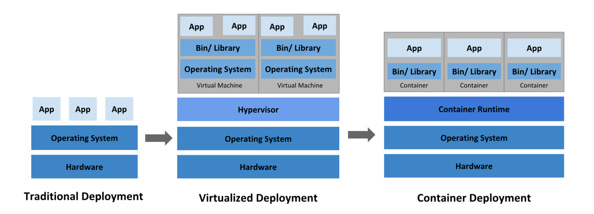
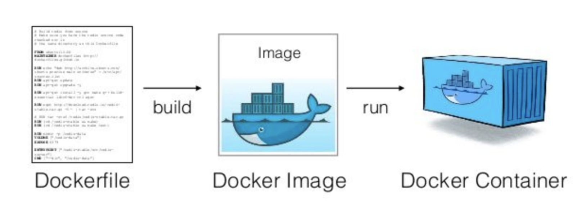

# 도커, 컨테이너

## 전통적 배포

물리적인 컴퓨터 한 대에 하나의 OS를 깔고 여러 가지 프로그램을 설치하는 방식   

 

### 단점

* 어떤 프로그램을 설치했을 때 다른 앱에 영향을 미침
  * 정부 금융, 보안 앱 설치 시 타 앱의 오류 등

  

## 가상화 배포

가상머신을 기반으로 배포  
하이퍼바이저는 하나의 시스템 상에서 가상 컴퓨터를 여러 개 구동할 수 있도록 해 주는 중간 계층  
* **`가상머신(Virtual Machine)`** : 컴퓨터의 모든 부품을 애뮬레이션(모든 부품의 모든 기능을 소프트웨어적으로 구현) 한 것

 

### 장점

* 컴퓨터 한대로 여러개의 앱을 독립적으로 돌릴 수 있음
* 가상화 기술 때문에 클라우드 컴퓨팅이 가능해짐   

 

### 단점

* 하나의 컴퓨터 위의 여러 개의 가상머신을 둘 수 있고 이는 서로 샌드박스되어 전혀 상호 작용하지 않음 
* 한 가상머신 위의 프로그램은 다른 가상머신 위의 프로그램에서 볼 수 없음 
* OS 공유가 안되기 때문에 전통적 배포보다는 아니지만 가상머신에 일일히 OS를 설치해야 하는 등 비용 상승

  

## 컨테이너 배포

**`컨테이너`**  : 코드와 모든 종속성(Node.js, 라이브러리 등)을 패키징하는 소프트웨어의 표준 단위  
OS를 공유하는 방식  
컨테이너나 VM은 궁극적으로 애플리케이션이 ‘서로 다른 컴퓨터에서 설치되어있다’고 생각하게 만듦 

 

### 장점

* 컨테이너는 VM과 유사하지만 격리 속성을 완화, 격리성이 무너지지 않음
* 애플리케이션 간에 운영체제(OS)를 공유 -> 빠른 실행
* 가상머신보다 경량화 
* 가상화 배포보다 일반적으로 약 5배의 애플리케이션을 실행 가능

 

### 단점

* 두 프로그램 간에 간섭을 일으킬 수 없는 장벽을 침 
* 애플리케이션의 문제가 OS에 영향을 미치면, OS에서 구동 중인 전체 컨테이너의 문제가 될 가능성 존재

  

  

## 도커

컨테이너라는 경량 단위로 애플리케이션을 실행하는 기능을 제공하는 플랫폼  
여러 컴퓨터 간에 공유된 규격으로 리소스를 공유할 수 있어 유지보수성이 증대  

도커는 IaaS의 장점인 이식성, PaaS의 장점인 저렴한 운영비를 갖춘 도구  

 

### 사용법

기존의 종속적인 라이브러리나 파일 복사 등 기존 시스템에 대한 설치 절차를 Dockerfile 스크립트에 작성   
배포 관련 사항을 도커스웜이나 쿠버네티스에 맞춰 작성  
대개 `도커 + 쿠버네티스` 또는 `도커 + 도커스웜`으로 구축

* **`도커`** -> 💡 IaaS의 장점
* **`쿠버네티스, 도커스웜`** : 컨테이너화된 애플리케이션을 자동으로 배포, 스케일링 및 관리해주는 컨테이너 오케스트레이션 (운영을 도와줌) -> 💡 PaaS의 장점 

  

### 도커가 컨테이너를 만드는 과정

1. 도커파일 빌드
2. 도커이미지 생성 및 실행
3. 도커컨테이너 실행

 

 

- **도커파일(dockerfile)** : 컨테이너에 설치해야하는 패키지, 환경변수설정 등을 기록한 하나의 파일(파이썬3설치, Node.js 설치, 어떤 파일을 어디로 복사 등)
- **도커이미지** : 도커가 도커파일의 단계에 따라 컴퓨터의 상태를 **스냅샷**으로 저장한 것.
- **컨테이너** : 도커가 이미지를 불러와 실행할 때 생성. 실행중인 컨테이너는 이미지에 지정된 프로그램과 데이터를 사용해 일반적인 실제 컴퓨터와 연결되어 사용 가능

  

### 도커는 IaaS인가? PaaS인가?

엄밀히 말하면 둘 다 x   
클라우드 가상화기술 이지만 굳이 따지면 **PaaS의 일부**   
컨테이너의 가상화는 커널 레벨이 아닌 운영 체제 레벨, 즉 가상 머신의 가상화가 일어나는 곳에서 한 추상화 계층 높은 곳에서 일어남  
IaaS에서도 도커는 가능하며, PaaS인 heroku에서도 가능

  
