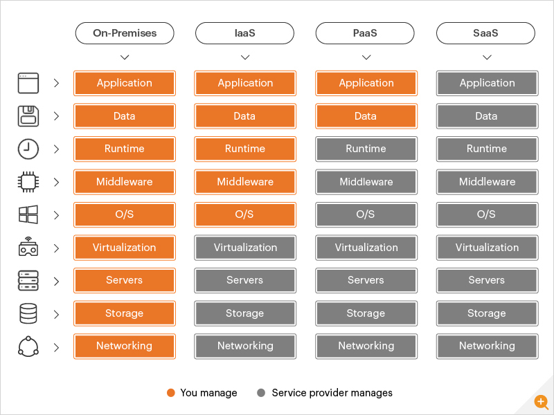

# 클라우드, SaaS, IaaS, PaaS

## 클라우드 

인터넷을 통해 접근할 수 있는 서버, 그 안에서 구동되는 소프트웨어, 데이터베이스 등  
온라인에 존재하는 데이터 센터(클라우드)에 맡겨서 수행하는 것  

-> 서비스 운영에만 집중할 수 있음  
=> **`오프 프레미스 Off-premises`**  

↔️ **`온 프레미스 On-premise`** : 자체적으로 보유한 전산실 서버에 직접 설치해 운영하는 방식

 

  

## SaaS

### Software-as-a-Service

인터넷을 통해 소프트웨어를 제공하는 방법, **완제품**  
모든 하드웨어 및 전통적인 소프트웨어를 관리  

 

### 예시

* 구글 드라이브, N 드라이브, 구글 DOCS 등

사람, 위치가 달라도 동일한 환경에서 실시간 작업 가능  
내 장비를 사용하지 않아도 클라우드에 저장 가능

  

## IaaS

### Infrastructure-as-a-service

클라우드 인프라 서비스  
서버와 저장소를 제공 (= 빈 방 제공)

* 특정 클라우드에 종속 x
* 가상머신 위에서 애플리케이션의 각 컴포넌트가 구동됨
  * 가상머신 : 가상 컴퓨터. 컴퓨터 시스템을 에뮬레이션(가상현실화)하는 소프트웨어
* 운영비 상승 (인적자원, 시간 등)
* 설치 어려움
* 이식성 좋음
* 자유로움

 

### 예시

* AWS의 EC2, NCP

  

## PaaS

### Platform as a Service

플랫폼 제공 (= 빌트인)  
Iaas 보다는 유연하지 않으며 플랫폼에 종속

* 설치 쉬움
* 자유롭지 않음
* 이식성 나쁨 
* 클라우드 서비스를 구매해서 연계시켜야 함
* 운영비 절감

 

### 예시

* heroku
