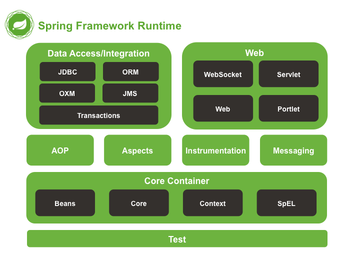
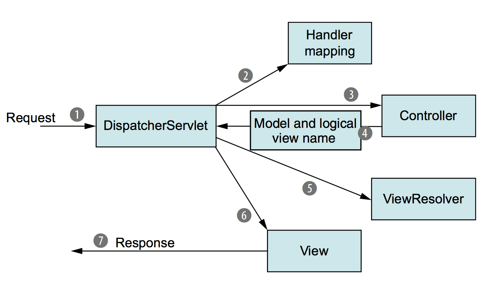

# Spring의 MVC패턴 적용사례

## Spring

자바 기반으로 애플리케이션 개발할 때 여러 기능을 제공해주는 개발 프레임워크

  

## 스프링 프레임워크 런타임

여러가지 모듈로 이루어진 아키텍쳐

  

## MVC패턴이 적용된 Web 모듈

### 디스패처 서블릿

디스패처 서블릿의 요청 처리 과정에 MVC패턴이 적용됨

 

### 요청 처리 과정

1. 디스패처 서블릿(프론트 컨트롤러)가 들어오는 요청을 받음
2. 핸들러 매핑을 통해 요청을 처리할 컨트롤러를 결정 (@requestmapping을 참고해 컨트롤러 할당)
3. 컨트롤러는 비즈니스 로직을 처리(데이터베이스를 참조한다면 레파지토리 계층, DB 계층을 참고)
4. 모델에 상수, 변수가 담김
5. 모델과 ViewResolver를 통해 사용자에게 보여줄 View를 만듦
6. 뷰가 사용자에게 전달됨

**💡컨트롤러가 모델과 뷰의 다리 역할**
