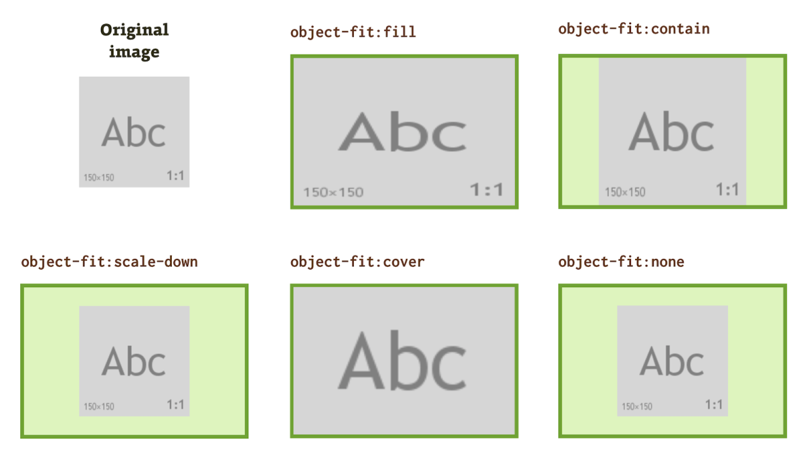

# CSS

## background

* `background-repeat` : 요소의 배경 이미지의 반복 여부와 반복 방향을 지정
* `background-size` : 요소의 배경 이미지의 크기를 지정
  * cover, auto, contain, 직접 픽셀 입력 
* `background-attachment` : 요소의 배경 이미지의 스크롤 여부를 지정
  * fixed, scroll(기본값), local(내부 스크롤 적용)

<br><br>

## background-image

요소의 배경 이미지를 한 개, 혹은 여러개 지정

```
background-image: url("이미지 경로");
```

### 이미지 중첩하기 

```
background-image: url("이미지 경로") , url("이미지 경로2")
```

* 앞에 있는 것이 가장 위에 깔리고, 뒤에 있는 것이 아래로 깔림

### 그라데이션 배경 만들기 : linear-grandient

```
background-image: liner-gradient(방향, 시작색상, 종료 색상)
```

<br><br>

## background-position

요소의 배경 이미지의 위치를 지정

```
/* 다섯가지 키워드를 조합해서 위치를 지정 */
background-position: center;
background-position: top right;
background-position: left;
background-position: bottom center;

/* x축과 y축 수치 직접입력 */
background-position: 50px 24px; (각각 x축 y축)
```

<br><br>

## background 단축 속성

```
/* background : color imageUrl repeat position/size attachment */
background : red url("이미지 경로") no-repeat center/cover fixed
```

<br><br>

## object-fit

`` 나 `<video>` 등 대체요소의 내용이 지정된 규격과 맞춰지는 방식을 지정



```
/* 네개 중 하나를 선택해서 사용 */
object-fit : cover / fill(기본값) / contain(이미지 전체가 보임) / none(원본 비율)
```

<br><br>

## object-position

`` 나 `<video>` 등 대체요소의 콘텐츠 정렬 방식을 지정

background-position과 사용 방법 동일  
