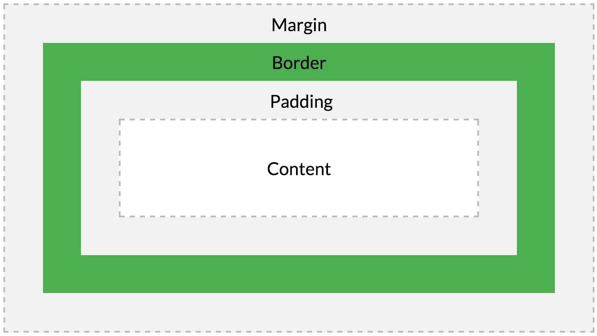

# CSS

## Box-Model

* `content` : 요소의 실제 내용이 차지하는 영역
* `padding` : 내용과 테두리 사이의 간격, 내부 여백
* `border` : 내용과 패딩을 감싸는 테두리
* `margin` : 테두리와 이웃하는 요소 사이의 간격, 외부 여백
* `box-sizing` : 요소의 너비와 높이를 계산하는 방법을 지정

  

## box-sizing

기본값이 content-box라서 발생하는 오류가 많음  

* content-box : Content 영역을 기준으로 box의 size를 적용, **⚠️기본값**
* border-box : Border 영역을 기준으로 box의 size를 적용 
  * 사람이 인식하는 박스 크기는 대개 border를 기준으로 함
  * content와 padding을 포함한 박스 크기
    
  

## block vs inline 

- `block` 
  - 블록 요소를 여러개 연속해서 쌓을 경우 자동으로 다음 줄로 넘어감
  - 좌우 양 쪽으로 늘어나 부모 요소의 너비를 가득 채움
  - `
`, `
`, `<ul>`, `<dl>`, `<h1>`, `<section>`, `<article>`, `<aside>` 등 

- `inline` 
  - 여러개의 요소를 연속해서 입력해도 자동으로 다음 줄로 넘어가지 않음
  - 태그에 할당된 공간 만큼의 너비만 차지
  - `<a>`, ``, ``, `<strong>`, `<em>`, `<input>`, `<button>`, `<textarea>`, `<select>` 등 
