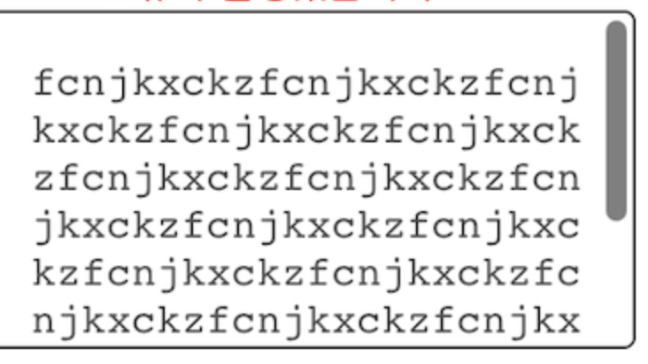

# styled-components

## 스크롤바

스크롤바 스타일에 관한 웹표준은 존재하지 않지만  
wekbit 브라우저(크롬, 사파리, 오페라)에 한해, 가상요소를 사용해 스타일을 적용할 수 있음

<br><br>

## 가상 요소

* ::webkit-scrollbar: 스크롤바 전체
* ::webkit-scrollbar-thumb: 스크롤 막대
* ::webkit-scrollbar-track: 스크롤 막대가 움직일 공간  

<br><br>

## 예시



```js
import React from 'react';
import styled from 'styled-components';

const Textarea = ({
    id,
    name,
    rows,
    placeholder,
    onChange,
    ...props
}: TextAreaProps) => (
    <Container
        id={id}
        name={name}
        rows={5}
        placeholder={placeholder}
        onChange={onChange}
        {...props}
    />
);

const Container = styled.textarea`
  border: 1px solid #E0E0E0;
  border-radius: 4px;
  padding: 16px 16px 0 16px;
  font-size: 14px;
  outline: none;
  resize: none;
  overflow-y: auto;

  &::-webkit-scrollbar-thumb {  // 스크롤바 스타일 적용
    width: 4px;
    height: 90px;
    border-radius: 2px;
  }
`;

```
