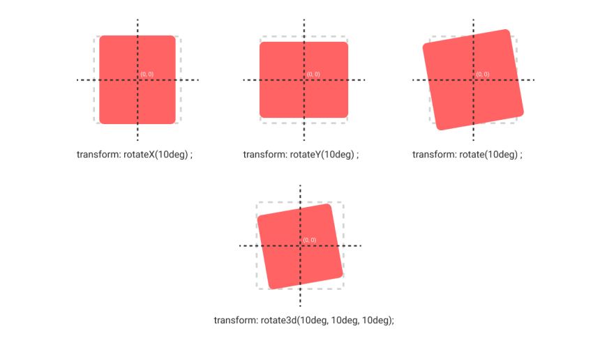

# CSS

## transform

변환  
대상이 되는 요소에 이동, 회전 확대/축소, 비틀기 등의 변형 효과를 줄 수 있음

tranform에는 여러가지 변환 함수를 속성값으로 줌

* `translate(x, y)` : 요소의 좌표를 움직임
  * ⚠️ 소괄호 안에 한개의 값만 입력된 경우에는 두 영역에 동일한 값이 입력된 것으로 간주
  * 양수, 음수 입력 가능
* `translateX(n) / translateY(n)` : 요소를 X좌표/Y좌표를 기준으로 n만큼 움직임
* `scale(x, y)` : 각 축 방향으로 x, y만큼 요소를 축소/확대 
  * scale 변환함수는 배수로 측정
* `scaleX(n) / scaleY(n)` : x/y축 방향으로 n만큼 요소를 축소/확대
* `skew(x, y)` : 요소를 기울여 마름모꼴처럼 만들기
* `skewX(n) / skewY(n)` : 요소를 X/Y축으로 n도 만큼 기울이기
* `rotate(n)` : 요소를 n도 만큼 시계방향 회전
  * 반시계방향으로 돌릴 경우 음수값  
  * transform: rotate(45deg)

<br><br>

### skew


### rotate



<br><br>

## 중첩 적용 

transform은 여러가지 변환 함수를 중첩해서 속성값으로 줄 수 있음

```
/* 75도 회전 + y축 방향 120px 이동 */
transform : rotate(75deg) translateY(120px);
```
