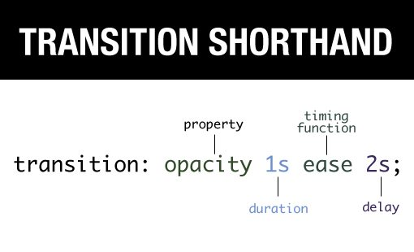

# CSS

## transition

전환효과, css에서 애니메이션을 줄 수 있는 방법

변화의 전, 후 사이에 애니메이션을 추가해서 움직임을 부드럽게 만들어 줌

* `transition-property` : 어떤 속성(property)에 transition을 적용할 것인지 지정
  * transition-property: color,transform (특정 프로퍼티 지정)
* `transition-duration` : transition에 걸리는 시간을 지정 
  * 초(s), 혹은 밀리초(ms) 단위
* `transition-timing-function` : transition의 속도 패턴 지정 
  * 변화가 일정한 속도로 일어날 것인지, 빠르게 시작했다가 느리게 끝날 것인지 등
  * `linear` : 일정한 속도로 변화
  * `ease` : 시작할때는 빨라지다 느려짐
  * `ease-in` : 천천히 시작했다가 속도를 높여 끝남
  * `ease-out` : 빠른 속도로 시작했다가, 천천히 끝남
  * `ease-in-out` : 천천히 시작했다가, 정상 속도가 됐다가, 빠르게 끝남 ✅
  > [CSS - Transition timing function sample](https://codepen.io/Joogumi/full/eYMgrKO)
* `transition-delay` : transition이 실제로 실행되기까지 기다려야 하는 시간을 지정
  * 초(s), 혹은 밀리초(ms) 단위
  * 각각 transition의 순서를 지정할 때 편리  
  
<br><br>

## 단축 속성



```
/* property duration timing-func. delay */
transition: color 0.4s ease-in-out 1s
```
