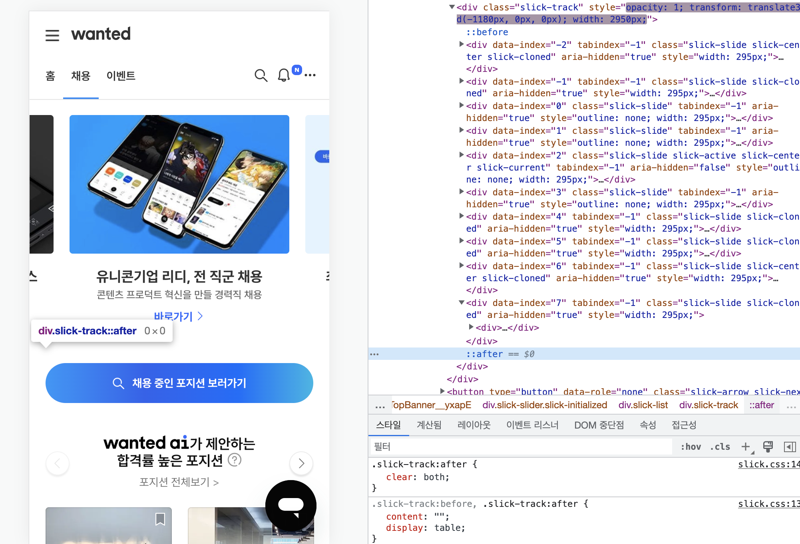
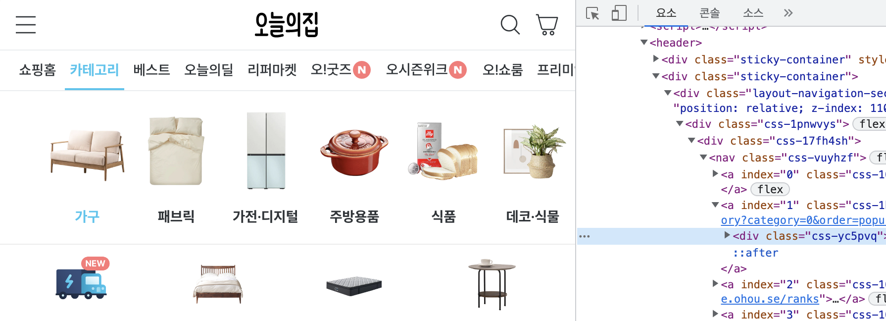

# CSS

## 작성 방법


```
선택자(Selector) {
    선언(Declaration)
    속성(property): 속성값(property value);
}
```

<br><br>

## 적용 방식

### 1. inline style 작성하기
해당 태그에 직접 style 속성을 추가  

```html
<div style="background-color: red;">Hello</div>
```  

### 2. `<style>` 태그 사용하기 
html 파일의 head 부분에 style 태그를 추가

### 3. CSS 파일 분리하기
.css 파일을 따로 만든 후 `<link>` 태그로 연결

* 유지보수 편리
* 소스코드 관리 용이

```html
<link rel="stylesheet" href="./index.css">
```

* rel : 해당 파일과의 관계(relation), "stylesheet"
* href : 참조할 css 파일의 경로

<br><br>

## 선택자

### 1. 태그 선택자

모든 해당 태그를 선택

### 2. id 선택자

`#id명`  
하나만 존재 

### 3. class 선택자

`.class명`  
여러 요소에 중복 사용 가능 

### 4. 자손 선택자

여러개의 선택자를 `한 칸의 공백`으로 연결  

```
부모 자식 {
    속성: 속성값;
}
```

### 5. 다중 선택자

여러개의 선택자를 `공백 없이` 연결  
두 조건을 모두 만족하는 요소만 선택   
자손 관계가 불명확할 때 사용하면 좋음  

```
선택자1선택자2 {
    속성: 속성값;
}
```

### 6. 전체 선택자

HTML의 모든 요소를 선택

```
* {
    속성: 속성값;
}
```

### 7. 그룹 선택자

여러 선택자를 그룹으로 묶는 기능

```
h2, p, div {
    속성: 속성값;
}
```

### 8. 가상 클래스 선택자

선택자 뒤에 `:가상 이벤트` 를 붙이면 특정 이벤트마다 적용할 스타일을 설정할 수 있으며, 이를 가상 클래스라고 함

```
some-box:hover { 
    속성: 속성값;
}
```

> - `:first-child` : 첫번째 자식
> - `:first-of-type` : 형제 요소 중 자신의 유형과 일치하는 제일 첫 요소
> - `:last-child` : 마지막 자식
> - `:nth-child(n)` : 홀수번째 자식
> - `:nth-child(2n)` : 짝수번째 자식
> - `:nth-of-type(n)` : 형제 요소 중 특정 형제의 n번째 요소를 선택
> - `:hover` : 마우스를 요소에 올렸을 때
> - `:active` : 활성화된 요소를 선택
> - `:focus` : focus를 받고있는 입력창들의 요소를 선택 (입력창의 커서가 활성화 되어있는 요소)
> - `:visited` : 사용자가 방문한 적 있는 링크를 선택 (해당 경로를 방문한 기록이 브라우저 상에 남아 있는 링크, 방문한 적이 있을 경우에는 기본적으로 보라색으로 표시)

<br>

### 9. 가상 요소 선택자

실제로 html요소를 수정하지 않고, css만으로 가상 요소를 추가해 선택할 수 있음  
css만으로도 간단히 새로운 요소를 만들거나 조작할 수 있음  

* ⚠️ content를 꼭 적어줘야 함(공백이더라도)
  * content 속성이 없으면 해당 가상요소는 화면에 그려지지 않음

```html
<div class="box1">
    나는 박스1입니다.
</div>
```

```css
.box1 {
    width : 200px;
    height: 300px;
    background-color: yellow;
}

.box1:after {
    content: "나는 박스2입니다.";
    display: block;
    background-color: blue;
}
```

> - `:before` 
> - `:after` : 💡clearfix 설정을 `.clearfix:after`를 통해 줄 수 있음 

<br>

#### 예시

1. 케러셀(carousel, 회전목마) 배너의 버튼 요소 



2. 메뉴 hover 시 하단 바



<br>

### 10. 형제 요소 선택자

A와 같은 부모를 가지고 있는 형제 요소들 중 B를 선택

```
A ~ B {
  속성: 속성값;
}
```

<br><br>

## 참고 사이트 
> CSS Diner - 선택자 게임 https://flukeout.github.io/
