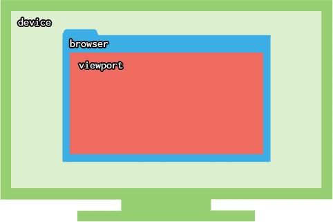

# CSS

## 절대 단위

외부 요인의 영향을 받지 않고 절대적인 값을 지니는 단위  
절대 길이 단위(가변성X) : **px, pt**

### 📌 px = pixel = 화소

화면을 구성하는 가장 기본이 되는 단위

px은 웹에서 가장 많이 사용되는 절대 단위  
디지털 화면은 수많은 작은 네모들로 구성되어있으며, 이 🟦네모 한 칸이 1px

### pt(포인트) = 1/72 inch(인치)

인쇄를 위한 단위

pt는 인쇄를 위한 단위이기 때문에 **웹에서는 잘 사용하지 않음**  
보통 워드 프로세서 등 문서 편집 프로그램에서 pt를 많이 사용

<br><br>

## 상대 단위

외부 요인의 영향을 받아 유동적인 값을 지니는 단위  

### 📌 가변 레이아웃 단위 %

부모 요소와의 상대적 크기 지정   
여백은 부모의 너비(width)를 기준으로 계산    

### 📌 em, rem

텍스트 크기 조정할 때 사용  
font-size 속성 값에 비례해 값을 결정

* **em** : 부모 요소의 글꼴 크기 
  * ⚠️ 여백 크기를 정할 때는 자기 자신의 글자 크기를 기준으로 함    

* **rem**(root em) : 루트 요소의 글꼴 크기  
  * 💡루트 요소(html 요소)의 기본 글꼴 크기 : 16px  


### 📌 뷰포트 단위(반응하는 단위) vw vh vmin vmax

반응형 웹 제작시 많이 사용  
**vw**, **vh** 는 요소의 규격을 viewport의 너비값과 높이값에 비례하여 결정  
앞에 붙는 숫자가 백분율   

```
/* viewport가 1200(px)x920(px)인 경우 */

10vw => 1200x0.1 = 120px
50vh => 920x0.5 = 460px
100px => 1200x1 = 1200px
```

#### viewport : 화면 display 상의 표시 영역

* device : 컴퓨터, 태블릿, 스마트폰 등 



