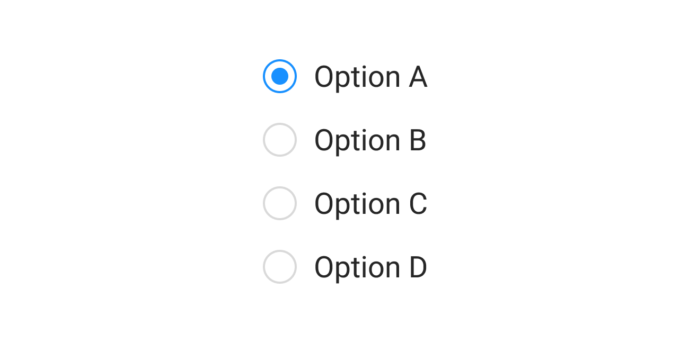

# HTMLCSS

## 라디오 버튼

그래픽 사용자 인터페이스(GUI)    
사용자가 미리 정의된 선택 사항의 모임, 하나만 선택할 수 있음    
서로 연관된 옵션들의 집합을 보통 **하나의 라디오 버튼 그룹**으로 나타내며, 그룹 내의 라디오 버튼은 **오직 하나만이 선택**될 수 있음

라디오 버튼(radio button), 또는 옵션 버튼(option button)으로 불림 



<br>

### 유래 

미리 정의되어 있는 기지국을 선택할 수 있는 오래된 자동차 라디오의 물리적인 단추에서 이름을 따옴   
단추 가운데 하나를 누르면 다른 단추들은 모두 밖으로 나오면서 눌려있는 단추만 눌린 상태로 보이게 됨

<br>

### 체크박스와의 차이점

[체크박스](https://developer.mozilla.org/en-US/docs/Web/HTML/Element/input/checkbox)

라디오 버튼과 유사하지만 중요한 차이점이 있음  
라디오 버튼은 세트에서 하나의 값을 선택하도록 설계된 반면, 체크박스는 개별 값을 켜거나 끌 수 있음  
여러 컨트롤이 있는 경우 `라디오 버튼`을 사용하면 전체 중에서 **하나**를 선택할 수 있는 반면, `체크박스`를 사용하면 **여러 값**을 선택할 수 있음

<br><br>

## 사용방법

value 속성은 라디오 버튼의 값을 포함하는 문자열  
값은 사용자 에이전트에 의해 사용자에게 표시되지 않음  
대신 그룹에서 어떤 라디오 버튼이 선택되었는지 식별하는 데 사용됨 

<br>

### 라디오 버튼 정의

`<input type="radio">` 라디오 버튼을 정의

<br>

### 라디오 그룹 정의

라디오 그룹은 그룹의 **각 라디오 버튼에 동일한 name을 부여**하여 정의됨
라디오 그룹이 설정되면 해당 그룹에서 라디오 버튼을 선택하면 동일한 그룹에서 현재 선택된 라디오 버튼이 **자동으로 선택 취소**됨  

각 페이지에 고유한 name을 가진 라디오 그룹이 있는 한 원하는 만큼 많은 라디오 그룹을 가질 수 있음
명시적으로 코드를 추가하지 않는 한, 사용자는 value 또는 name을 볼 수 없음  

Ex. 양식에서 사용자에게 선호하는 연락 방법을 물어야 하는 경우
각각의 name 속성이 contact 값으로 설정되고, value가 각각 email, phone, mail인 세 개의 라디오 버튼을 만들 수 있음

<br>

### 특징 

라디오 버튼은 라디오 그룹(관련 옵션 세트를 설명하는 라디오 버튼 모음)으로 표시되며, 그룹에서는 동시에 하나의 라디오 버튼만 선택할 수 있음 

* 참고: 라디오 그룹으로 처리되려면 동일한 이름(속성 name 값)을 공유해야 함
  * 라디오 그룹이 생성되면 해당 그룹에서 라디오 버튼을 선택하면 동일한 그룹에서 선택한 다른 라디오 버튼이 자동으로 선택 취소
  * 각 그룹에 고유한 이름이 있으면, 한 페이지에 원하는 만큼 많은 라디오 그룹을 가질 수 있음 

* 참고: 속성 value은 각 라디오 버튼과 관련된 고유 값을 정의
  * 이 값은 사용자에게 표시되지 않지만, 선택된 라디오 버튼을 식별하기 위해 **제출** 시 서버로 전송되는 값

* 팁: 최상의 접근성을 위해 항상 `<label>` 태그를 추가할 것 

<br><br>

## 예시

```html
<form>
  <fieldset>
    <legend>Please select your preferred contact method:</legend>
    <div>
      <input type="radio" id="contactChoice1" name="contact" value="email" />
      <label for="contactChoice1">Email</label>

      <input type="radio" id="contactChoice2" name="contact" value="phone" />
      <label for="contactChoice2">Phone</label>

      <input type="radio" id="contactChoice3" name="contact" value="mail" />
      <label for="contactChoice3">Mail</label>
    </div>
    <div>
      <button type="submit">Submit</button>
    </div>
  </fieldset>
</form>
```

```html
<form action="/examples/media/action_target.php" method="get">
    여러분의 나이대를 골라보세요.<br>
    <input type="radio" name="ages" value="teenage"> 10대<br>
    <input type="radio" name="ages" value="twenties"> 20대<br>
    <input type="radio" name="ages" value="thirties"> 30대<br>
    <input type="radio" name="ages" value="forties"> 40대 이상<br>
    <input type="submit">
</form>
```

<br><br>

## 참고 사이트 

> https://developer.mozilla.org/en-US/docs/Web/HTML/Element/input/radio  
> https://www.w3schools.com/tags/att_input_type_radio.asp
