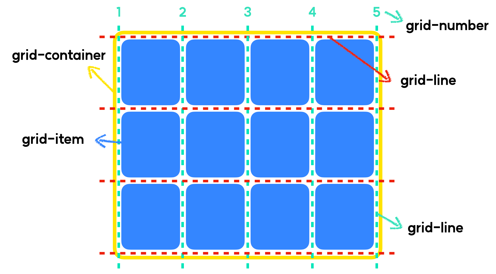
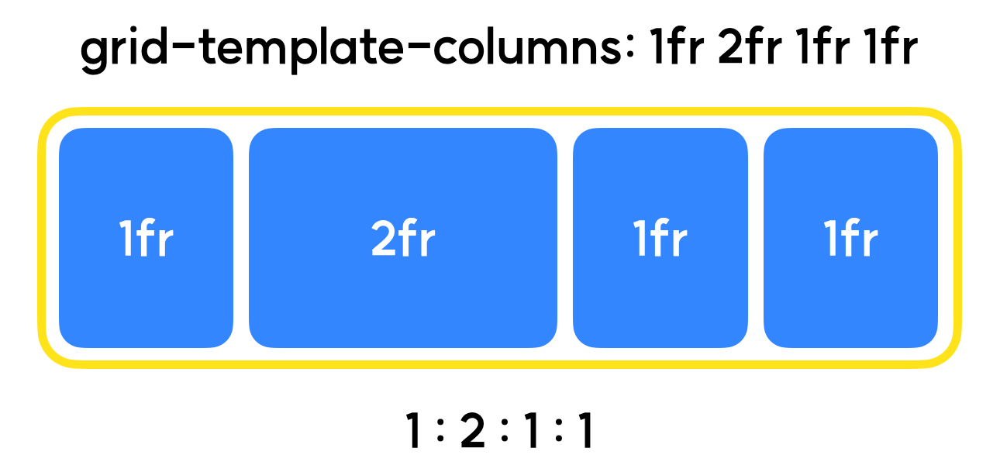

# CSS

## Layout의 변천사

> `Float` ➡️ `Flex` ➡️ `Grid`

* float는 거의 사용되지 X
  * 반응형 웹을 만드는 데 적합하지 않기 때문 
  * 그렇지만 기존에 float로 구현된 코드를 이해하기 위해서 학습을 해야 함 
* flex, grid는 상황에 따라 적절한 것을 사용

<br><br>

## 📌 float 레이아웃

### float

HTML 요소를 일반적인 흐름(normal flow)으로부터 벗어나서 특정한 컨테이너의 좌측 혹은 우측을 감싸는 형태로 강제 배치할 수 있도록 도와주는 속성


- float: none (기본값)
- float: left
- float: right

<br>

### clear

float가 적용된 요소에 추가로 줄 수 있는 속성으로, float의 영향력을 해당 요소에 한해 해제


- clear: none (기본값)
- clear: left
- clear: right
- clear: both 
  - 실무에서 주로 사용

<br>

#### float를 사용했을 때 clear 해주는 방법 

float를 적용하는 css의 마지막에 형제 요소로 clearfix 클래스를 추가하고 `clear: both`를 부여

```css
/* float 적용 부분 */
/* <div class="clearfix"></div> */

.clearfix {
  clear: both;
}
```

<br>

### clear 사용 이유

float는 요소를 배치하기 위해 사용되는 되는 속성  
하지만 float를 사용하게 되면 **브라우저가 높이를 인식하지 못하게 되고** float된 요소가 부모 요소의 높이에 영향을 주지 않기 때문에 clear 해주는 과정이 필요

> 참고 사이트 https://naradesign.github.io/float-clearing.html

<br><br>

## 📌 flex 레이아웃

### flex-container 속성

- display : flex
- flex-direction (배치 방향 설정)
  - `row` (행) : 중심축을 가로 방향으로 배치
  - `column` (열) : 중심축을 세로 방향으로 배치
- justify-content (메인축 방향 정렬) : 메인축은 flex-direction방향과 동일, 메인축 방향으로 어떻게 정렬할지 결정
  - `flex-start`, `flex-end`, `center`, `space-between`, `space-around`, `space-evenly`
- align-items (교차축 방향 정렬) : 교차축 방향, 즉 메인축의 수직 방향으로 어떻게 정렬할지 결정
  - `stretch`, `flex-start`, `flex-end`, `center`
- flex-wrap : item들의 줄바꿈을 허용할 것인지 말 것인지 결정
  - flex-wrap : nowrap (기본값) : 줄바꿈 허용 X
  - flex-wrap : wrap : 줄바꿈 허용
- flex-flow : flex-direction과 flex-wrap을 합친 단축 속성 
  - flex-flow: column wrap 


⚠️ `align-items`는 **flex-items이 한 줄일 때** 우선 적용  
item이 두 줄 이상일 때는 `align-content` 속성 이용

<br>

### flex-item 속성

* `order` : item의 순서를 지정, html의 작성 순서 무시  
* `flex-basis` : item의 기본사이즈를 지정
* `flex-shrink` : 설정된 숫자값에 따라 flex-container 요소 내부에서 flex-item 요소의 크기가 축소
* `flex-grow` : flex-item 요소가, flex-container 요소 내부에서 할당 가능한 공간의 정도를 선언

<br><br>

## 📌 grid 레이아웃

### flex vs grid


* `flex` : 1차원적인 구조 
  * row/column 중 택1 하여 배치 방향을 결정
* `grid` : 2차원적인 구조 
  * row와 column 방향의 배치 방식을 동시에 설정

<br>

## 사용방법

### 1. 요소의 속성을 grid로 변경 `display: grid` 



* `grid-container` : grid가 적용된 요소
* `grid-item` : grid가 적용된 요소의 자식 요소들
* `grid-line` : grid-item 사이의 경계
* `grid-number` : 해당 grid-line이 몇 번째 line인지 의미

<br>

### 2. grid-template

grid의 행/열의 개수 및 크기를 지정

```
/* row는 행의 템플릿을, columns는 열의 템플릿을 지정 */
grid-template-rows : 1fr 2fr 200px
grid-template-columns : 1fr 2fr 200px
```



* `fr` : fraction(분수)의 약자   
grid-template에서 사용할 수 있는 비율 단위  
지정한 비율로 쪼개서 나눔 

#### repeat

grid-template에 `repeat()` 반복 함수 사용 가능   
repeat(a, b)라고 입력하면, b규격의 grid-template을 a개 생성한다는 의미

```
/* 동일 css */
grid-template-columns: repeat(4, 1fr);
grid-template-columns: 1fr 1fr 1fr 1fr;

grid-template-rows: repeat(2, 1fr 200px);
grid-template-rows: 1fr 200px 1fr 200px;
```

<br>

### 3. grid-column & grid-row

`grid-item`에 줄 수 있는 속성  
각각의 grid-item이 열과 행 방향으로 얼마만큼의 영역을 차지할 지 정의  
값으로 **시작점**이 되는 grid-number와 종료지점이 되는 grid-number를 **입력**

* grid-column는 `gird-line`의 번호를 기준으로 영역 할당 
* grid-row는 `grid-number`의 번호를 기준으로 영역 할당

```
grid-column: 1 / 4;
grid-row: 2 / 3;
```

<br><br>

## flex와 grid의 차이점

### flex

* 비교적 작은 단위의 레이아웃 구성에 적합
* 작업 유동성이 높기 때문에, 디자인/기획 변경 가능성이 있는 경우에 적합

### grid

* 큰 규모의 레이아웃 구성에 적합
* 레이아웃 구조가 확실하게 잡혀있는 경우, 효율적으로 반응형 디자인 구현 가능
* ⚠️ 상대적으로 최신 기술이라 지원하지 않는 브라우저 존재
* > https://caniuse.com/
