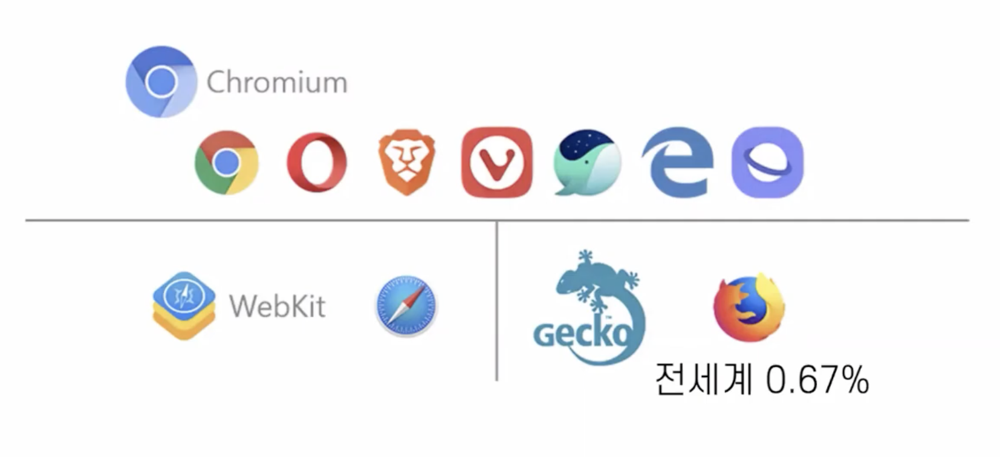
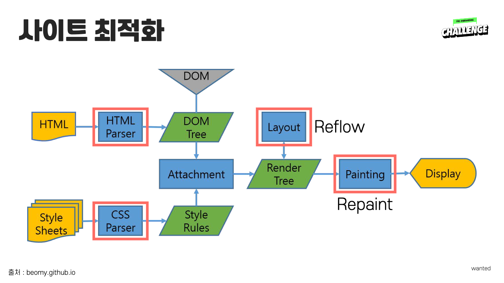

# 반응형 - 데스크탑

## 브라우저 점유율 

> https://gs.statcounter.com/

한국 데이터

### 데스크탑 

크롬 > 엣지 > 웨일 > 사파리 > IE 

### 모바일 & 태블릿

크롬 > 사파리 > 삼성 인터넷 > 웨일 

### 웹킷(WebKit)

내부 엔진이 동일하기 때문에 브라우저 호환성을 고려하는 것이 의미가 없어짐  
브라우저들의 내부 코드는 대부분 웹킷 (모바일은 전부 웹킷) 

> 09년도에는 IE가 거의 100%에 가까운 점유율을 보임 => 현재의 웹킷과 비슷   
> 이후에 어떻게 변할지 모르지만 경계할 필요는 있음 

* chromium과 webkit 모두 웹킷 계열 
* 웹킷은 애플이 개발하고, 구글, 삼성, MS 등이 얼라이언스를 만들어 오픈 소스로 만듦

  

## 사이트 최적화

사이트 최적화는 네모친 4부분에서 가능  

* **리플로우와 리페인트를 줄이는 것이 핵심** -> 웹사이트가 느려지는 이유 
* HTML 태그를 원래 용도로 사용할 것
* CSS 규칙을 어렵게 작성하지 않을 것

 

### 리플로우

* 화면의 레이아웃이 변화했을 때
* DOM 노드 추가/제거, 위치, 박스모델 변경
* CSS 애니메이션, 트랜지션
* 폰트, 텍스트 내용 변경
* 이미지 크기 변경
* offset, scrollTop 등과 같은 계산된 스타일 정보 요청
* 페이지 초기 렌더링
* 윈도우 리사이징

> 전체 선택자 사용을 지양해야 하는 이유   
> 리플로우가 많이 발생하기 때문 

 

### 리페인트

* 화면의 디자인이 변화했을 때
* opacity, background-color, outline 등의 디자인 스타일 관련

 

### 사이트 최적화 방법 - 코드 생성 시 

* 인라인 스타일을 지양
* HTML 구조를 깊게 짜지 않음 
* CSS 선택자를 짧게 사용 - 연산이 많아지기 때문 
* 렌더트리 생성 이후 박스 모델을 변경하지 않음 
* 애니메이션이 있는 요소의 경우 다음을 사용 
  * position: fixed | absolute - 전체 레이아웃의 흐름을 방해하지 않음
  * transform - 리페인트는 되지만 리플로우는 일어나지 않음, GPU에서 계산 
  * opacity
  * will-change 지정
* JS로 스타일을 변경할 때는 `display: none` 으로 숨긴 후 변경, 노출
* JS는 `</body>` 바로 앞에 작성 - JS 에러가 나면 화면이 그려지는 중간에 멈춰버리기 때문

 

### 사이트 최적화 방법 - preload

> `<link rel="preload" as="script" href="preloda.js">`

* 현재 페이지에서 사용할 소스를 미리 로딩하기
* 현재 페이지에서 3초 이내에 반드시 사용되는 리소스에만 사용 
* ⚠️ 남발하면 리퀘스트를 늘리기 때문에 악역향 -> 필요한 소스를 부르는 것이 늦어지기 때문 

 

### 사이트 최적화 방법 - preconnect

> `<link rel="preconnect" href="https://google.com">`

* 현재 페이지에서 사용할 외부 도메인을 브라우저가 미리 준비
* ⚠️ CPU에 부하를 줄 수 있음, https인 경우 더 많은 부하
* 사용자가 10초 이상 보지 않는 짧은 내용의 콘텐츠에는 부적절

 

### 사이트 최적화 방법 - prefetch

> `<link rel="prefetch" href="...">`

* 지금 보는 콘텐츠가 아닌, 사용자가 다음에 볼 콘텐츠에서 필요한 내용을 미리 로딩

 

### 사이트 최적화 방법 - async

> ``

* JS 파일을 병렬 로딩
* html 파싱을 멈추고 JS를 먼저 실행 후 파싱을 이어서 진행 
* ⚠️ DOM에 영향을 주지 않는 JS 파일레 적합 - 제이쿼리, 부트스트랩 등 라이브러리
* ⚠️ 실행 순서를 보장하지 않음 -> JS로 동적 코드 추가하고 값을 false로 추가 (`script.async = false`) 

 

### 사이트 최적화 방법 - defer

> ``

* 병렬 로딩을 하지만 html 파싱이 끝난 후에 실행
* `</body>` 앞에 코드를 넣은 것과 같음 
* head 영역 안에 js 관련 코드를 넣어야 하는 경우 유용 
* JS 파일 용량이 크거나, 파싱 후 바로 실행시켜야 하는 경우에 사용

 

### 사이트 최적화 방법 - 이미지 최적화

> ``

* 🚨 반드시 최적화 과정을 거칠 것 - 90%가 거의 이미지 때문에 느려짐
* 이미지 파일을 주고 받는 횟수도 줄일 것
* 아이콘 10개 보다 아이콘을 모아둔 이미지 1개의 용량이 작음
* 💡 이미지 스프라이트 기법 
  * 이미지 용량 ⬇️, 이미지 갯수 ⬇️ ️
  * background-position, background-size를 이용
  * 개발자가 직접 만드는 것이 좋음
  * 비트맵 파일에서 사용
  * 규칙을 가지고 작업하는 것이 중요 (Ex. 60px 단위로 띄우기 등)

 

### 브라우저 테스트

> 안 좋은 상황에서의 체크를 꼭 하자 

개발자 도구 > 네트워크

* 느린 3G
* 캐시 사용 중지
* 해외 서비스 개발 시 필수로 확인할 것

  

## 웹사이트 접근성 측면 고려사항

* hover 처리
  * 밑줄을 쳐주는 것이 가장 확실(링크)
  * 흐리게 처리하는 것(이것만 사용하지는 말 것) + 밑줄
* min-width: 320px 고정할 것
* 버튼에 round 표시 줄 것(디자이너가 안 좋아하는 경우가 있지만)
