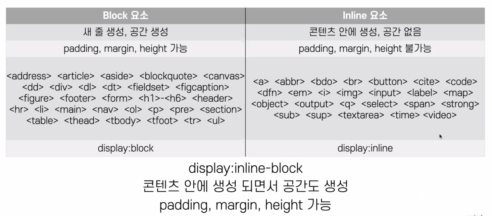

# 반응형 - 모바일

## 모바일 퍼스트

* 데스크탑 부터 작업하면 오버라이딩이 많이 발생 
  * 이미 그려놓은 화면을 다시 그려야하는 문제
* 복잡한 구조를 줄이기보다, 단순한 구조를 늘리는 것이 쉬움
  * 점점 확장시키는 것이 나음 

```html
<meta name="viewport" content="width=device-width" >
```

### 뷰포트

모바일 브라우저가 웹페이지를 어떻게 렌더링해야 하는지 설정

### width

렌더링 영역 크기를 설정, 보통은 device-width로 설정   
특별한 경우가 아니면 수치로 설정할 필요는 없음

### initial-scale

웹페이지가 처음 로딩될 때 줌 레벨 제어

<br><br>

## 웹표준

WWW와 관련된 기술의 표준 문법을 지키는 웹개발 기법

HTML, CSS, JS의 표준 문법을 지켜서 코드를 작성    
웹접근성과 함께 사용되는 경우가 많지만 **서로 다른 개념**    
💡 웹표준만 잘 지켜도 웹접근성 90% 정도는 지켜짐   

시멘틱 태그 사용 중요

<br><br>

## 화면 설계

영역을 나누는 것이 매우 중요

기본적으로 `헤더/콘텐츠/푸터` 로 나눔 

### 헤더

일반적으로는 fixed 사용 

<br><br>

## Reset css

* 코드를 작성하면서 필요한 부분만 구성해서 사용하는 것을 추천
* 전체 선택자(*) 사용하지 말 것 -> 필요한 곳에 영향주기 때문
* Reset CSS를 사용하려면 왜 리셋했는지를 알고 사용해야 함
* 아무것도 하지 않을 때 가장 성능이 좋고 빠름

<br><br>

## CSS

### inline, block 요소 



<br>

### 반응형 상대 단위 

* font-size : 62.5% -> 10px (rem을 사용하겠다는 의미)
  * 사용자의 OS 설정에 맞추기 위한 것 

<br>

### 브라우저 개발자 도구

* 사용자 에이전트 스타일시트 : 브라우저에서 기본적으로 적용하는 고유 속성 

<br>

### 클래스명

* 클래스명 : 스네이크 케이스(한번에 선택 가능, '-'의 경우 한번에 선택 불가)
* 아이디명 : 카멜 케이스
* 클래스명 규칙을 정해서 사용(코딩 컨벤션, 스니펫) : .btn, .list, .box, .gnb 등

**⚠️ ID명으로는 스타일링 하지 않음**  
css는 오류가 나도 화면이 멈추진 않지만, js는 화면이 멈춤  
id는 JS를 이용할 때 사용

> !important는 최대한 쓰지 말것    
> id는 css의 우선순위에서 상위를 차지 -> 최후의 보루  
> display:none 등의 경우만 씀  

<br>

### layout 

* float & position : 내가 움직일 요소에서 제어
* flex & grid : 부모 요소에서 제어함

<br>

### CSS Function

* var
* calc : 값 계산할 때
* max
* min
* clamp
* env : 노치를 조절할 때 사용

<br><br>

## 디버깅

JS 작업에서의 디버깅은 실제 기기에서 하는게 확실 

### 안드로이드 기기 디버깅

실제 기기에서 테스트하는 방법
안드이드에 보이는 것이 미러링되면서 컴퓨터에서 제어 가능 

* 안드로이드 기기에 개발자 옵션 활성화
  * 기기 설정에서 빌드번호를 빠르기 7번 터치
* 기기의 개발자 옵션에서 USB 디버깅 활성화
* 안드로이드 기기와 랩탑 USB 연결
  * 무선도 가능
* chrome://inspect 입력 
* 맥북과 안드로이드 기기 연결 가능 

<br>

### iOS/iPadOS 기기 디버깅

* 사파리 설정에서 개발자 기능 보기 설정
* 아이폰 - 설정 - 사파리 - 고급 - 웹 인스펙터
* Mac 기기와 아이폰 연결 
  * 팝업에서 신뢰 선택 
* Mac 사파리 메뉴 - 개발자용 연결된 기기 확인
* 화면 미러링은 불가
* Mac이랑만 연결 가능
* 윈도우에서 이용하려면 inspect.dev 사이트에서 사용 가능

<br>

### 맥북 시뮬레이터

* 개발자용 도구 - 다음으로 페이지 열기 - 시뮬레이터 사용 가능  

<br>

