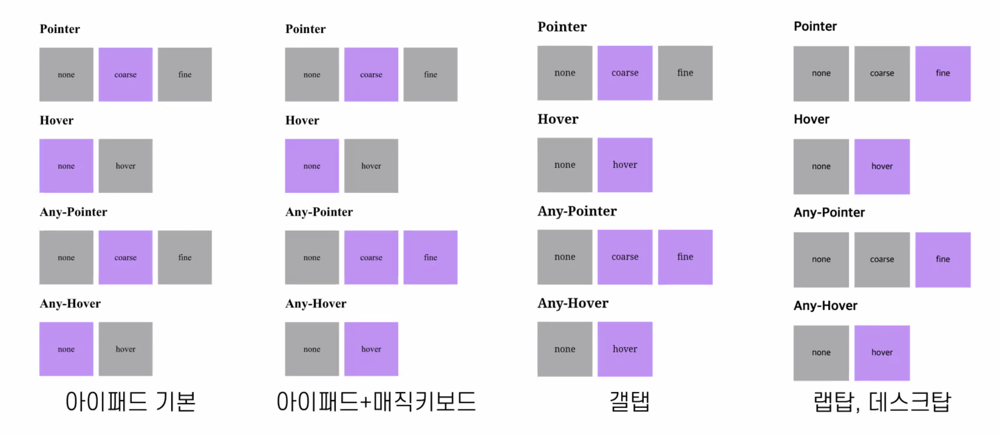

# 반응형 - 태블릿

## 미디어쿼리

### 기본

* @media only screen and (min-width: 320px) { }
  * 스크린 형태에만 적용 
  * 0 ~ 319px 적용 안함
  * 320px 부터 적용, 확장 개념  

* @media only screen and (min-width: 320px) { }
  * 스크린 형태에만 적용
  * 0 ~ 320px 까지 적용, 축소 개념 
  * 321px 부터 적용 안함 

### min & max 

min과 max를 정확히 알아야 함

* `min` : ~부터
* `max` : ~까지

<br>

### 모바일 퍼스트 

```css
/*모바일*/

@media (min-width: 768px){
  /*태블릿*/
}

@media (min-width: 1024px){
  /*랩탑/데스크탑*/
}
```

모바일에서 잘 구현이 되면 다른 기기 사이즈 작업을 할 때 수월  

<br>

### 데스크탑 퍼스트

```css
/*랩탑/데스크탑*/

@media (max-width: 1023px){
  /*태블릿*/
}

@media (max-width: 639px){
  /*모바일*/
}
```

<br>

### 미디어쿼리 활용

* 고해상도 디스플레이가 아닌 경우 : `-webkit-max-device-pixel-ratio: 1` 
* 기기 세로인 경우 : `orientation: portrait`
* 기기 가로인 경우 : `orientation: landscape`
  * 기기가 세로 고정인 경우도 있으니 테스트할 때 체크 
* 입력 방법이 hover를 지원하지 않는 경우, 오직 터치스크린 : `any-hover: none`

<br>



* Pointer
  * fine : 정확하게 컨트롤할 수 있음
  * coarse : 대략적으로 컨트롤할 수 있음

<br>

### 태블릿 구간 설정

```css
@media (min-width: 768px) { }
```

* 일반적으로 768px부터 적용 (아이패드 세로 사이즈 기준) 
* 0 ~ 767px 까지는 모바일, 768px 부터 태블릿 
* 768px와 스마트폰 가로 사이즈 중복 구간 발생 
* 정확히 태블릿에만 적용하려면 다른 조건을 추가해야함 

#### 아이패드 

⚠️ 1px만 다르게 해도 가로에서만 작동하게 되는 경우도 있으니 주의

```css
@media (min-width: 768px) and (max-width: 1024px) {
  /*아이패드 가로 & 세로*/
}

@media (min-width: 768px) and (max-width: 1023px) {
  /*아이패드 가로*/
}
```

<br>

### :root

:root는 전체적으로 스타일을 지정해주기 위한 가상 클래스

* 전역 변수 영역을 선언할 수 있음 
* 변수명은 `-- + 변수명`의 형태로 선언

<br>

### 터치 영역 고려

텍스트나 아이콘이 작다고 해서, 클릭 영역을 그렇게 잡으면 안 됨    
충분히 클릭할 수 있도록 넉넉하게 구현해야 함    
기획/디자인에서 언급되지 않았더라도 알아서 고려해야 사용성 높은 페이지를 만들 수 있음    

<br>

### 햄버거 버튼 만들기

CSS만으로 가능

1. span 태그로 선을 3개 만들기
2. position: absolute로 가운데 정렬
3. margin top, button으로 위아래 값 적용
4. 클릭 시 X로 만들려면 span을 없애기
5. after와 before만 transition을 이용해 X로 변경 - 리페인트만 일어나서 성능 이슈는 크지 않음 

<br>

### 이미지 처리 

정보로서 가치가 있으면 이미지 태그,
단순 디자인 용도이면 CSS 백그라운드로 처리 

<br>

### order 속성

반응형 디자인의 콘텐츠 순서가 달라지는 경우, order를 이용해 조절할 수 있음 

* html 코드가 우선이며 먼저 오고, order 속성은 디자인적으로 활용 
* footer 등에서 이용하기 좋음 

<br>

### gird

* [grid-area](https://developer.mozilla.org/en-US/docs/Web/CSS/grid-area) 

> 그리드 게임 : https://cssgridgarden.com/#ko

<br>

### 애니메이션 처리

will-change 속성

애니메이션 바꿀 요소에 미리 will-change 속성 처리를 하면,
좀 더 부드럽게 애니메이션을 처리할 수 있음  
GPU에 관련 내용을 미리 올려놓는(할당) 것    

* ⚠️ 애니메이션 처리할 속성에만 적용할 것 
* 재생이 길거나 중요한 애니메이션에만 사용
