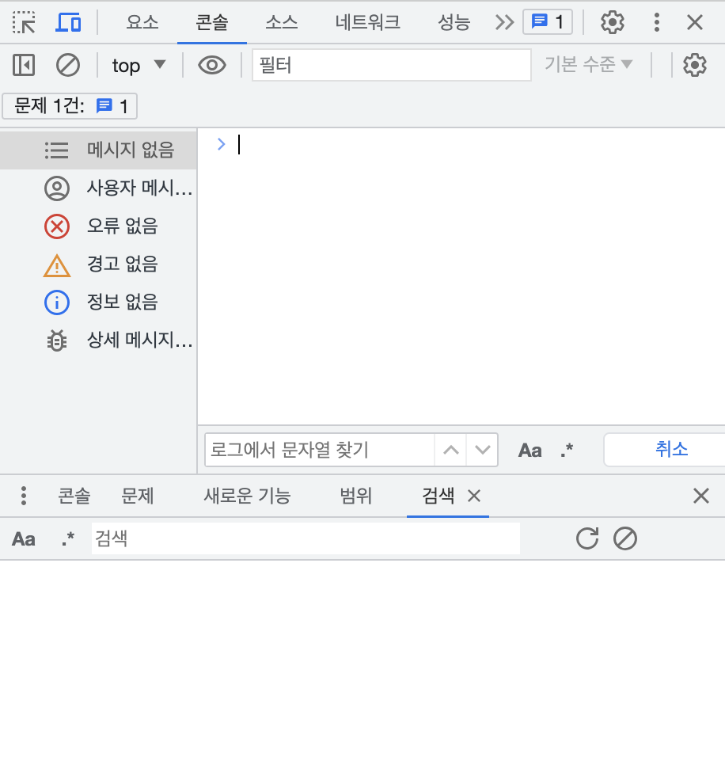
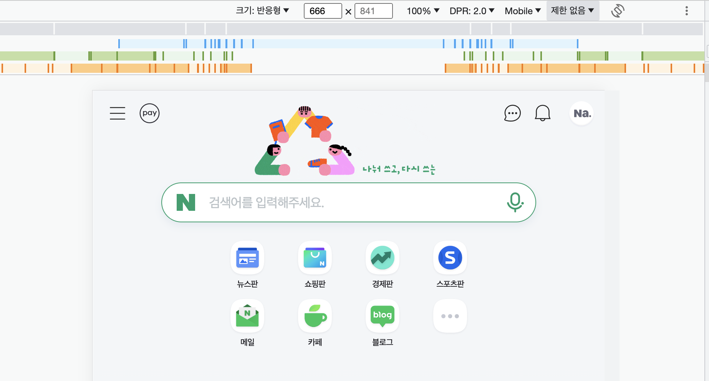
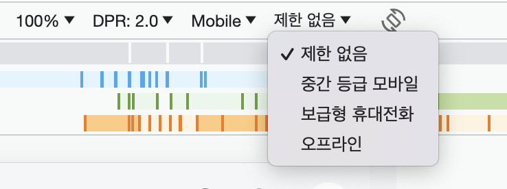

# 반응형 웹사이트

## 반응형 

기기의 화면 크기에 맞춰 **자동으로** 레이아웃 및 콘텐츠를 구성하는 개발 방법

⚠️ 반응형이라고 해서 px을 사용하지 않는 것은 아님  
px과 %만을 이용해서도 반응형 사이트 구현 가능  

### 접근성

접근성 공부는 한국웹접근성 사이트의 문서를 볼 것

> 한국웹접근성 : https://www.wa.or.kr/

### 반응형 관련 사이트

> https://mediaqueriestest.com/  
> https://browserleaks.com/  
> 미디어쿼리 만들어주는 사이트 : https://giona.net/tools/css3-mediaquery-generator/  

  

## 비트맵과 벡터

### 비트맵

* 점(픽셀)을 모아 그래픽을 만듦
* 확대 시 깨짐
* 용량 큼
* 복잡한 이미지 표현 가능 
* jpg, png, gif, bmp, webp

 

### 벡터

* 좌표를 계산해서 그래픽을 만듦
* 확대 시 깨지지 않음
* 용량 작음
* 복잡한 이미지 표현 어려움 
* ai, svg, eps, pdf

⚠️ 아이콘은 무조건 svg 라는 공식은 없음, 상황에 맞게 판단해야 함

  

## 해상도와 밀도

실제 기기의 디스플레이 픽셀과 CSS에서 인식하는 픽셀이 다름 

DPR(Device-pixel-ratio)  
제곱으로 계산 3 => 3*3  
높을수록 선명함

* DPR1 : 초등학교 시절 컴퓨터 모니터
* DPR2 : 맥북
* DPR3 : 서피스

 

### DPR(Device-pixel-ratio)

CSS 미디어쿼리에서 DPR을 구분하는 값 

> https://screensiz.es/phone  
> https://blisk.io/devices  
> 본인 기기의 현황 : https://www.mydevice.io

  

## 개발자 도구

### 검색 

* 커맨드 F : 코드에서 검색
* 커맨드 옵션 F : 전체에서 검색

 

### 반응형 기능

* 회전 : 가로 모드도 테스트 필수 
* 미디어쿼리 표시 : 어느 구간에서 바뀌는지 표시됨 

모바일 작업은 **기준 디바이스 사이즈**가 꼭 있어야함  
기준은 현재보다 2-3년 전 기종으로 정할 것 

 

### 네트워크 속도 제한

해외 서비스 작업시 필수    
네트워크 탭에 있는 것과 같은 역할

* 제한 없음
* 중간 등급 모바일

  

## 디자인 툴 사용

💡 아이콘, 이미지 등의 사이즈 확인 -> 2배수로 저장  
💡 뷰포트 사이트의 2배일 때 ->  최적화 과정 거쳐야 함 (용량 줄이기) 

디자인 툴에서 추출한 파일을 2배수 등 파일 크기를 크게해서 사용  
그러면 파일의 크기가 커지는데, compress 프로그램 등을 통해 이미지 용량을 줄일 것

 

### 2배수로 저장

레티나(retina) : 5배 선명한 고해상도 LCD

2배수로 저장해야 고해상도에서 깨지지 않음      
svg는 확대해도 깨지지 않아서 괜찮음    

Ex. 모바일에서 retina 기준으로 width 750px일 때 나누기 2해서 처리하면 됨     
이미지는 retina 기준이므로 그대로 사용해도 됨

피시버전은 레티나에 맞춰 고해상도로 작업해야 함 -> 2배 사이즈 이용 및 이미지 최적화

 

### 이미지 사이즈  

피그마는 아이콘 2배로 키워서 저장하고 원본 이미지 받아야함    
2배 사이즈로 되어있으면 그 이미지 그대로 쓰고, 수치는 2분의 1로 나눠서 쓰면 됨   

svg파일은 상관없고 픽셀로 이루어진 파일들은 2배, 3배로 저장
