# Git Book

## gitbook 가입 및 연동하기 

### 1. 깃허브로 회원가입

> https://www.gitbook.com/

  

### 2. gitbook과 연동시킬 새로운 repository 생성

깃허브에서 새로운 저장소 만들기

  

### 3. GitBook 앱 페이지 상단 오른쪽 메뉴에서 Synchronize with Git 선택

> https://docs.gitbook.com/getting-started/git-sync/enabling-github-sync

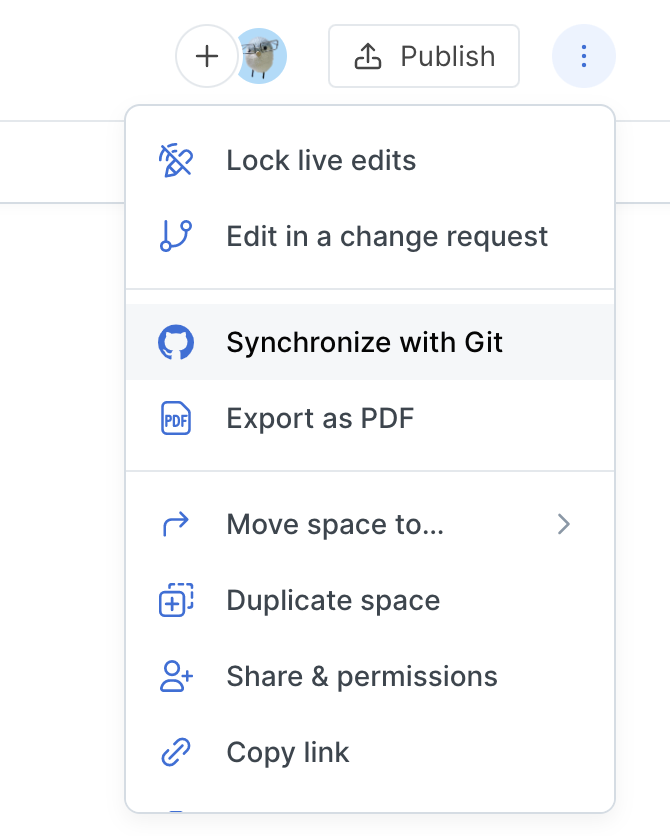

  

### 4. provider 및 Configuration 설정

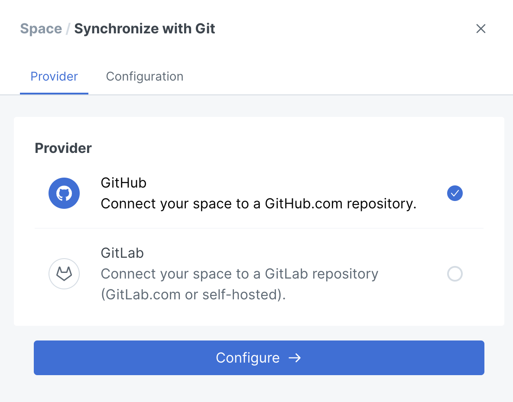

* github

 

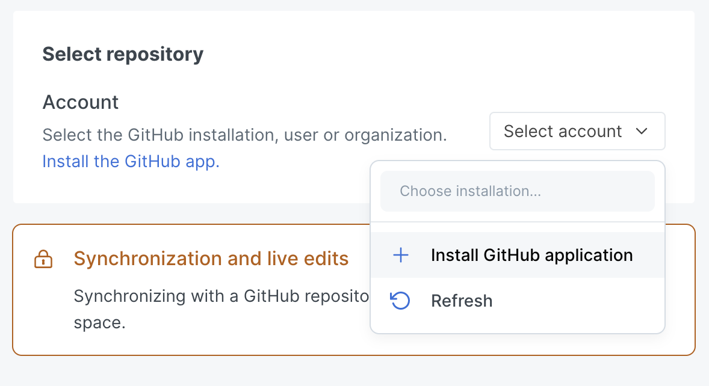

* Install GitHub application

 

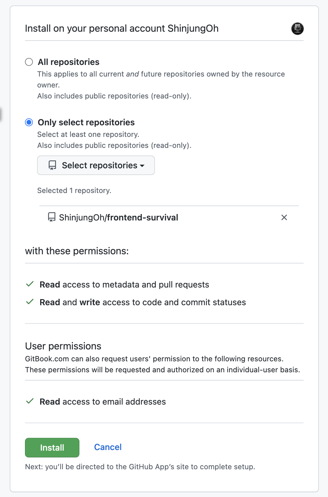

* 특정 repository 옵션 선택 후 연동하려는 저장소 선택

 

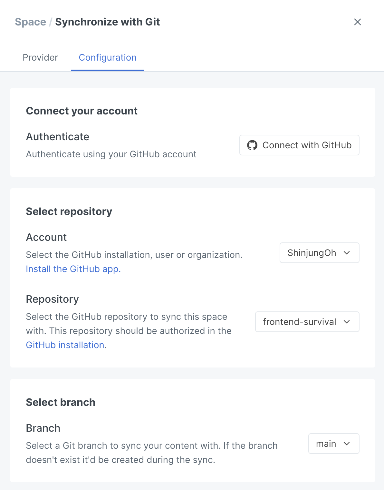

* 💡 main branch로 설정하는 것을 권장

 

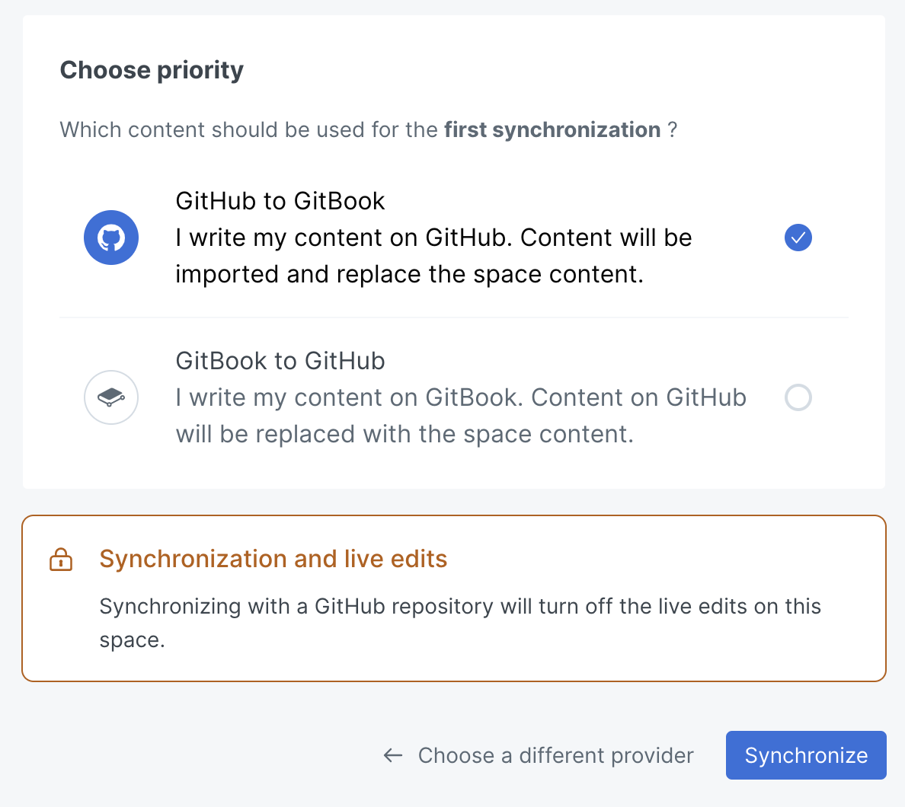

* GitHub to GitBook 옵션 선택 
* GitBook에서의 변경은 GitHub에서 commit으로 동기화됨
* GitHub에서의 변경은 GitBook에서 history commit으로 동기화됨

  

## 문서 작성하기

### 1. GitBook 에디터에서 수정하기

GitBook 앱 페이지 상단 오른 쪽 `Edit` 버튼을 눌러 문서 수정  
수정 후 `Merge` 버튼을 누르면 연동된 repository에 변경사항 commit이 추가

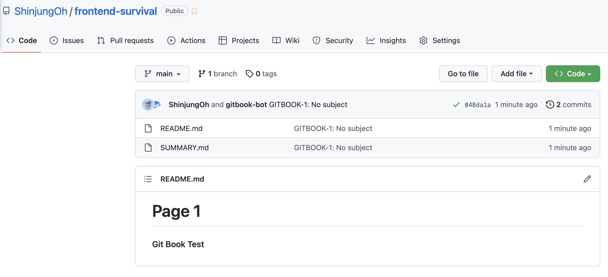

  

### 2. repository에서 Pull Request를 날려 수정하기 (권장)

GitBook과 연결된 repository에서 브랜치를 딴 후 작업 진행  
작업 완료 후 커밋, 푸시 -> PR 등록하기

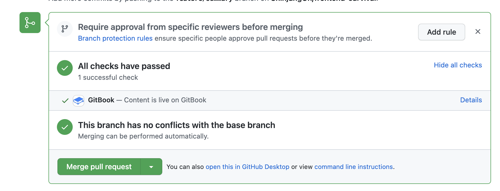

> https://docs.gitbook.com/getting-started/git-sync/github-pull-request-preview

* ⚠️ PR의 base branch가 GitBook과 연동했던 branch으로 되어 있는지 확인
* merge하기 전 변경 내용 미리 확인 가능
* Pull Request를 merge하면 GitBook의 내용이 동기화됨 

  

### 📌 SUMMARY.md 파일은 목차로 반영

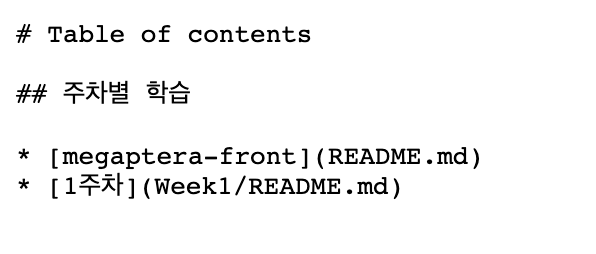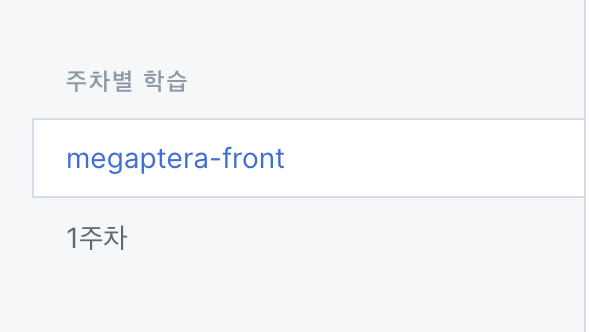

  

## GitBook 내보내기

### 🔗 Public 버튼을 클릭해 링크 생성 

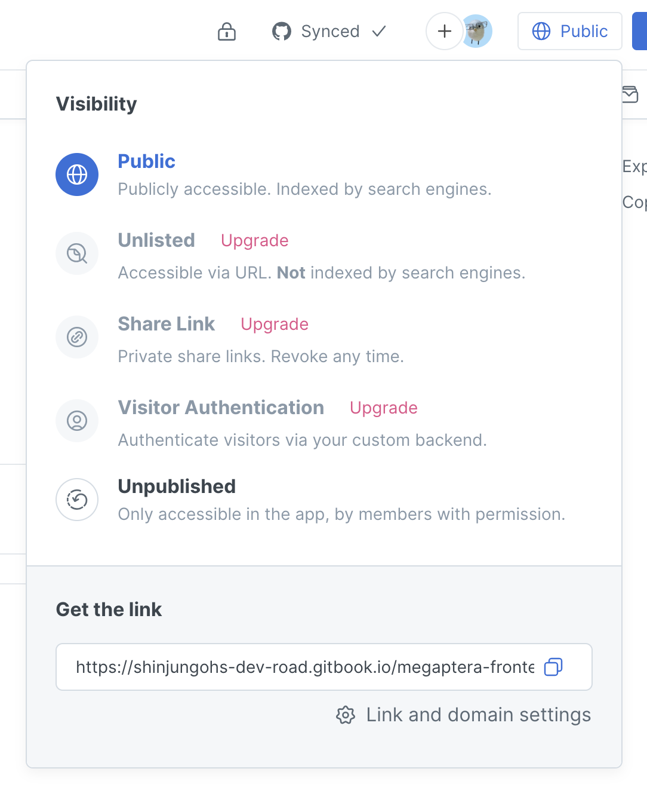

