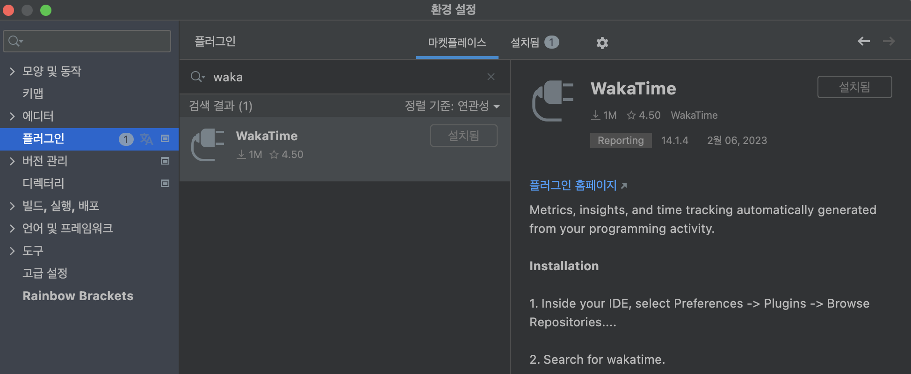

# WakaTime 

## 설치 및 에디터 연동

### 1. GitHub 아이디로 가입

> https://wakatime.com

  

### 2. 에디터에서 플러그인 설치

Preference > Plugins > MarketPlace

  

### 3. WakaTime 설치 후 재시작

  

### 4. API Key 등록 

* wakatime 홈페이지에서 API Key 확인

  

### 5. 에디터에서 작업 진행 후 연동 확인  

  

### 6. 대시보드 조회  

