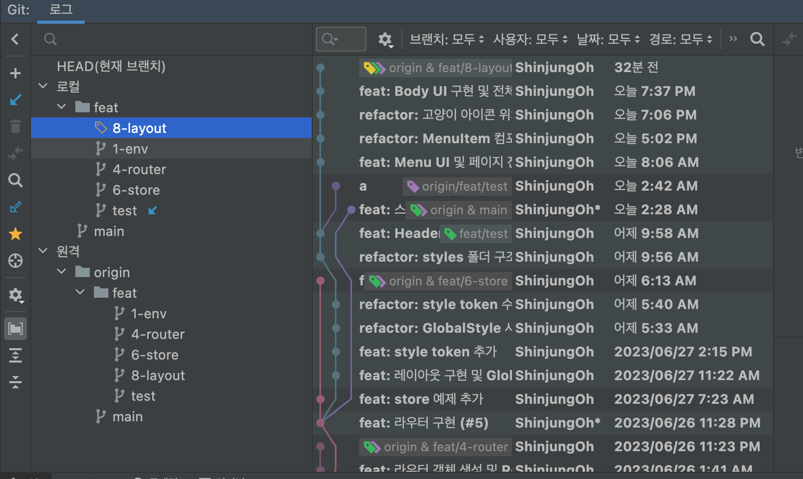
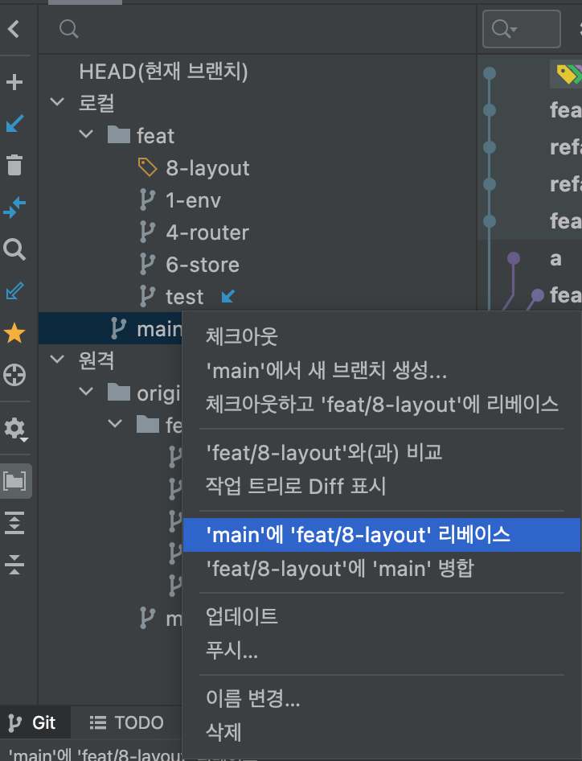
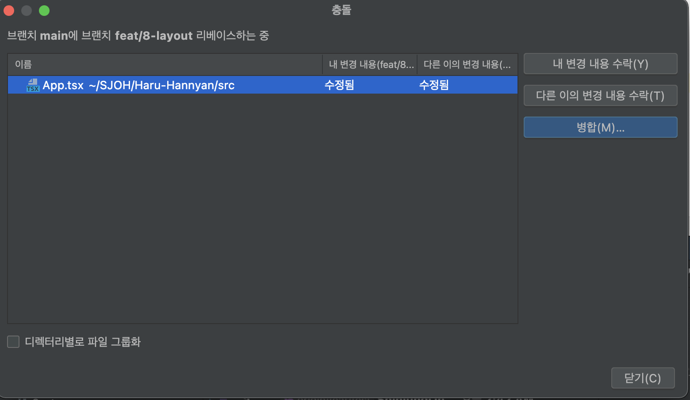
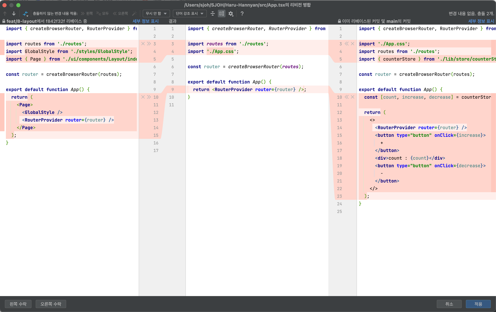
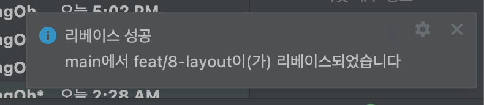
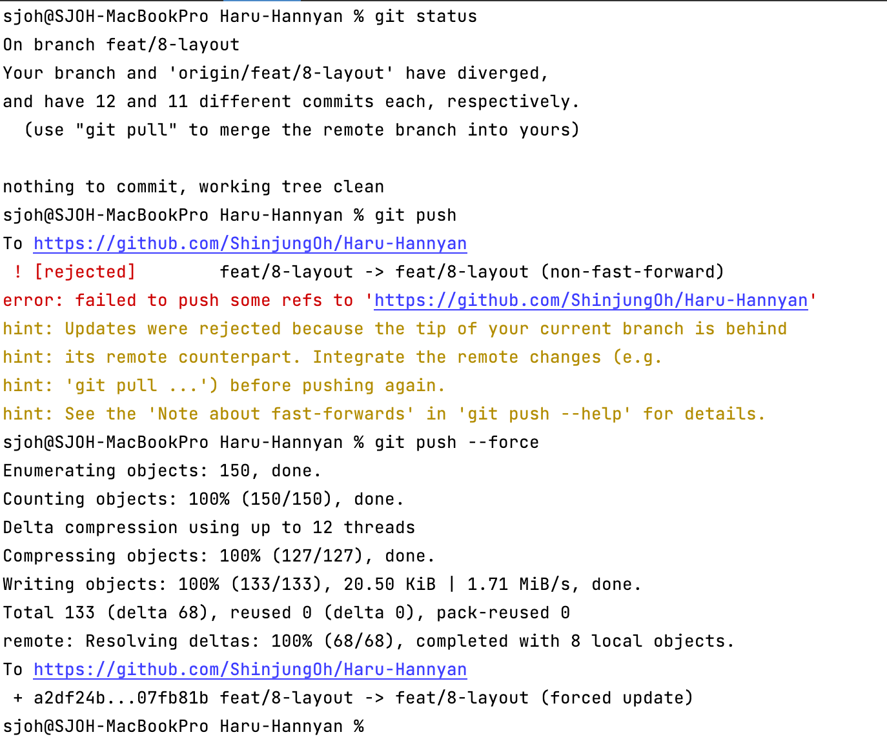

# Rebase

## WebStorm에서 rebase하기

기존의 머지된 브랜치 내용과 현재 작업 중인 브랜치에서 push한 내용이 충돌을 일으키는 경우, rebase를 이용하게 됨  
CLI 명령어가 아닌 IDE에서 리베이스 하는 방법 

  

## rebase 사용 방법

### 1. IDE 하단의 `Git`을 클릭해 현재 브랜치 확인

* 스크린샷의 경우 현재 브랜치 `feat/8-layout`

 

### 2. rebase하려는 브랜치 우클릭

* `rebase` 항목 클릭

 

### 3. 병합(merge) 클릭 

 

### 4. conflict 내용 확인 

* 한쪽의 내용으로 바꾸고 싶을 때는 하단의 `왼쪽 수락` 또는 `오른쪽 수락` 클릭
* 일부분씩 반영하고 싶을 경우에는 블록 처리된 코드에서 `>>`, `<<` 클릭

 

### 5. 변경 내용 반영 후 적용

* `변경 내용을 적용하고 해결됨으로 표시` 클릭

 

### 6. rebase 확인 

 

### 7. 해당 내용 `git push --force`

* 🚨 이 단계에서 `git pull` 금지
* `git push`의 경우 오류 발생

