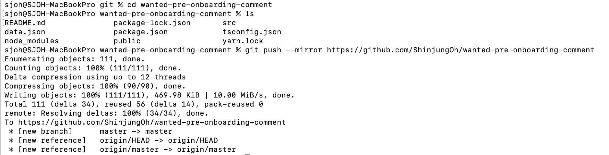

# Git

## fork repository 잔디

fork해온 레파지토리에서 작업한 내용은 개인 github에 잔디가 찍히지 않음  
잔디가 찍히도록 repo 설정 하는 방법

  

## 사용 방법 

1️⃣ github에서 새로운 레파지토리 생성

2️⃣ 복사하고 싶은 레파지토리를 bare clone  
`git clone --bare 복사하고 싶은 레파지토리 주소`

3️⃣ 새로운 레파지토리로 Mirror-push  
`cd 새로운 레파지토리`   
`git push --mirror 새로운 레파지토리 주소`

4️⃣ 처음에 임시로 생성한 local 레파지토리 삭제

  

## 예시 

  

## 참고 사이트

> https://soranhan.tistory.com/11  
