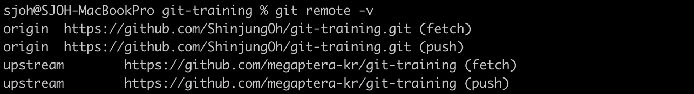
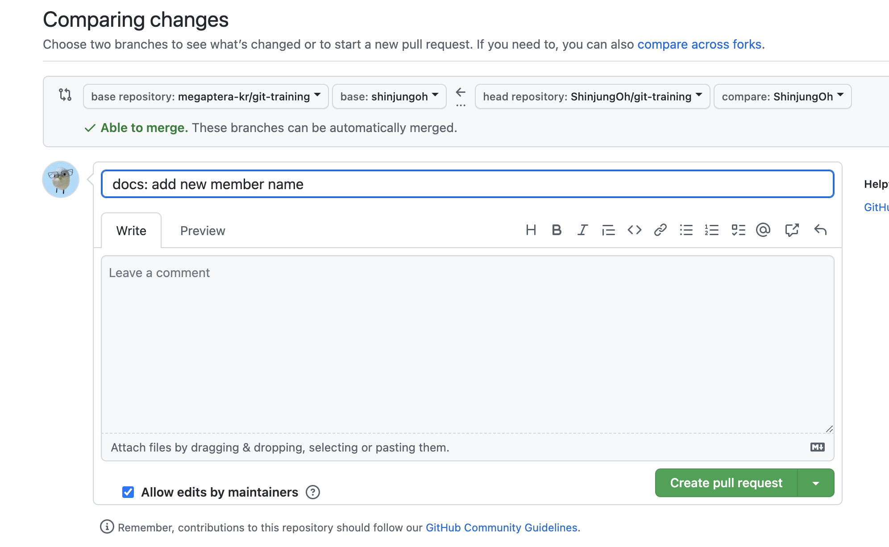

# git fork

## 🍴 fork 및 세팅 

### 1. 원본이 될 저장소에서 fork를 진행  

[👉 git fork하는 법](https://github.com/ShinjungOh/TIL/blob/main/Git/git%20fork.md)  

개인 레파지토리의 주소를 복사해서 로컬에 클론 

```
git clone <fork한 개인 repository 주소>
```

<br>

### 2. PR 보낼 저장소 주소를 upstream이라는 이름으로 추가

```
// 생성된 폴더로 이동
cd 생성된 폴더


// upstream 원격 저장소 추가
git remote add upstream <PR 보낼 원본 repository 주소>
```

<br>

### 3. upstream 원격 저장소들이 잘 추가되었는지 확인

```
// 원격 저장소 확인
git remote -v


// 결과 예시 
origin      https://github.com/ShinjungOh/git-training.git (fetch)
origin      https://github.com/ShinjungOh/git-training.git (push)
upstream         https://github.com/megaptera-kr/git-training (fetch)
upstream         https://github.com/megaptera-kr/git-training (push)
```



<br>

### 4. upstream 원격 저장소의 최신 상태를 반영

```
git fetch upstream

git rebase upstream/main
```

<br>

### 5. 새 브랜치를 생성 후 작업 진행

```
git branch --all : 서버에 있는 브랜치 포함 모든 브랜치 보기
git switch -C new-branch : 새로운 브랜치 만들기 + 이동
git checkout -b new-branch : 새로운 브랜치 만들기 + 이동 (switch와 동일)
```

<br>

### 6. 작업 완료 후 add, commit

<br>

### 7. origin 원격 저장소에 작업 브랜치 push

```
git push origin <작업했던 내 브랜치 이름>
```

* 브랜치를 업로드하면서 커밋 내용도 push

<br><br>

## 📤 원본 저장소에 PR 요청하기

### 8. 원본 저장소에서 Compare & pull request 버튼 클릭

<br>

### 9. PR 등록하기  



⚠️ `base` repository의 main에 PR 요청을 보내는 것이 아님  
⚠️ 이미 생성되어 있는 `본인의 브랜치`에 보내야 함
