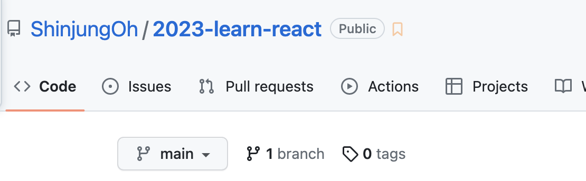

# git fork

## 브랜치 대소문자 구분하기

### 1. 깃허브 repository 메인에서 branch 버튼 클릭   



<br>

### 2. New branch 버튼 클릭 후 브랜치 생성


<br>

### 3. 대소문자 구분된 브랜치 생성 


<br><br>

## 원본 저장소에 브랜치 push하기

### ⚠️ 특정 브랜치가 이미 만들어져 있는 경우 


<br>

### 해당 브랜치로 이동하면 `upstream/ShinjungOh`라고 표기됨  


<br>

### 작업 완료 후 push할 경우 오류 발생 


`403 Forbidden`  
서버가 클라이언트의 접근을 거부할 때 반환하는 오류 코드  
🚨 권한이 없는 원본 repo 저장소에 직접 push하는 것으로 명령을 받아들였기 때문  

<br>

### 해결 방법 : origin 원격 저장소에 작업 브랜치 push

```
git push origin <작업했던 내 브랜치 이름>
```

* 브랜치를 업로드하면서 커밋 내용도 push


