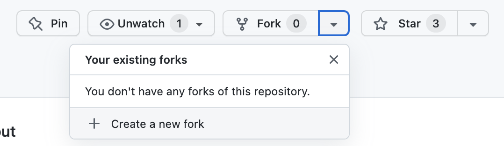
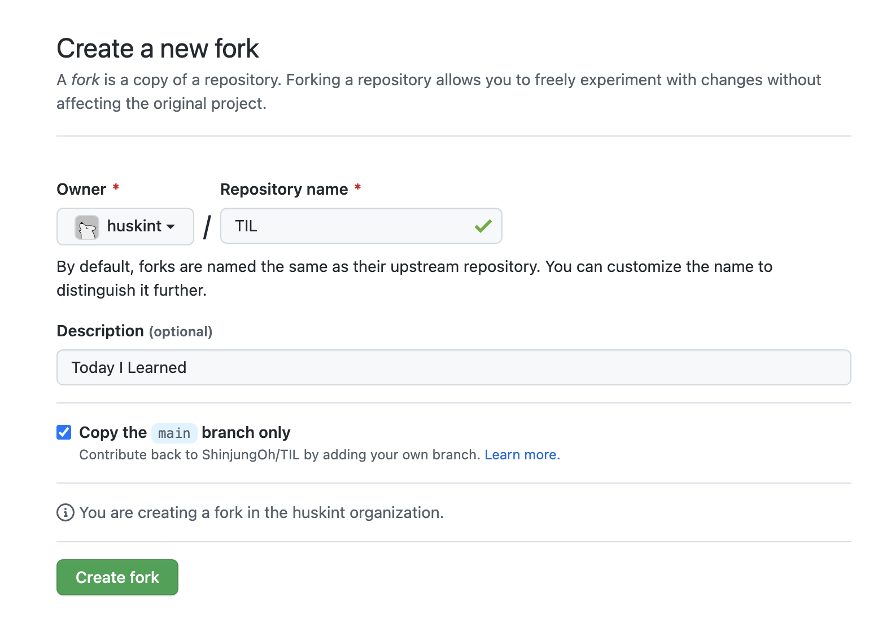

# Git

## git fork

다른 사람의 레포지토리에서 어떤 부분을 수정하거나 추가하고 싶을 때 `해당 레포지토리를 내 깃허브로 복제`하는 기능   
fork한 저장소는 원본 레포지토리와 연결되어 있어서, 원본 레포지토리에 변화가 생기면(새로운 commit 등) 포크 해온 레포지토리에 반영 가능   
이 때 fetch나 rebase의 과정이 필요  

  

## clone vs fork

### clone

* 기존의 원본 저장소와 연결되지 않음 
* 레포지토리의 커밋 등 로그를 보지 못함

### fork

* 원본 저장소에 변경 사항을 적용하고 싶으면 해당 저장소에 pull request 해야함
* PR이 원본 저장소의 관리자에게 승인받으면 코드가 commit, merge되어 original에 반영

  

## fork 사용 방법

1️⃣ fork 하고 싶은 레포지토리에서 `+ Create a new fork` 클릭

 

2️⃣ Owner와 이름 등을 설정하고 새로운 fork 만들기

 

3️⃣ fork 해서 새로 생성된 개인 레포지토리의 주소를 복사해서 로컬에 클론 `git clone repo주소`

  

## 참고 사이트

> https://pers0n4.io/github-remote-repository-and-upstream/  
> https://velog.io/@manyyeon/Github-fork%ED%95%B4%EC%84%9C-%EC%9E%91%EC%97%85%ED%95%98%EA%B8%B0  
> https://velog.io/@imacoolgirlyo/Git-fork%EC%99%80-clone-%EC%9D%98-%EC%B0%A8%EC%9D%B4%EC%A0%90-5sjuhwfzgp
