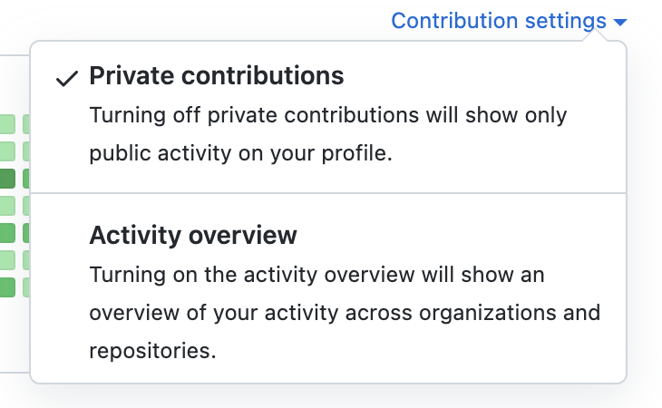
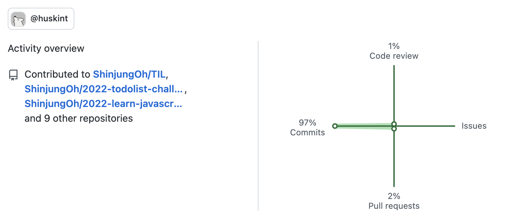

# github 잔디

## github private repository 잔디 표시

잔디 오른쪽 위의 Contribution settings 클릭 

* `Private contributions` 
  * 다른 사람에게 private repository의 commit 잔디를 표시
  * private contribution에 대한 내용은 표시되지 않음

  

## github activity UI 표시

* `Activity overview`
  * 속해있는 organization에 대한 contribution, commit, code review, issue, pull request 등 기록 표시

