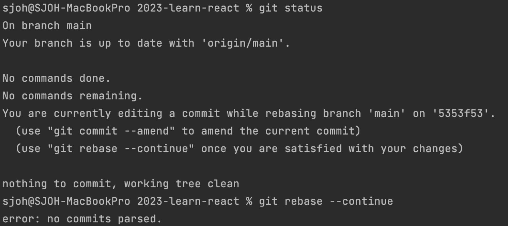

# Git

## 사용할 수 있는 상황

`git rebase`를 통해 깃허브에 업로드된 커밋을 수정하려고 했을 때 

```
git rebase -i HEAD~n

리눅스 vi 에디터에 명령어 입력
i → r → esc / :wq!
```

### 작업을 제대로 끝내지 않았을 경우



* 이미지의 상황에서는 `git rebase --abort` 사용 

<br><br>

## 해결 방법

### 다른 커밋과 충돌이 발생할 경우   

충돌 부분을 수정한 후 `add`

```
git rebase --continue
```

커밋은 필요 없으므로 실행하지 않음  

### 도중에 rebase 작업을 중지할 경우  

```
git rebase --abort
```

### 커밋을 완전히 건너뛰고 싶은 경우 

```
git rebase --skip
``` 
