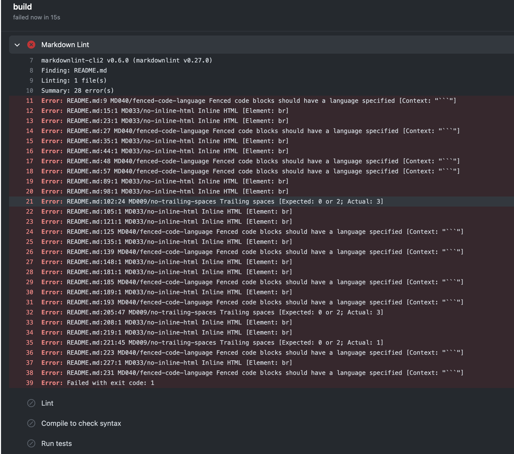
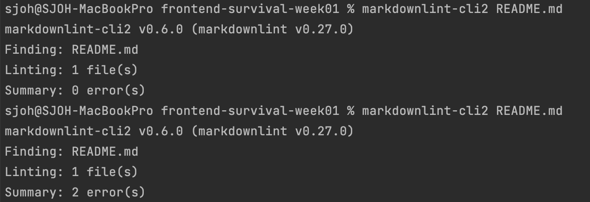

# CI

## markdownlint-cli2

CI 과정에서 markdown lint 에러로 통과하지 못하는 경우에 유용 

[markdownlint-cli2](https://www.npmjs.com/package/markdownlint-cli2)

### Github Actions CI Markdown Lint 에러 예시 



<br><br>

## 설치 방법 

```
npm install markdownlint-cli2 --global
```

### EACCES: permission denied 오류가 발생하는 경우

```
sudo npm install markdownlint-cli2 --global
```

* 비밀번호 입력 필요

<br><br>

## 테스트 방법

`markdownlint-cli2` 뒤에 원하는 파일명을 입력 

```
markdownlint-cli2 파일명.md
```




