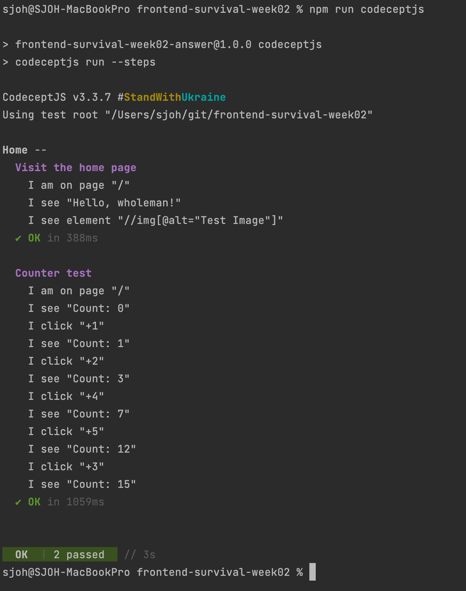

# CodeceptJS

## E2E 테스트

[CodeceptJS](https://codecept.io/)

BDD 스타일 구문을 사용하는 최신 End 2 End 테스트 프레임워크  
테스트는 사이트에서 사용자 작업의 선형 시나리오로 작성됨

* 테스트는 `ECMAScript 7`로 작성되어야 함
* 브라우저를 띄우고 자동으로 테스트 진행

### 예시

* npm start 후 진행



<br><br>

## 사용 방법

### 실행

```bash
# 개발용 서버 실행
$ npm start

# E2E 테스트 실행
$ npm run codeceptjs
```

### package.json

```
"scripts": {
    "codeceptjs": "codeceptjs run --steps",
    "codeceptjs:headless": "HEADLESS=true codeceptjs run --steps",
    "codeceptjs:ui": "codecept-ui --app",
    "ci": "concurrently -s first -k 'npm:serve' 'npm:codeceptjs'"
  },
```
