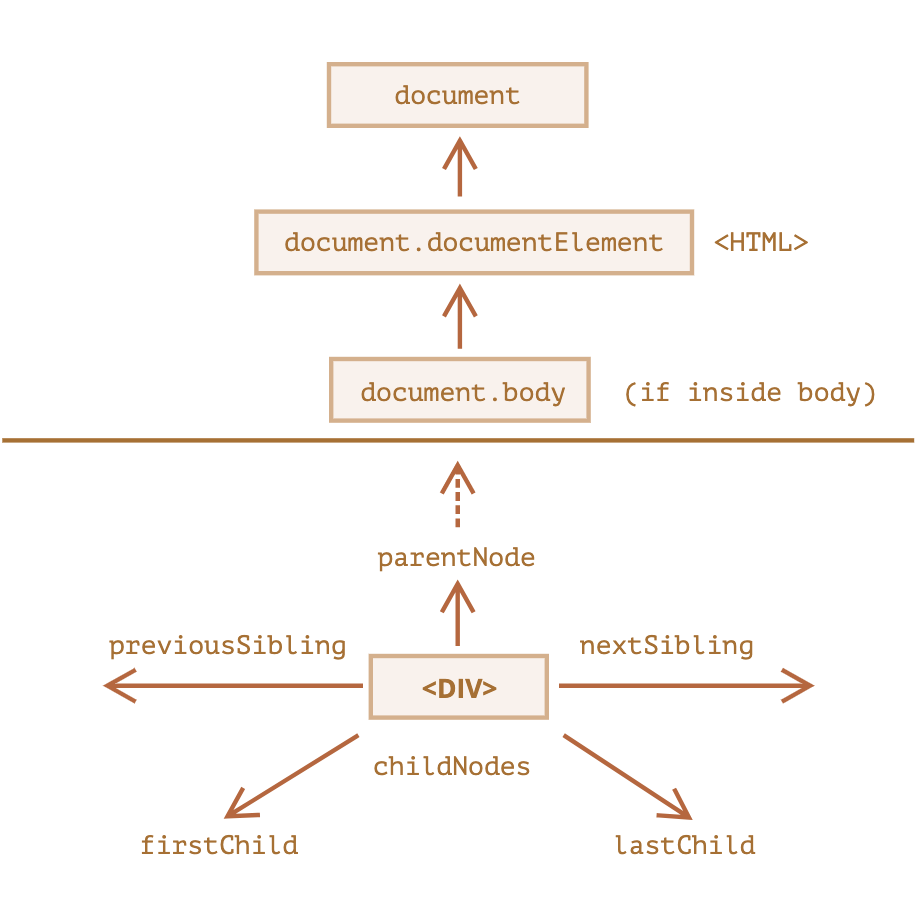

# DOM 요소 탐색

## DOM 노드

DOM 트리 상단의 노드들은 document가 제공하는 프로퍼티를 사용해 접근

`<html>` = document.documentElement  
`<body>` = document.body  
`<head>` = document.head  

 

⚠️ DOM에서 null 값은 '존재하지 않음’이나 '해당하는 노드가 없음’을 의미

  

## 👶🏻 자식 노드

### 자식 노드(child node, children)

* 바로 아래의 자식 요소
* 자식 노드는 부모 노드의 바로 아래에서 중첩 관계를 만듦
* `<head>`와 `<body>`는 `<html>`요소의 자식 노드

 

### 후손 노드(descendants)

* 중첩 관계에 있는 모든 요소
* 자식 노드, 자식 노드의 모든 자식 노드 등이 후손 노드

 

### 자식 노드 탐색

childNodes, firstChild, lastChild

모든 자식 `childNodes`(텍스트 노드를 포함한 모든 자식 노드 - 띄어쓰기, enter 등이 text로 처리됨)   
첫번째 자식 `firstChild`  
마지막 자식 `lastChild`  

 

### 자식 노드의 존재 여부 검사
elem.hasChildNodes()

  

## 👨‍👩‍👧‍👦 부모 노드

### 부모 노드 탐색

parentNode

부모 `parentNode`   
부모의 부모 `parentNode.parentNode`  
부모의 이전형제 `parentNode.previousSibling`

  

## 👬🏼 형제 노드

같은 부모를 가진 노드는 형제(sibling)노드  
대표적 형제 노드 `<head>`와 `<body>` (부모 노드는 `<html>`)

### 형제 노드 탐색 

sibling

이전 형제 노드에 대한 정보는 `previousSibling`  
다음 형제 노드에 대한 정보는 `nextSibling`   

  

## 참고 사이트

> https://ko.javascript.info/dom-navigation  
