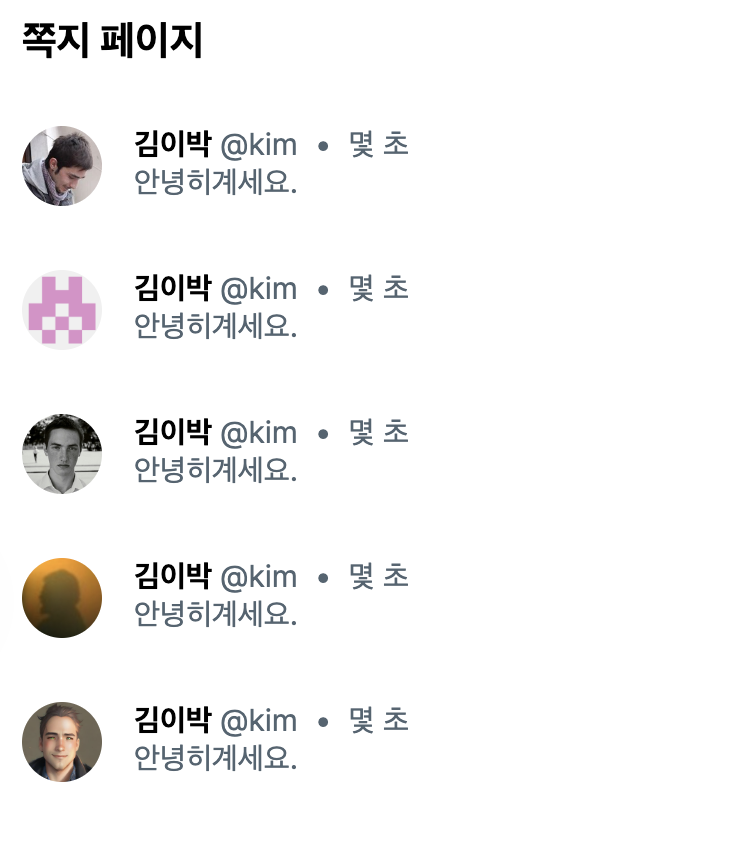

# JavaScript

## Day.js로 날짜, 시간 표기하기

> **Day.js**  
> https://www.npmjs.com/package/dayjs  
> https://day.js.org/

```
npm i dayjs
```

날짜와 시간을 구문 분석, 검증, 조작 및 표시하는 최소한의 JavaScript 라이브러리

* dayjs는 플러그인 방식으로 되어있어서 필요한걸 import 해서 사용하는 방식
* ⚠️ 매 페이지마다 플러그인 추가 필요

<br>

### Moment.js

> **Moment.js**  
https://momentjs.com/

npm trend를 살펴보면 예전에는 moment.js를 주로 쓰다가 흐름이 day.js로 넘어옴  
둘의 사용법이 거의 동일해서, 신규 프로젝트에서는 dayjs를 주로 사용하는 추세

<br><br>

## 사용방법

### 한국어 지원

```
// 한글 플러그인
dayjs.locale(‘ko’); 
```

<br>

### from now 

dayjs 라이브러리를 사용하면 게시글이 몇 초/분/시 전에 작성되었는지 편하게 계산 가능

> https://day.js.org/docs/en/display/from-now

```
// fromNow를 사용하기 위한 플러그인
dayjs.extend(relativeTime);  

dayjs('1999-01-01').fromNow() // 22 years ago
dayjs('1999-01-01').fromNow(true) // 22 years
```

<br>



```tsx
const user = {
    id: 'kim',
    nickname: '김이박',
    Messages: [
        {roomId: 123, content: '안녕하세요.', createdAt: new Date()},
        {roomId: 123, content: '안녕하세요.', createdAt: new Date()},
    ]
}

return (
    <>
        {dayjs(user.Messages?.at(-1).createdAt).fromNow(true)}
    </>
);
```

```tsx
// 기타 사용 예시 

<span>{dayjs(target.createdAt).fromNow(true)}</span>

<div>{dayjs(m.createdAt).format('YYYY년 MM월 DD일 A HH시 mm분')}</div>
```

* format을 지정해 사용할 수도 있음 
