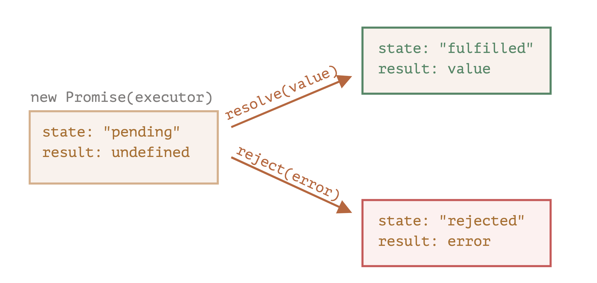
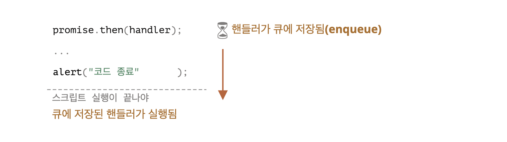

# Promise와 async/await

## Promise

### 1. promise 객체 생성하기 

```tsx
const promise = new Promise(function(resolve, reject) {
  // executor (실행자, 실행 함수)
   // 대개 시간이 걸리는 일을 수행
});
```

#### promise 객체의 내부 프로퍼티

* `state` : 처음엔 `pending`(보류)였다가 resolve가 호출되면 `fulfilled`, reject가 호출되면 `rejected`로 변화 
* `result` : 처음엔 `undefined`였다가 resolve(value)가 호출되면 `value`로, reject(error)가 호출되면 `error`로 변화

<br>

### 2. 실행 함수 executor  

executor는 자동으로 실행되는데 여기서 원하는 작업이 처리됨  
처리가 끝나면 executor는 처리 **성공 여부에 따라** `resolve`나 `reject`를 호출



1. executor의 인수 `resolve`와 `reject`
   * 자바스크립트에서 **자체 제공하는 콜백**
   * resolve와 reject를 신경 쓰지 않고 **executor 안의 코드**만 작성하면 됨
   * executor에선 결과를 즉시 얻든 늦게 얻든 상관없이, 인수로 넘겨준 콜백 중 **하나를 반드시 호출**해야 함 

2. 결과 
   * `resolve(value)` : 일이 **성공**적으로 끝난 경우 그 결과를 나타내는 `value`와 함께 호출 
   * `reject(error)` : **에러** 발생 시 에러 객체를 나타내는 `error`와 함께 호출
   
3. 주의점
   * executor는 resolve나 reject 중 **하나를 반드시 호출**해야 함
   * 변경된 상태는 더 이상 변하지 않음 - 처리가 끝난 프로미스에 resolve와 reject를 호출하면 무시됨 

<br>

### 3. 소비 함수와 then, catch, finally 메소드 

#### 📍 then

```
.then(promise가 이행되었을 때 실행되는 함수(실행 결과를 받음), promise가 거부되었을 때 실행되는 함수(에러를 받음)) 
```

```js
promise.then(
  function(result) { /* 결과(result)를 다룸 */ },
  function(error) { /* 에러(error)를 다룸 */ }
);
```   

#### 📍 catch

에러가 발생한 경우만 다루고 싶을 때

* `.then(null, errorHandlingFunction)` : null을 첫 번째 인수로 전달하기
* `.catch(errorHandlingFunction)`

> .catch(f)는 문법이 간결하다는 점만 빼고 .then(null,f)과 완벽하게 같음 

```js
promise.catch(alert); // 1초 뒤 "Error: 에러 발생!" 출력
```

#### 📍 finally

프로미스가 처리되면(resolve 또는 reject) f가 항상 실행된다는 점에서 `.finally(f)` 호출은 `.then(f, f)`과 유사

<br>

### 4. 마이크로태스크 큐

> 프로미스 핸들러 `.then/catch/finally`는 항상 **비동기적**으로 실행     
> 즉시 실행되는 프로미스이더라도 `.then/catch/finally` 아래에 있는 코드는 이 핸들러가 **실행되기 전에** 실행

비동기 작업을 처리하려면 관리가 필요  
💡 `PromiseJobs라는 내부 큐(internal queue)` 또는 `마이크로태스크 큐(microtask queue)`(V8 엔진에서) 라고 부름   
**프로미스 핸들러는 항상 마이크로태스크 큐를 통과함**



* 마이크로태스크 큐는 먼저 들어온 작업을 먼저 실행(FIFO, first-in-first-out)
* 실행할 것이 **아무것도 남아있지 않을 때만** 마이크로태스크 큐에 있는 작업이 실행되기 시작

#### 실행 순서가 중요한 경우엔 .then을 사용해 큐에 넣으면 됨 

```js
Promise.resolve()
        .then(() => alert("프라미스 성공!"))
        .then(() => alert("코드 종료"));
```

<br>

### 예제

프로미스를 기반으로 하는 동일 기능 함수  
함수 delay(ms)는 프로미스를 반환하고, 반환되는 프로미스는 .then을 붙일 수 있도록 ms 이후에 이행됨

```js
function delay(ms) {
    new Promise((resolve) => {
        setTimeout(resolve, ms)
    });
}

delay(3000).then(() => alert('3초후 실행'));
```

<br><br>

## 예시 - 모달 OverlayProvider에서의 Promise 

```tsx

export const OverlayProvider = ({children}: PropsWithChildren) => {
    const [overlay, setOverlay] = useState<OverlayState | null>(null);

    const openOverlay: OverlayOpenFn = useCallback((children, option) => {
        if (isValidElement(children)) {
            setOverlay({
                content: children,
                options: {...defaultOverlayClickOption, ...(option ?? {})},
            });

            return new Promise((resolver) => {
                console.log('Promise 객체 생성됨');
                // resolver(1); -> 1이 반환되며 프로미스 처리가 완료, 이후에 resolve와 reject를 호출하면 무시됨  
                setOverlay((prevOverlay) => (prevOverlay ? {...prevOverlay, resolver} : prevOverlay));
            }); // 모달이 켜졌을 때 여기까지 진행된 상태
        }

        return null;
    }, []);

// const getItem = async () => {
//   const response = await http.get(); // response가 resolver랑 같음 // ex. submitResult같은거 // 실행결과가 아니라 실행할 수 있는 무언가
//   return response;
// }
//
// getItem();

    const handleSubmitOverlay = (result: OverlaySubmitResult) => {
        console.log('제출');
        overlay?.resolver?.(result);
        console.log('Promise가 끝남!');

        if (overlay) {
            if (overlay.resolver) {
                overlay.resolver(result);  // await http.get()가 성공했다는 가정과 같음 // return response과 같음
            }
        }

        handleCloseOverlay();
    };
    
    // return (...)
}
```

### 옵셔널 체이닝

1과 2는 동일한 로직

```tsx
// 1.
overlay?.resolver?.(result);

// 2. 
if (overlay) {
    if (overlay.resolver) {
        overlay.resolver(result);  // await http.get()가 성공했다는 가정과 같음 // return response과 같음
    }
}
```

<br><br>

## 참고 사이트

> https://ko.javascript.info/promise-basics
> https://ko.javascript.info/async-await
