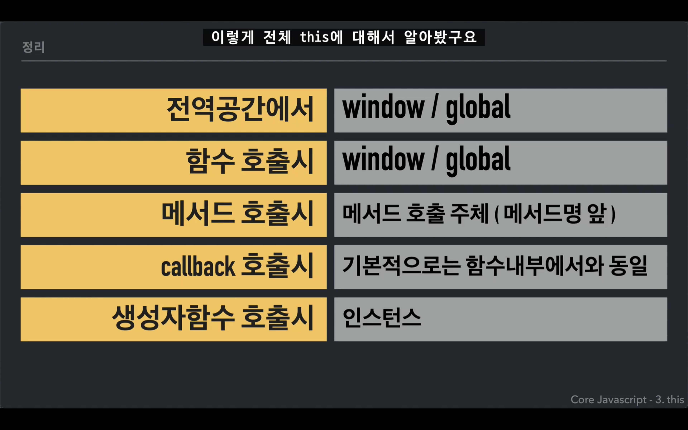
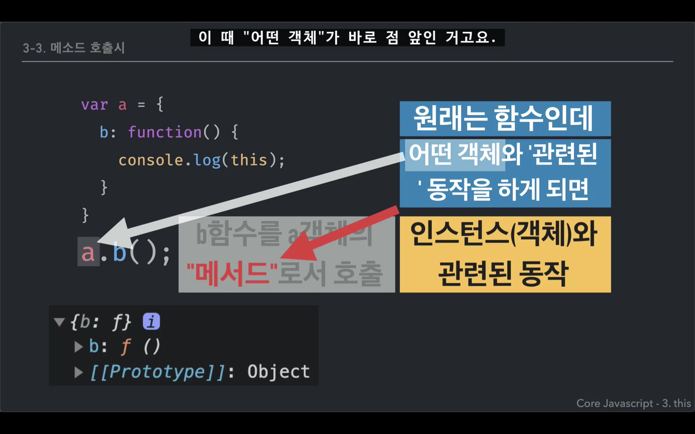
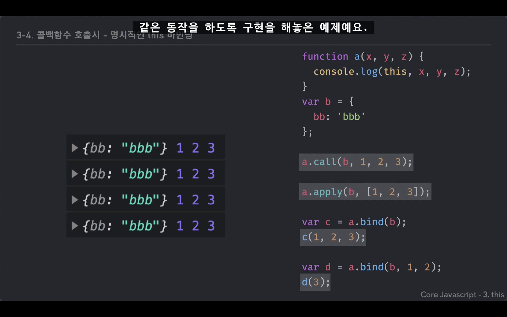
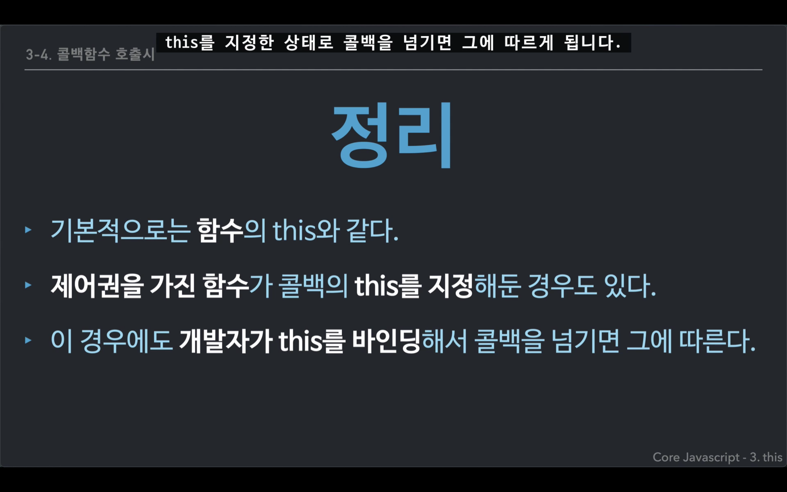

## This

### This
<strong>this는 함수가 호출될 때에 결정된다.</strong>  
ThisBinding은 실행컨텍스트가 활성화될 때

<strong>함수를 어떤 방식으로 호출했느냐에 따라 this는 달라질 수 있다. </strong> 
=> 동적으로 바인딩된다.

 

 

### 전역공간에서

This는 전역 객체를 가리킨다.
* 브라우저 - window
* node.js - global

host 객체라고도 한다.  
런타임(자바스크립트가 실행되는 환경)에 따라서 전역 객체의 정보가 달라짐

 

### 함수 호출시

This는 전역 객체를 가리킨다.
* 브라우저 - window
* node.js - global

ECMAScript 6에서는 이것이 문제라는 의견을 수렴해,  
아예 This 바인딩을 하지 않는 arrow function이 나왔다.

arrow function은 바로 위 컨텍스트에 있는 this를 그대로 가져다 사용한다.

<em>ES5 환경에서는 this를 함수로써 호출했을 때, 무조건 전역 객체를 가르킨다.</em>

 

### 메소드 호출시

This는 메소드를 호출한 주체 (메소드명 앞)를 가리킨다.

    var a = {
        b: function() {
            console.log(this);
        }
    }
    a.b();  <--- . 앞의 a가 this
 

 
<strong>메소드 내부함수에서의 우회법</strong>  

* 스코프 체인 이용 
* ES5 call, apply 이용
* ES6 arrow function (this를 바인딩하지 않음)

 

### callback 호출시
This는 기본적으로는 함수 내부에서와 동일하다.

 
<strong>call, apply, bind 메소드</strong>

명시적으로 this를 바인딩 하는 3가지 방법

 

<strong>콜백함수 호출시</strong>

콜백함수 내부에서의 this는 콜백함수를 넘겨받는 대상이 
매개변수로 넘겨받은 것을 어떤 식으로 처리하는지에 따라 
this가 달라질 수 있다.

=> 콜백함수에서의 this는 지정하는 바에 따라 달라진다.

 

 

### 생성자함수 호출시 (new 연산자 사용)
새로 만들 인스턴트 객체 그 자체가 곧 This가 된다.

 

