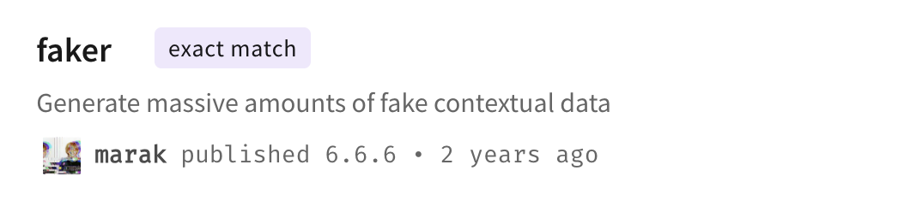
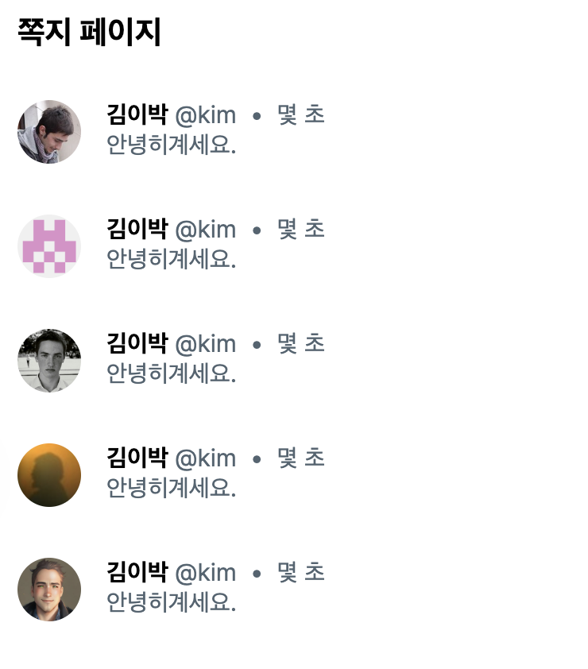

# JavaScript

## faker를 이용해 더미 데이터 생성하기

### faker

> **@faker-js/faker**   
> https://www.npmjs.com/package/@faker-js/faker

```
npm i @faker-js/faker
```

faker는 더미 데이터를 쉽게 넣어주는 라이브러리  
개발하면서 필요한 더미 데이터를 쉽게 추가해 보여줄 수 있음  

userId, username, email, avatar, password, birthdate, registeredAt 등을 이용 가능 


<br>

### 주의점 

❗️ npm 라이브러리를 잘못 다운받으면 해킹당할 수 있으니 항상 주의할 것  
faker가 그 대표적 사례  
faker는 원래 잘 쓰이던 라이브러리였는데 개발자가 망치고 접음(버전도 6.6.6)  
새로 나온 **@faker-js/faker**를 사용할 것  

> 🚨 사용하면 안 되는 라이브러리   
> **faker**    
> https://www.npmjs.com/package/faker



<br><br>

## 사용법

### 50% 확률로 이미지 노출하기

모든 글에 이미지가 있는 것은 아니므로 50%로 설정 

```tsx
import { faker } from '@faker-js/faker';

if (Math.random() > 0.5) {
    target.Images.push(
        {
            imageId: 1,
            link: faker.image.urlLoremFlickr()
        }
    )
}
```


* 스크린샷에서는 4개의 이미지 사용

<br>

### 아바타 생성하기 

```tsx
import { faker } from '@faker-js/faker';

const user = {
    id: 'kim',
    nickname: '김이박',
    Image: faker.image.avatar()
}
    
return (
    // 생략
    
    // 생략
);
```




