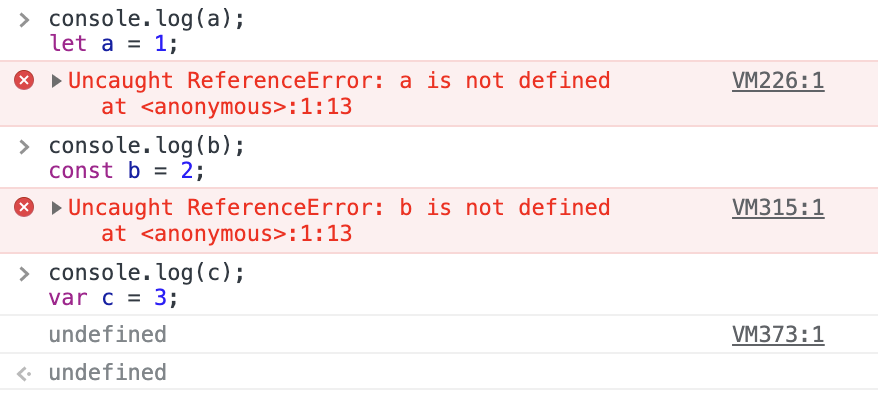

# var

## 변수 선언 방법

1. let : 변수를 선언할 때
2. const : 변화하지 않는 변수를 선언할 때  
3. var : let과 거의 동일하게 동작

<br><br>

## var 특징 

### 1. 블록 스코프가 없음

var로 선언한 변수의 스코프는 **함수 스코프**이거나 전역 스코프  
블록 기준으로 스코프가 생기지 않기 때문에 **블록 밖에서 접근 가능**  

{ 블록 } 안에서 생성한 var 변수는 전역변수가 됨 -> 전역 스코프에서 변수에 접근 가능 

```js
if (true) {
  var test = true; 
}

alert(test); // true(if 문이 끝났어도 변수에 여전히 접근할 수 있음)
```

* if, for 등의 코드 블록을 관통

<br>

### 2. 변수의 중복 선언 

같은 변수를 여러 번 **중복 선언**할 수 있음     
앞의 선언문은 무시

<br>

### 3. 호이스팅 - 선언하기 전 사용 가능

var로 선언한 모든 변수는 함수의 최상위로 호이스팅됨    

**선언은 호이스팅 되지만 할당은 호이스팅 되지 않음**

```
var example = "Hello"
```

1. 변수 선언(var)
2. 변수에 값을 할당(=)


* 변수 선언 : 함수 실행이 시작될 때 처리(호이스팅) 
* 할당 : 호이스팅 되지 않음, 할당 관련 코드에서 처리됨
  * 선언과 동시에, 변수에 값을 할당하기 전까진 기본 초기화 상태인 `undefined`
  * LexicalEnvironment가 생성되면서 동시에 `undefined`로 초기화


```js
console.log(num); // 호이스팅한 var 선언으로 인해 undefined 출력
var num; // 선언
num = 6;  // 초기화
```

변수 선언 시 초기화를 제외한 선언만 호이스팅   

<br>

### ✨ let, const와 차이

* 공통점 : let과 const로 선언한 변수도 호이스팅됨 
* 차이점 : var와는 달리 `undefined`로 변수를 초기화 하지 않기 때문에 변수 선언 전에 먼저 사용하면 오류 발생
  * 자기 코드 위치까지 읽어지면 그 지점에서 초기화
  * LexicalEnvironment가 활성화될 때 생성
  * `undefined`를 할당하지 않고 초기화를 마침
  
<br>

#### var, let, const 초기화 



#### let 초기화  


<br>

### var가 블록 레벨 스코프를 가지는 방법

`즉시 실행 함수 표현식(immediately-invoked function expressions, IIFE)`  
함수 표현식을 괄호로 둘러싼 `(function {…})` 형태로 만들어 함수 표현식으로 인식하도록 속임   
* 함수 표현식은 이름이 없어도 괜찮고, 즉시 호출도 가능
* 즉시 실행 함수 표현식은 요즘에는 자주 쓰지 않음


<br><br>

## 참고 사이트 

> https://ko.javascript.info/var
