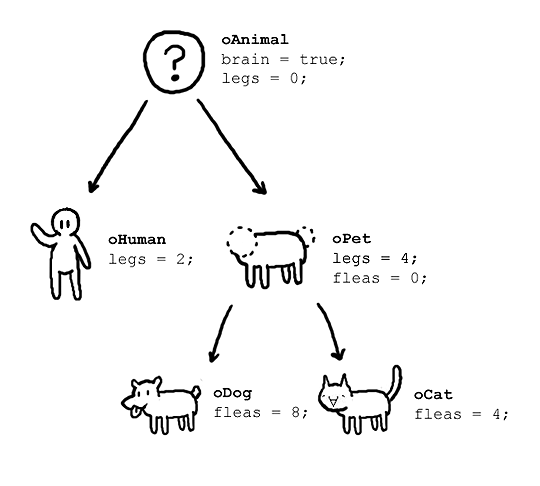
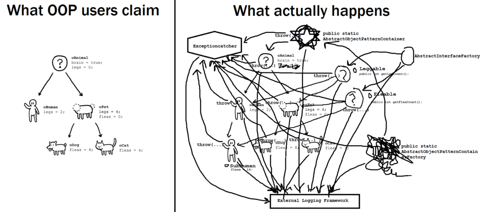

# 객체 지향

## 객체 지향 프로그래밍

[객체 지향 프로그래밍](https://ko.wikipedia.org/wiki/%EA%B0%9D%EC%B2%B4_%EC%A7%80%ED%96%A5_%ED%94%84%EB%A1%9C%EA%B7%B8%EB%9E%98%EB%B0%8D)

객체 지향 프로그래밍(Object-Oriented Programming, OOP)은 컴퓨터 프로그래밍의 패러다임 중 하나   
프로그램을 명령어의 목록으로 보는 시각에서 벗어나 여러 개의 독립된 단위, `객체`의 집합으로 파악하고자 함   
각각의 `객체`는 메시지를 주고받고, 데이터를 처리할 수 있음 

### 장점

* 프로그램을 유연하고 변경이 쉽게 만듦 -> 대규모 소프트웨어 개발에 많이 사용
* 프로그래밍을 더 배우기 쉽게 하고 소프트웨어 개발과 보수를 간편하게 함
* 직관적인 코드 분석을 가능 

### 단점

* 지나친 객체화 경향은 실제 세계의 모습을 그대로 반영하지 못한다는 비판을 받기도 함

  

## 객체 지향 프로그래밍 언어

* 시뮬라 67(Simula 67): 최초의 객체 지향 언어
* 오브젝티브-C
* C++
* C#
* Dart
* 자바
* 파이썬
* 루비
* 스위프트

  

## 기본 구성 요소 

### 1. 클래스(Class) 

**같은 종류의 집단**에 속하는 `속성`(attribute)과 `행위`(behavior)를 정의한 것    
객체지향 프로그램의 기본적인 사용자 정의 데이터형(user defined data type)   
클래스는 다른 클래스 또는 외부 요소와 **독립적**으로 디자인되어야 함  

### 2. 객체(Object) 

클래스의 **인스턴스**(실제로 메모리상에 할당된 것)   
객체는 자신 고유의 `속성`(attribute)을 가지며, 클래스에서 정의한 `행위`(behavior)를 수행할 수 있음   
객체의 행위는 클래스에 정의된 행위에 대한 정의를 공유함으로써 메모리를 경제적으로 사용 

### 3. 메서드(Method), 메시지(Message)

클래스로부터 생성된 객체를 사용하는 방법    
객체에 명령을 내리는 메시지  
메서드는 한 객체의 서브루틴(subroutine) 형태로 객체의 속성을 조작하는 데 사용됨   
객체 간의 통신은 메시지를 통해 이루어짐 

  

## 객체 지향 언어의 4대 특징

### 1. 캡슐화 (Encapsulation)

객체의 속성과 행위(메소드)를 하나로 묶음   
실제 구현 내용 일부를 내부에 감추어 **데이터를 은닉**하고, 그 데이터에 접근하는 기능을 노출시키지 않는다는 의미

> **접근 제어 지시자**
>
> public : 모두 접근 가능  
> protected : 상속/같은 패키지 내 클래스에서 접근 가능  
> private : 본인만 접근 가능  

### 2. 상속 (Inheritance)

상위 개념의 특징을 하위 개념이 물려받는 것  
하나의 클래스가 가지고 있는 특징(데이터와 함수)을 다른 클래스가 물려주고자 할 때 상속을 사용  

* 코드의 재사용성 증대 -> 같은 기능을 중복 구현 할 필요 없음 
* 폭넓은 사용 -> 상속 받은 함수에 추가적으로 데이터와 함수 내용을 변경 가능

### 3. 추상화 (Abstraction)

객체의 **공통적인 특징**(속성과 기능)을 뽑아내는 것  
구현하는 객체들이 가진 공통적인 데이터와 기능을 도출해 내는 것

### 4. 다형성 (Polymorphism)

다양한 형태로 표현이 가능한 것  
한 요소에 여러 개념을 넣어 놓는 것

자료형 체계의 성질을 나타내며 프로그램 언어의 각 요소들(상수, 변수, 식, 오브젝트, 함수, 메소드 등)이 다양한 자료형(type)에 속하는 것이 허가되는 성질

> #### 오버라이딩(Overrideing)  
>   
> 같은 이름의 메소드가 **여러 클래스**에서 다른 기능을 하는 것    
>   
> 같은 메서드 이름 / 같은 인자 목록 / 상위 클래스의 메서드를 재정의    
> 상위 클래스 타입의 객체 참조 변수에서 자동으로 하위 클래스가 오버라이딩한 메소드를 호출  

> #### 오버로딩(Overroding)  
>   
> 같은 이름의 메소드가 **인자의 개수나 자료형**에 따라서 다른 기능을 하는 것  
>   
> 같은 메서드 이름 / 다른 인자 목록 / 다수의 메서드를 중복 정의  

  

## 참고 사이트 

> https://poiemaweb.com/js-object-oriented-programming  
> https://velog.io/@limsaehyun/%EA%B0%9D%EC%B2%B4-%EC%A7%80%ED%96%A5%EC%9D%98-4%EA%B0%80%EC%A7%80-%ED%8A%B9%EC%A7%95-OOP%EB%9E%80-%EB%AC%B4%EC%97%87%EC%9D%BC%EA%B9%8C
