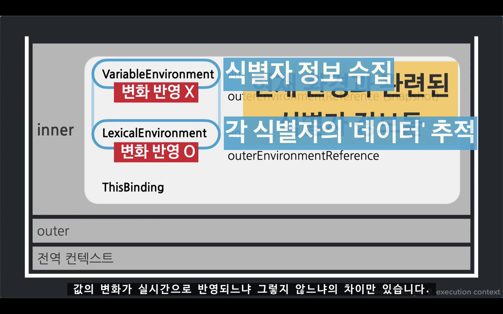
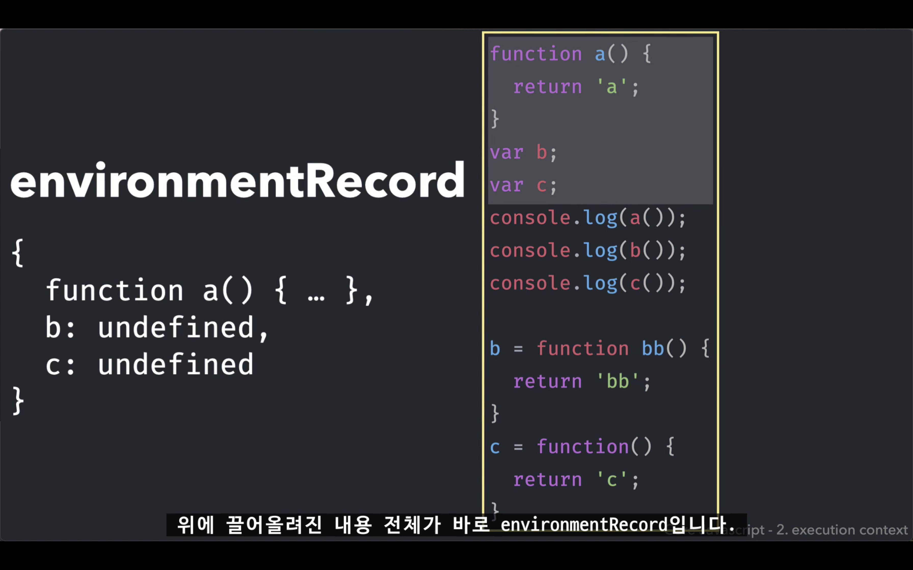
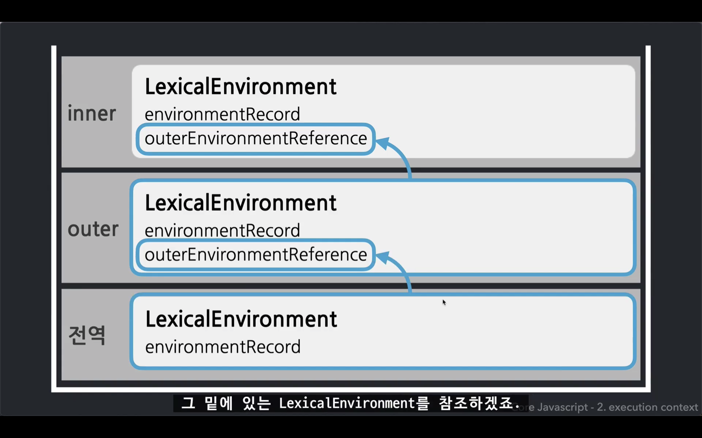
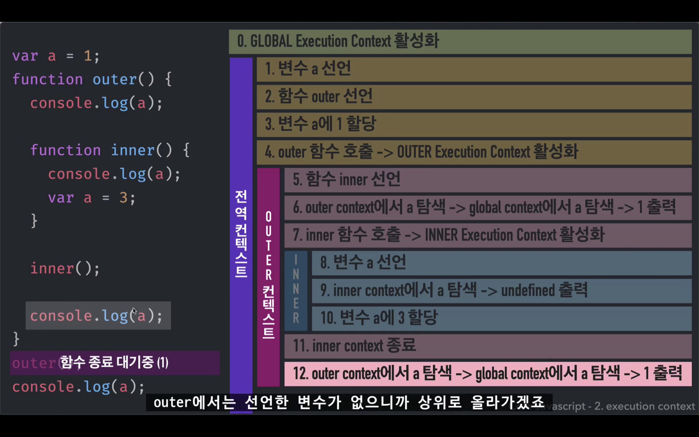
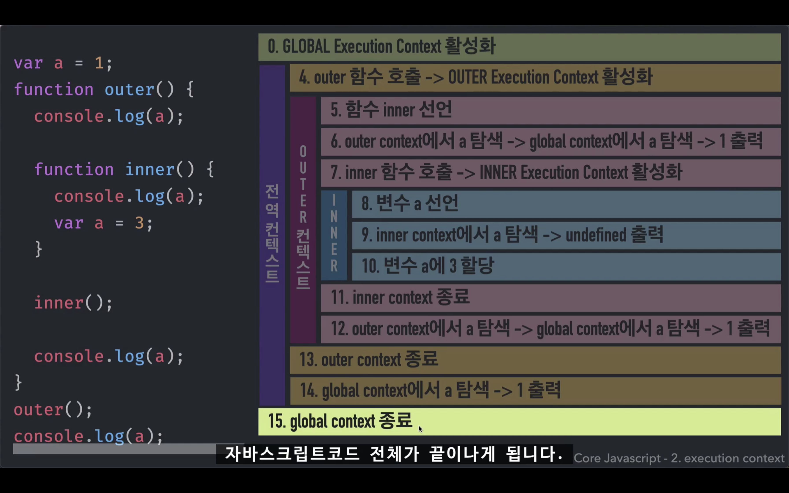
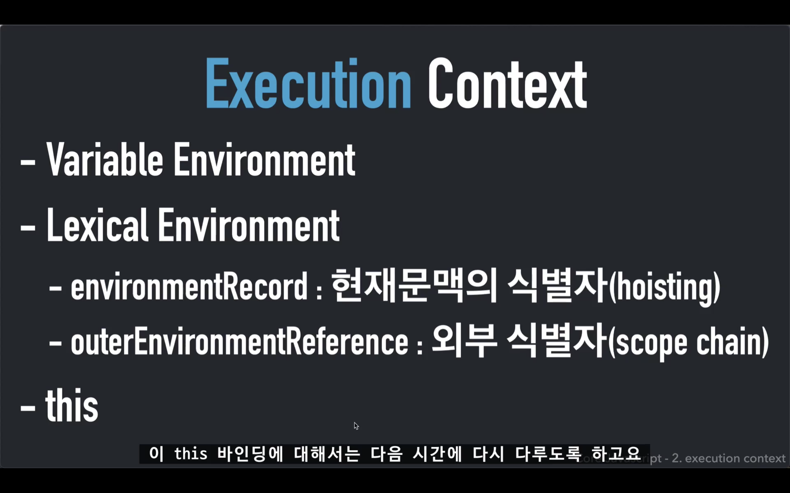

## 실행 컨텍스트 (execution context)

<strong>의미</strong>  

Execution 실행  
Context 문맥, 맥락, 환경 

=> 코드틀 실행하는 데에 필요한, 배경이 되는 조건/환경  
=> 함수를 실행할 때 필요한 조건, 환경정보를 담은 객체

 

동일한 조건/환경을 지니는 코드 뭉치  
를 실행할 때 필요한 조건/환경정보
 

* 동일한 조건/환경을 지니는 코드 뭉치 
  * 함수
  * 전역공간 (하나의 함수 공간)
  * module (하나의 함수 공간)
  * eval (위험한 명령어 - 논외)
  
 

<strong>if / for / switch / while '문' 은?</strong>  

let과 const에 대해 별개의 독립된 공간으로서의 역할을 하고 있지만
별개의 실행 컨텍스트를 생성하지는 않음

=> JS는 오직 <u>함수</u>에 의해서만 컨텍스트를 구분할 수 있다

 

<strong>스택</strong>  

제일 마지막에 들어온 게 제일 먼저 빠지고,  
제일 먼저 들어왔던 게 제일 마지막에 빠지는 개념

 

<strong>콜스택</strong>  

코드 실행에 관여하는 스택  
현재 어떤 함수가 동작중인지, 
다음에 어떤 함수가 호출될 예정인지 등을 제어하는 자료구조

 

<strong>실행 컨텍스트 내부</strong> 
 

VariableEnvironment와 LexicalEnvironment에는 현재 환경과 관련된 식별자 정보들이 담김

 

<strong>Lexical Environment</strong>  

어휘적 / 사전적 환경  
실행 컨텍스트를 구성하는 환경 정보들을 모아 사전처럼 구성한 객체 

 

어떤 실행 컨텍스트 A에 대한 환경정보가 담긴 사전
  * 내부 식별자들에 대한 정보 (environmentRecord)
  * 외부 정보 (outerEnvironmentReference)

  <em>Ex) 실행 컨텍스트 A 환경 사전  
    * 내부 식별자 a : 현재 값은 undefined이다.  
    * 내부 식별자 b : 현재 값은 20이다.  
    * 외부 정보 : D를 참조한다.   </em>

 

<strong>호이스팅 (Hoisting)</strong>  

현재 컨텍스트 식별자 정보들을 수집해서
environmentRecord에 담는 과정

Hoisting : 끌어올리다 (식별자 정보를 -> 실행 컨텍스트의 맨 위로)

environmentRecord 에는 현재 문맥의 식별자 정보가 수집됨  
실행 컨텍스트가 최초 실행될 때 제일 먼저 하는 일

 

<strong>outerEnvironmentReference</strong>  

외부 환경에 대한 참조  
환경 = Lexical Environment

=> 현재 문맥과 관련이 있는 외부 컨텍스트의 식별자 정보를 참조

 

<strong>Scope Chain</strong>

outerEnvironmentReference가 관여하는 것

Scope : 변수의 유효범위 (실행 컨텍스트가 만듦)  
외부로는 나갈 수 있는데, 자기보다 더 안쪽으로는 들어갈 수 없다

Scope Chain : 가장 가까운 자기 자신부터 점점 멀리 있는 스코프로 찾아 나가는 것   
shadowing : 가장 먼저 찾아지는 것만 접근이 가능하다

 

<strong>참고 자료</strong>  

