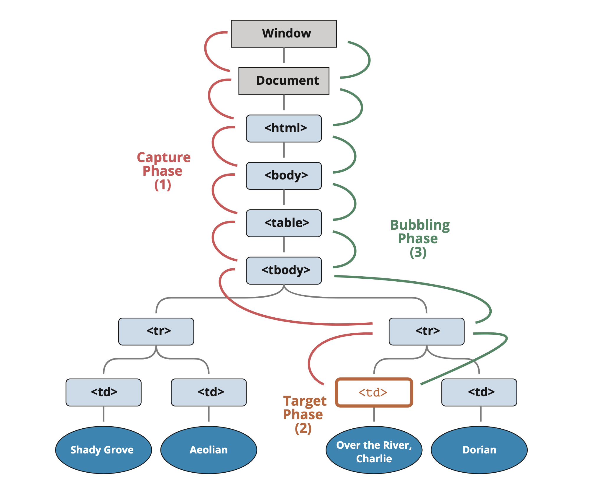

# 이벤트 전파 중단

## 이벤트

이벤트가 발생하면 이벤트가 발생한 **가장 안쪽 요소**가 `타깃 요소(event.target)`

* 이벤트는 document에서 시작해 DOM 트리를 따라 event.target까지 내려감   
이벤트는 트리를 따라 내려가면서 addEventListener(..., true)로 할당한 핸들러를 동작시킴
* 이후 타깃 요소에 설정된 핸들러가 호출됩니다. 
* 이후엔 이벤트가 event.target부터 시작해서 다시 최상위 노드까지 전달되면서 각 요소에 on<event>로 할당한 핸들러와 addEventListener로 할당한 핸들러를 동작시킵니다. addEventListener로 할당한 핸들러 중, 세 번째 인수가 없거나 false, {capture: false}인 핸들러만 호출됩니다.

<br>

### event 객체 프로퍼티

각 핸들러는 아래와 같은 event 객체의 프로퍼티에 접근할 수 있음

* `event.target` : 이벤트가 발생한 가장 안쪽의 요소
* `event.currentTarget` (=this) : 이벤트를 핸들링 하는 현재 요소 (핸들러가 실제 할당된 요소)
* `event.eventPhase` : 현재 이벤트 흐름 단계 (캡처링=1, 타깃=2, 버블링=3)

<br><br>

## 버블링(bubbling)

🛁 이벤트가 `제일 깊은 곳`에 있는 요소에서 시작해 부모 요소를 `거슬러 올라가며` 발생하는 모양이 물속 거품과 닮았기 때문에 버블링


한 요소에 이벤트가 발생하면 **이 요소**에 할당된 핸들러가 동작하고, 이어서 **부모 요소**의 핸들러가 동작  
**가장 최상단의 조상 요소**를 만날 때까지 이 과정이 반복되면서 요소 각각에 할당된 핸들러가 동작함  
이런 흐름이 `이벤트 버블링`

<br>

### 버블링 중단하기

이벤트 버블링은 타깃 이벤트에서 시작해서 `<html>` 요소를 거쳐 `document 객체`를 만날 때까지 **각 노드에서 모두 발생**  
몇몇 이벤트는 window 객체까지 거슬러 올라가기도 하며, 이 때도 모든 핸들러가 호출됨  

핸들러에게 이벤트를 완전히 처리하고 난 후 버블링을 중단하도록 명령하려면  
이벤트 객체의 메소드인 `event.stopPropagation`를 사용할 것

<br><br>

### stopPropagation

Event 인터페이스의 stopPropagation() 메소드는 현재 이벤트가 캡처링/버블링 단계에서 더 이상 전파되지 않도록 방지


```js
event.stopPropagation();
```

> 💡 **preventDefault**
> 
> 기본 동작을 방지하려면 **preventDefault** 사용  
> 전파를 방지해도 이벤트의 기본 동작은 실행되므로, 링크나 버튼의 클릭을 막는 것은 아님

> 💡 **stopImmediatePropagation**
>
> 한 요소의 특정 이벤트를 처리하는 핸들러가 여러개인 상황에서, 핸들러 중 하나가 버블링을 멈추더라도 나머지 핸들러는 여전히 동작  
> 같은 이벤트 대상에 할당된 다른 이벤트 리스너까지 막지는 않음  
> 버블링을 멈추고, 이것까지 막으려면 **stopImmediatePropagation** 사용  
> 요소에 할당된 특정 이벤트를 처리하는 핸들러 모두가 동작하지 않음

<br>

### 주의점 

⚠️ 꼭 필요한 경우를 제외하곤 버블링을 막지 말 것  
이벤트 버블링을 막아야 하는 경우는 거의 없음  

* 버블링은 유용하기 때문에 아키텍처를 잘 고려해 진짜 사용해여 하는 상황에서만 버블링을 막도록 할 것
* event.stopPropagation()은 추후에 문제가 될 수 있는 상황을 만들어낼 수 있음 
* 버블링을 막아야 해결되는 문제일 경우, **커스텀 이벤트** 등을 사용해 문제를 해결할 수 있음

핸들러의 event 객체에 데이터를 저장해 다른 핸들러에서 읽을 수 있게 하면,
아래쪽에서 무슨 일이 일어나는지를 부모 요소의 핸들러에게 전달할 수 있으므로,
이 방법으로도 이벤트 버블링을 통제할 수 있음  

<br><br>

## 캡처링

### 표준 DOM 이벤트에서 정의한 이벤트 흐름 3가지 단계

1. `캡처링 단계` : 이벤트가 하위 요소로 전파되는 단계
2. `타깃 단계` : 이벤트가 실제 타깃 요소에 전달되는 단계
3. `버블링 단계` : 이벤트가 상위 요소로 전파되는 단계

* `HTML` → `BODY` → `FORM` → `DIV` (캡처링 단계, 첫 번째 리스너)
* P (타깃 단계, 캡쳐링과 버블링 둘 다에 리스너를 설정했기 때문에 두 번 호출됨)
* `DIV` → `FORM` → `BODY` → `HTML` (버블링 단계, 두 번째 리스너)



<br>

### 테이블 안의 `<td>`를 클릭했을 때의 이벤트 흐름 

요소에 할당된 이벤트 핸들러가 호출되는 과정

1. `<td>`를 클릭하면 이벤트가 최상위 조상에서 시작해 아래로 전파되고(캡처링 단계)
2. 이벤트가 타깃 요소에 도착해 실행된 후(타깃 단계)
3. 다시 위로 전파됨(버블링 단계)

> 💡 캡처링 단계를 이용해야 하는 경우는 흔치 않아서, 캡처링에 관한 코드를 발견하는 일은 거의 없음  
> `on<event>` 프로퍼티나 `HTML 속성`, `addEventListener(event, handler)`를 이용해 할당된 핸들러는
> 캡처링에 대해 전혀 알 수 없음   
> 이 핸들러들은 2. 타깃 단계와 3. 버블링 단계의 이벤트 흐름에서만 동작

<br>

### capture 옵션

캡처링 단계에서 이벤트를 잡아내려면 addEventListener의 **capture 옵션을 true**로 설정해야 함 

```js
elem.addEventListener(..., {capture: true})
elem.addEventListener(..., true) // 축약형 
```

capture 옵션은 두 가지 값을 가질 수 있습니다.

* false(default 값) : 핸들러는 3. 버블링 단계에서 동작함 
* true : 핸들러는 1. 캡처링 단계에서 동작함

3개의 이벤트 흐름이 있지만, 이벤트가 실제 타깃 요소에 전달되는 단계인 `타깃 단계`(두 번째 단계)는 별도로 처리되지 않음   
`캡처링`과 `버블링` 단계의 핸들러는 `타깃 단계`에서 트리거됨

<br>

### event.eventPhase 프로퍼티

현재 발생 중인 이벤트 흐름의 단계를 알 수 있음   
반환되는 정숫값에 따라 이벤트 흐름의 현재 실행 단계를 구분할 수 있음   
💡 핸들러를 통해 흐름 단계를 알 수 있기 때문에 이 프로퍼티는 자주 사용되지 않음

<br><br>

## 참고 사이트 

> https://developer.mozilla.org/ko/docs/Web/API/Event/stopPropagation   
> https://ko.javascript.info/bubbling-and-capturing
