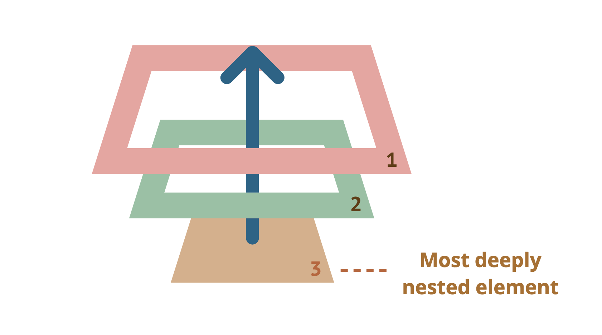

# 이벤트 전파 중단

## 버블링(bubbling)

🛁 이벤트가 `제일 깊은 곳`에 있는 요소에서 시작해 부모 요소를 `거슬러 올라가며` 발생하는 모양이 물속 거품과 닮았기 때문에 버블링



한 요소에 이벤트가 발생하면 **이 요소**에 할당된 핸들러가 동작하고, 이어서 **부모 요소**의 핸들러가 동작  
**가장 최상단의 조상 요소**를 만날 때까지 이 과정이 반복되면서 요소 각각에 할당된 핸들러가 동작함  
이런 흐름이 `이벤트 버블링`

<br>

### 버블링 중단하기

이벤트 버블링은 타깃 이벤트에서 시작해서 `<html>` 요소를 거쳐 `document 객체`를 만날 때까지 **각 노드에서 모두 발생**  
몇몇 이벤트는 window 객체까지 거슬러 올라가기도 하며, 이 때도 모든 핸들러가 호출됨  

핸들러에게 이벤트를 완전히 처리하고 난 후 버블링을 중단하도록 명령하려면  
이벤트 객체의 메소드인 `event.stopPropagation`를 사용할 것

<br><br>

### stopPropagation

Event 인터페이스의 stopPropagation() 메소드는 현재 이벤트가 캡처링/버블링 단계에서 더 이상 전파되지 않도록 방지


```js
event.stopPropagation();
```

> 💡 **preventDefault**
> 
> 기본 동작을 방지하려면 **preventDefault** 사용  
> 전파를 방지해도 이벤트의 기본 동작은 실행되므로, 링크나 버튼의 클릭을 막는 것은 아님

> 💡 **stopImmediatePropagation**
>
> 한 요소의 특정 이벤트를 처리하는 핸들러가 여러개인 상황에서, 핸들러 중 하나가 버블링을 멈추더라도 나머지 핸들러는 여전히 동작  
> 같은 이벤트 대상에 할당된 다른 이벤트 리스너까지 막지는 않음  
> 버블링을 멈추고, 이것까지 막으려면 **stopImmediatePropagation** 사용  
> 요소에 할당된 특정 이벤트를 처리하는 핸들러 모두가 동작하지 않음

<br>

### 주의점 

⚠️ 꼭 필요한 경우를 제외하곤 버블링을 막지 말 것  
이벤트 버블링을 막아야 하는 경우는 거의 없음  

* 버블링은 유용하기 때문에 아키텍처를 잘 고려해 진짜 사용해여 하는 상황에서만 버블링을 막도록 할 것
* event.stopPropagation()은 추후에 문제가 될 수 있는 상황을 만들어낼 수 있음 
* 버블링을 막아야 해결되는 문제일 경우, **커스텀 이벤트** 등을 사용해 문제를 해결할 수 있음

핸들러의 event 객체에 데이터를 저장해 다른 핸들러에서 읽을 수 있게 하면,
아래쪽에서 무슨 일이 일어나는지를 부모 요소의 핸들러에게 전달할 수 있으므로,
이 방법으로도 이벤트 버블링을 통제할 수 있음  

<br><br>

## 캡처링


<br><br>

## 참고 사이트 

> https://developer.mozilla.org/ko/docs/Web/API/Event/stopPropagation   
> https://ko.javascript.info/bubbling-and-capturing
