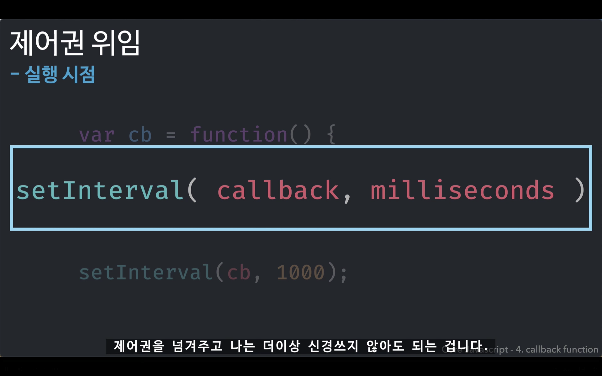
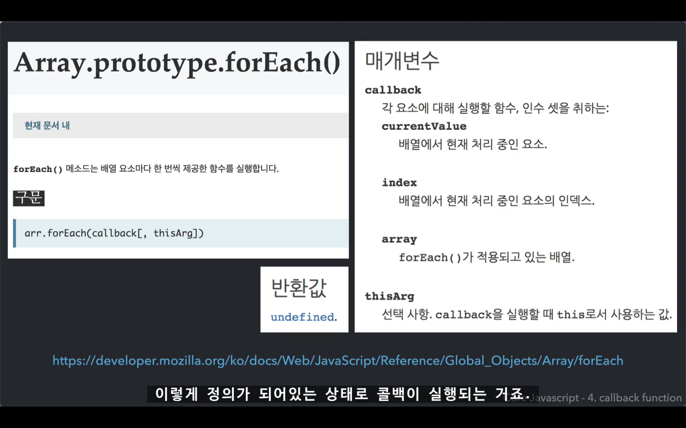
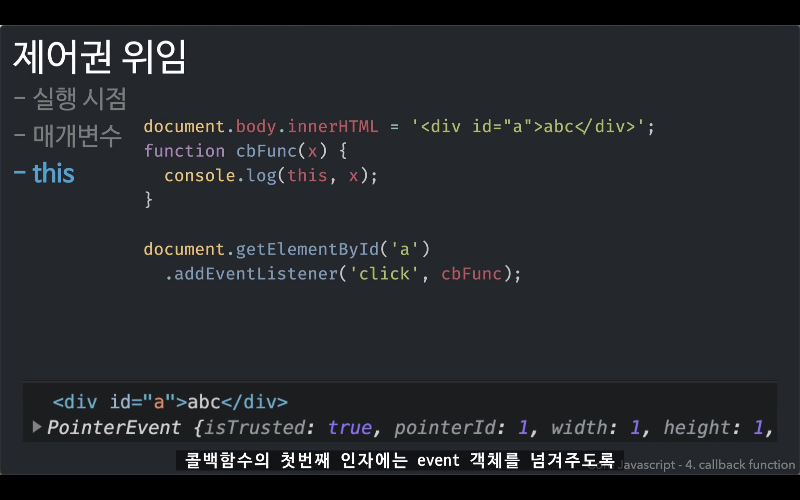
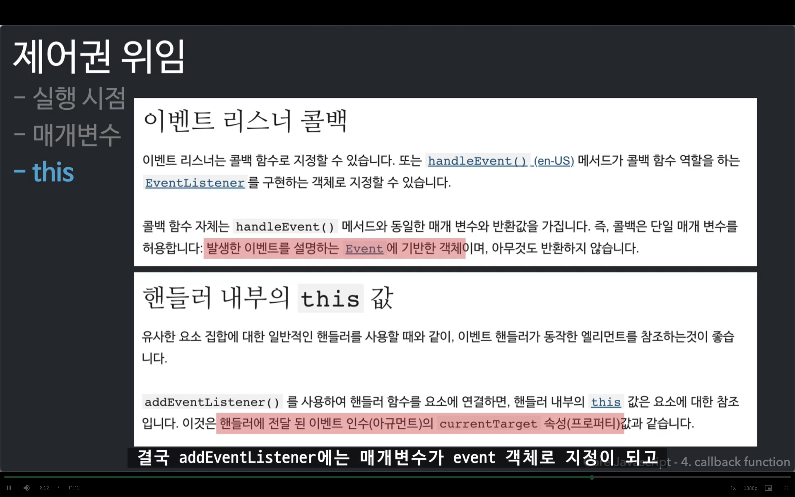

## 콜백 함수 (Callback Function)

### callback
회신하다, 답신하다  
-> 회신되는 함수

 

### 제어권 위임 
넘기고자 하는 대상에게 콜백함수에 대한 제어권을 넘기다

><strong>넘겨주게 될 제어권</strong>
>* 실행 시점 (Ex. setInterval)
>* 매개변수 (Ex. forEach)
>* this

 

<strong>1. 실행 시점</strong>

 

<strong>2. 매개변수</strong>

 

<strong>3. this</strong>

 

### 콜백함수의 특징
* 다른 함수(A)의 인자로 콜백함수(B)를 전달하면, 
A가 B의 <strong>제어권</strong>을 갖게 된다.
* 특별한 요청(bind)이 없는 한, 
A에 <strong>미리 정해놓은 방식</strong>에 따라 B를 호출한다.
* 미리 정해놓은 방식이란 어떤 <strong>시점</strong>에 콜백을 호출할지,
<strong>인자</strong>에는 어떤 값들을 지정할지, <strong>this</strong>에 무엇을 바인딩할지 등이다.

 

### 메소드로 호출 vs 콜백함수로 전달

    메소드로 호출   obj.logValues(1, 2);

    콜백함수로 전달  arr.forEach(obj.logValues);

⭐️콜백은 '함수'다.