# 코어 자바스크립트

## 클래스 (Class)

> 상위의 클래스부터 먼저 정의되어야 하위 클래스, 인스턴스를 생성할 수 있음 

### 클래스 class

계급, 집단, 집합 <br>
공통적인 속성을 모아 한 데 묶은 덩어리 또는 명세 <br>
인스턴스들의 공통 속성을 모은 추상적인 개념

<br>

### 인스턴스 instance 

해당 클래스의 속성을 지닌 구체적인 객체들

> 🍲 음식 = `class`, 과일 클래스의 상위 클래스 = `superclass`   
> 🍎 과일 = `class`, 음식 클래스의 하위 클래스 = `subclass`   
> 🍓🍌🍊 배 사과 바나나 감 오렌지 = `인스턴스`

<br>

### 예시 

> [1, 2, 3] 배열 리터럴 생성 = new 연산자로 Array 생성자 함수를 호출한 결과   

> 📌 **클래스**
> 
> `Array 생성자 함수` 부분이 일반적인 개념상의 **클래스** 역할  
> `Array 생성자 함수`는 그 자체로 특별한 역할을 하기보다, new 연산자로 생성한 배열 객체의 기능을 정의하는데에 주력

> 📌 **인스턴스**
>
> 클래스를 통해 생성한 객체(배열 객체) -> **인스턴스**    
> 구체적인 데이터를 지니고 실제 코드상에서 동작을 수행하는 실체 중의 하나

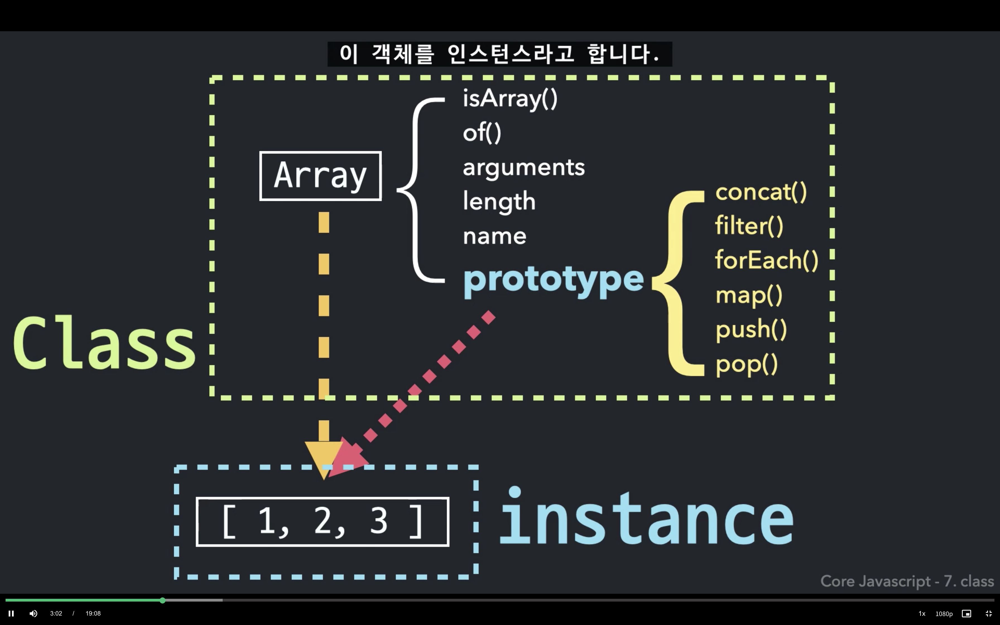

<br><br>

## 클래스 

* 클래스 부분만 분리한 이미지

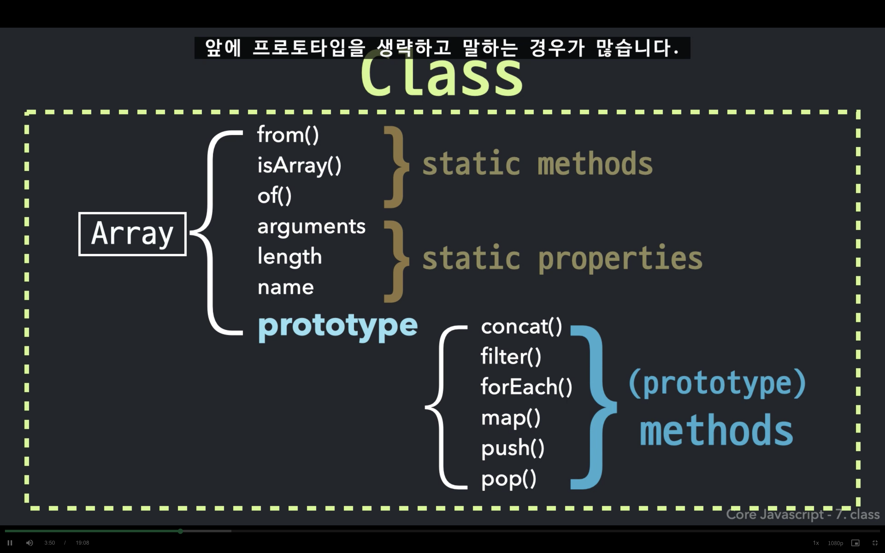

### 스태틱 메소드, 스태틱 프로퍼티  
  
프로토타입 프로퍼티에 할당되지 않고 **생성자 함수에 직접 할당되어있는 프로퍼티**    
생성자 함수를 new 연산자 없이 함수(객체)로서 호출할 때에만 의미가 있는 값  
해당 클래스 소속 인스턴스의 개별 동작이 아닌, 소속 여부 확인 등의 **공동체적 판단**을 필요로 할 때 활용     

<br>

### 프로토타입 메소드  

프로토타입 내부에 정의된 메소드   
줄여서 **메소드**라고 부름   
인스턴스에서 직접 활용 가능 

<br>

### 클래스와 인스턴스의 관계

스태틱 메소드와 프로토타입 메소드는 **인스턴스에서 직접 접근 가능 여부**가 다름 

* `스태틱 메소드` : 인스턴스에서 접근 불가 ❌, 생성자 함수 내부의 프로퍼티(스태틱 메소드)에 접근 불가능
  * 프로토타입의 constructor를 통해 우회는 가능하지만, 인스턴스를 this로 하려면 별도의 처리 필요
  * 우회하는 경우에도 제대로 동작하기를 기대하기는 어려움 
* `프로토타입 메소드` : 인스턴스에서 접근 가능 ✅, 인스턴스와 `[[prototype]]`으로 연결됨 

<br>

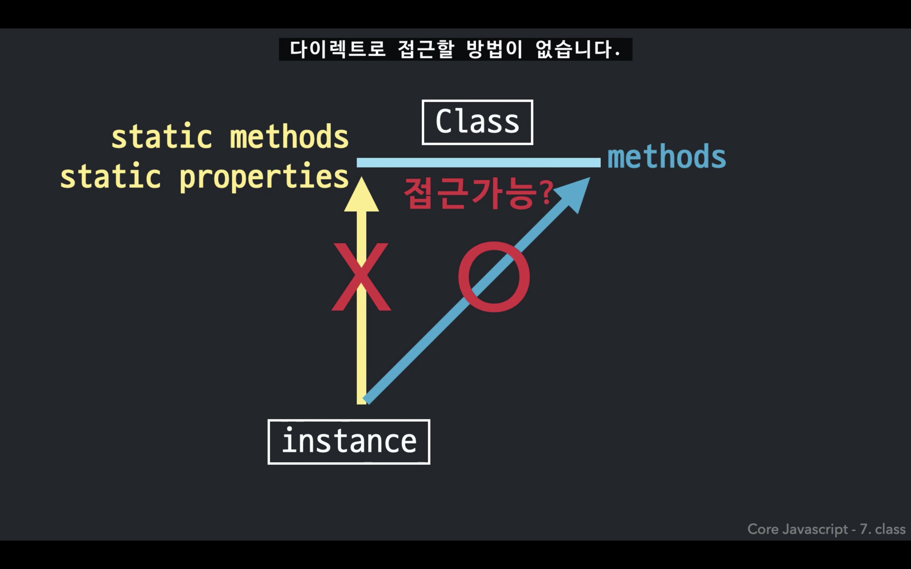

> 스태틱 메소드에서 제대로 된 결과를 얻으려면 생성자 함수에서 직접 접근해야 함

```js
// Person 생성자 함수 
function Person(name, age) {...}

// 스태틱 메소드
Person.getInformations = function(instance) {...}

// 프로토타입 메소드 
Person.prototype.getName = function() {...}
Person.prototype.getAge = function() {...}

const sj = new Person('sj', 20);

// OK - 메소드
console.log(sj.getName());
console.log(sj.getAge());

// Error - 인스턴스에서 스태틱 메소드에 직접 접근할 때
console.log(sj.getInformations(sj));

// OK - 생성자 함수에서 스태틱 메소드에 접근할 때 
console.log(Person.getInformations(sj));
```

<br><br>

## 클래스 상속 (class inheritance)

겹치는 메소드는 상위 클래스에만 놔두기  
하위 클래스(생성자 함수)에는 겹치지 않는 메소드만 남기기   
=> 하위 클래스의 인스턴스는 프로토타입 체이닝을 타고 상위 클래스의 메소드도 사용 가능   

<br>

### 예시 - 클래스 상속 관계 만들기  

> ⛓ 다중 상속 구조   
> 서로 다른 클래스가 슈퍼클래스, 서브클래스 관계를 갖도록 하는 방법 

<br>

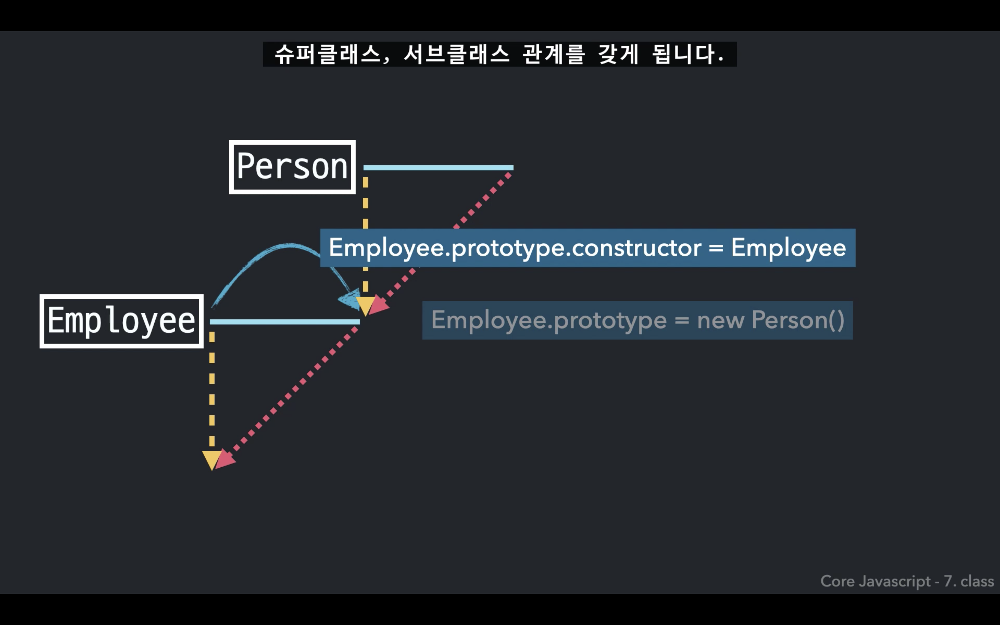

1. Employee의 프로토타입에 Person의 인스턴스를 할당

```js
Employee.prototype = new Person();
```

2. 프로토타입의 constructor에 Employee를 생성  
원래의 프로토타입 객체와 같은 기능을 수행하도록 구현 

```js
Employee.prototype.constructor = Employee;
```

기존의 `Employee.prototype` 객체를 완전히 새로운 객체로 대체하게 되어 버리기 때문에,   
다른 프로토타입과 동일하게 동작하도록 하려면 본래 기능을 다시 부여해야 함   
프로토타입 객체에는 자바스크립트가 기본적으로 constructor 프로퍼티(생성자 함수가 담겨있음)를 생성해줌

<br>

> superclass 👩🏻 `Person`
> > subclass 👩🏻‍💻 `Employee`

<br>

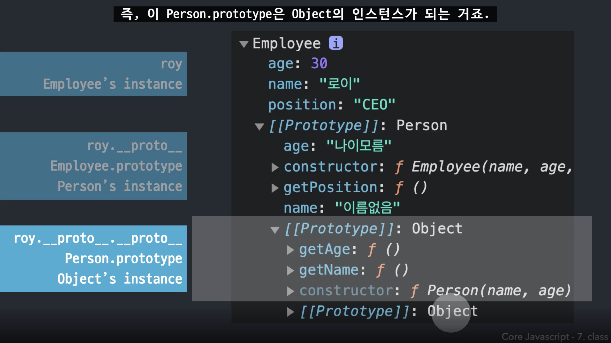

Employee.prototype 부분에서 `age, name`이 문제가 됨   
⚠️ 추상적이어야 할 클래스의 프로토타입에 **불필요한 프로퍼티**가 담겨 있는 것이 문제  


> `roy` 객체의 name 프로퍼티를 지운 상태에서 `getName` 메소드를 호출할 경우  
> 원래는 undefined가 반환되어야 하지만, 실제로는 프로토타입 체이닝을 타고 '이름없음'이 반환됨 

💡 프로토타입 체인 상에는 프로퍼티가 아닌 메소드만 존재하도록 하는 것이 **추상적인 클래스** 정의에 부합 

<br>

### 예시 - 불필요한 프로퍼티 지우기  

> ✏️ 추상적인 클래스를 만들기 위해 불필요 프로퍼티를 삭제하기 

<br>

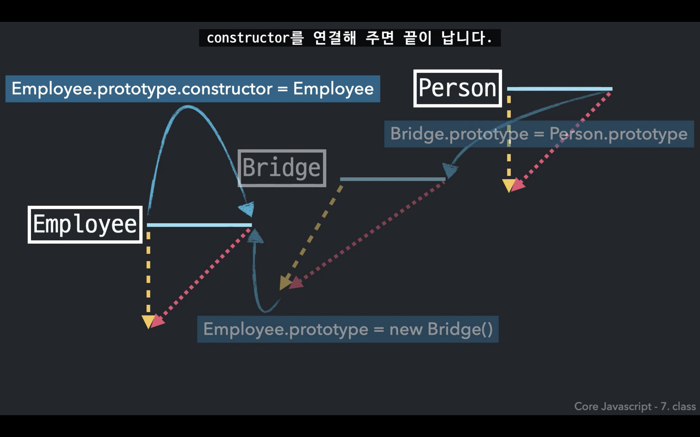

1. 빈 객체를 생성하는 `Bridge` 생성자 함수 만들기  
어떤 프로퍼티도 생성하지 않음 

```js
function Bridge() {}
```

2. Bridge의 prototype에 Person의 prototype을 연결한 상태에서 인스턴스를 생성  
생성된 인스턴스는 아무런 프로퍼티 없이, 메소드만 상속받는 형태

```js
Bridge.prototype = Person.prototype;
```

3. Employee의 prototype과 Bridge의 인스턴스를 연결  
원래 Person의 인스턴스를 넣는 대신에 빈 객체를 넣어줌 

```js
Employee.prototype = new Bridge();
```

4. 원래 프로토타입 기능을 되살리기 위해 constructor 연결 

```js
Employee.prototype.constructor = Employee;
```

<br>

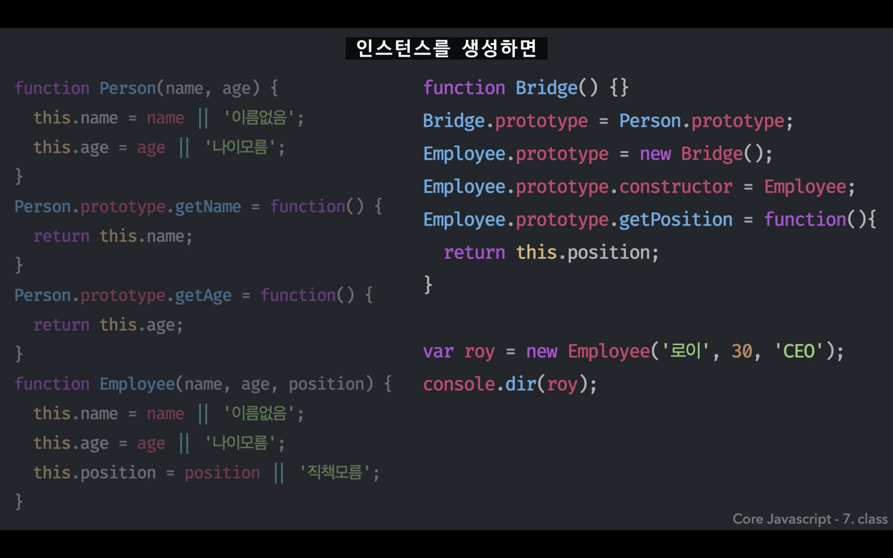

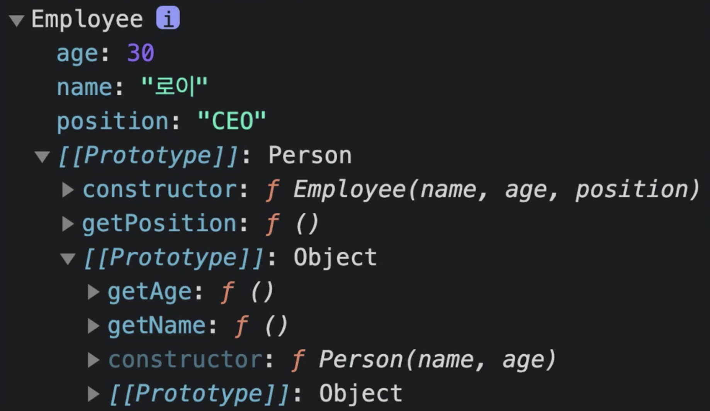

> 불필요 프로퍼티가 삭제된 결과 

<br>

* ES5 시스템에서 클래스 상속을 구현하는 데에 자주 등장하는 패턴
* Bridge라는 함수는 매개체 역할만 하며, 실제 코드상에 영향 주지 않음 

=> **함수화**를 통해 간단한 형태로 상속을 구현할 수 있음 (더글라스 크락포드)

<br>

### 함수화

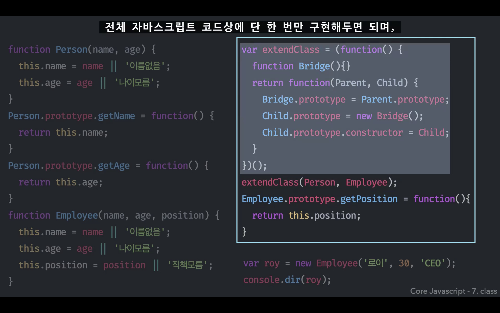 

**클로저**를 이용해 Bridge 생성자 함수는 단 한 번만 생성한 후 계속 재활용

super, sub 클래스로 쓰일 생성자 함수를 매개변수로 넘겨주기   
-> 🔗 둘 사이의 상속 구조를 연결해주는 함수

이후 `extendClass` 함수를 호출해주기만 하면 됨 

<br>

#### 인스턴스 값 상속

> 인스턴스의 값도 상속을 활용하면 간단하게 구현할 수 있음

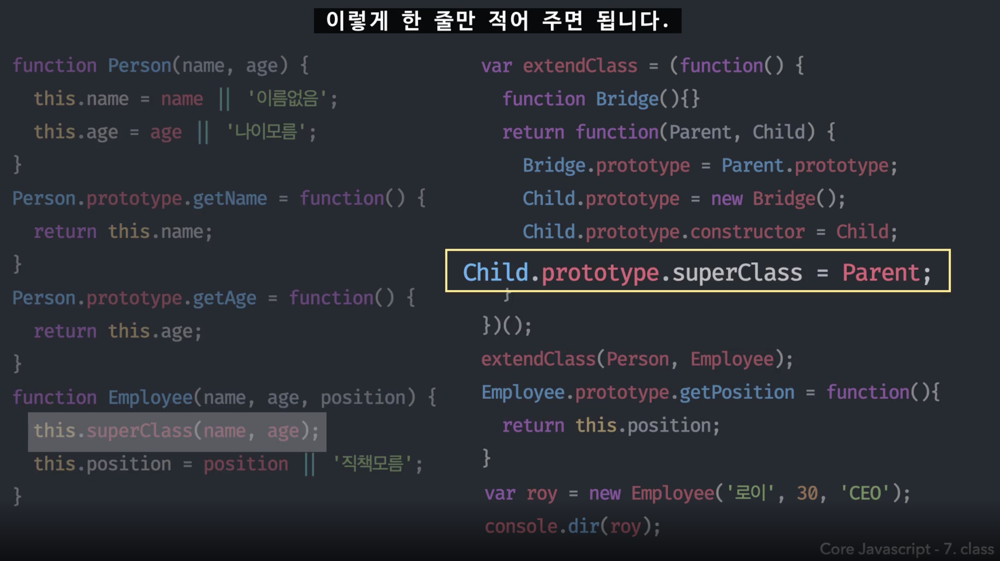

Person, Employee 모두 동일한 name, age 프로퍼티를 가짐   
하위 클래스에서 `this.superClass(name, age);` 호출로 name, age 프로퍼티를 구현하는 방법 

```js
Child.prototype.superClass = Parent;
```

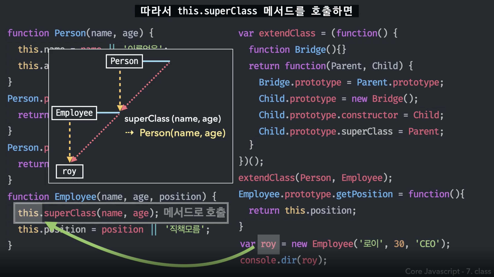

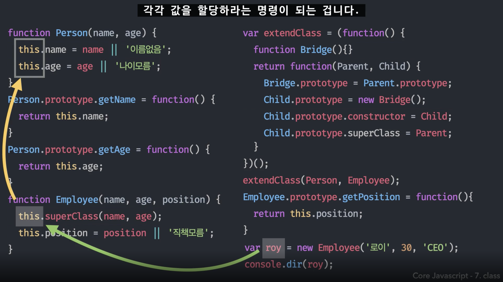

<br>

### ES6 - extends

[모던 자바스크립트 - 클래스 상속](https://ko.javascript.info/class-inheritance)

> ES6에서는 함수를 직접 만들어서 구현하지 않아도, 자바스크립트 내장 명령으로 클래스 상속 구현이 가능

클래스 상속을 사용하면 클래스를 다른 클래스로 확장 가능  
기존에 존재하던 기능을 토대로 새로운 기능을 만들 수 있음


* Person 생성자 함수(클래스)를 만들고, Employee는 Person을 `extends` 하기 


