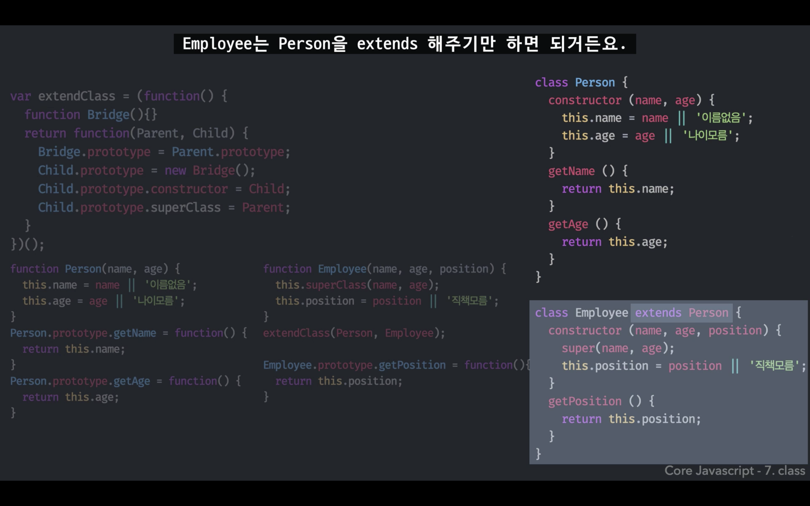

## 클래스 (Class)

### 클래스 class
계급, 집단, 집합  
공통적인 속성을 모아 한 데 묶은 덩어리 또는 명세  
인스턴스들의 공통 속성을 모은 추상적인 개념

 

### 인스턴스 instance 
해당 클래스의 속성을 지닌 구체적인 객체들

 

음식 = class, 과일 클래스의 상위 클래스 = superclass  
과일 = class, 음식 클래스의 하위 클래스 = subclass  
배 사과 바나나 감 오렌지 = 인스턴스

 

클래스를 통해 생성한 객체(배열 객체) -> 인스턴스  
구체적인 데이터를 지니고 실제 코드상에서 동작을 수행하는 실체 중의 하나  

 

 

### 클래스 상속 (class inheritance)

'프로토타입의 constructor는 Employee'를 만드는 과정 예시

 

 

* ES5 시스템에서 클래스 상속을 구현하는 데에 자주 등장하는 패턴
* Bridge라는 함수는 매개체 역할만 하며, 실제 코드상에 영향 주지 않음  

=> <strong>함수화</strong>를 통해 간단한 형태로 상속을 구현할 수 있다.

 

<strong>함수화</strong>

 

ES6에서는 함수를 직접 만들어서 구현하지 않아도 자바스크립트 내장 명령으로 클래스 상속 구현이 가능하다.

 

<strong>ES6</strong>

class Person 만들고, Employee는 Person을 extends 해주면 된다.

