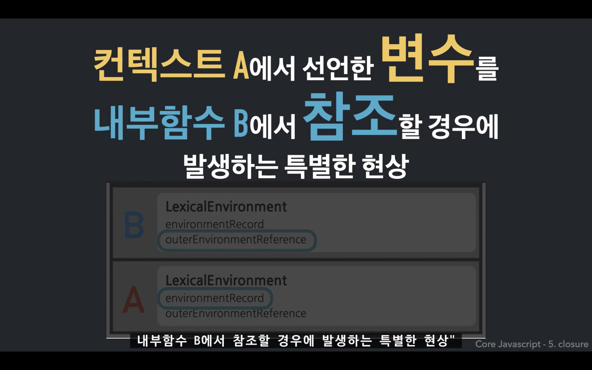
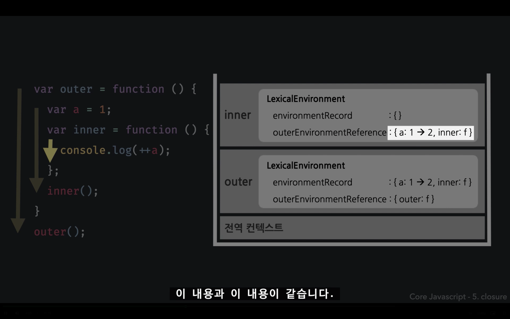
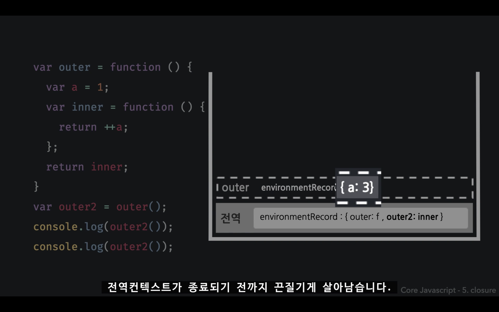
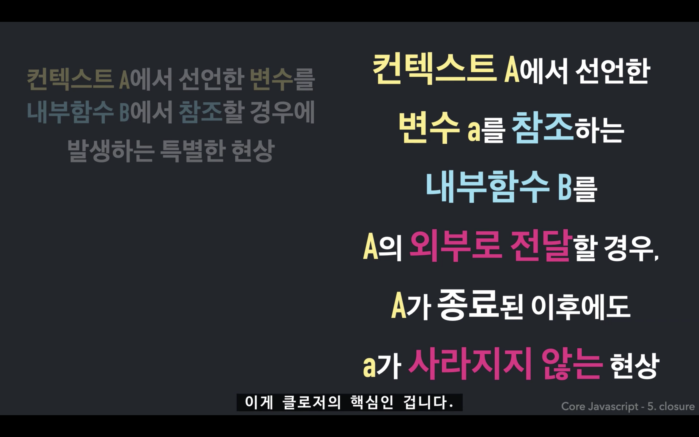
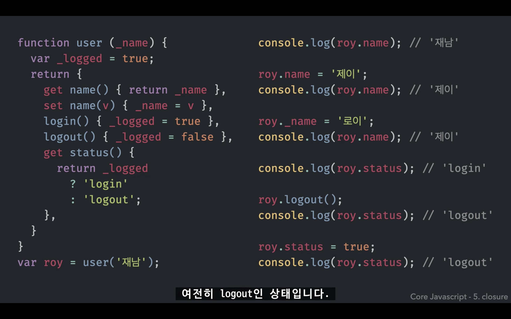
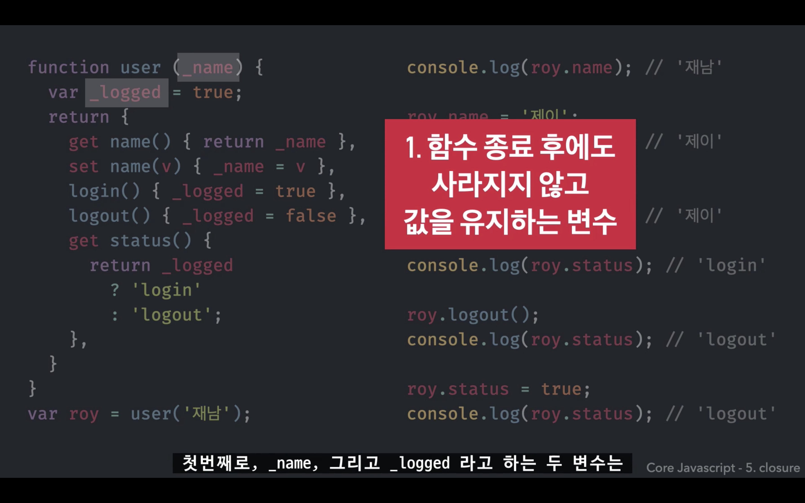
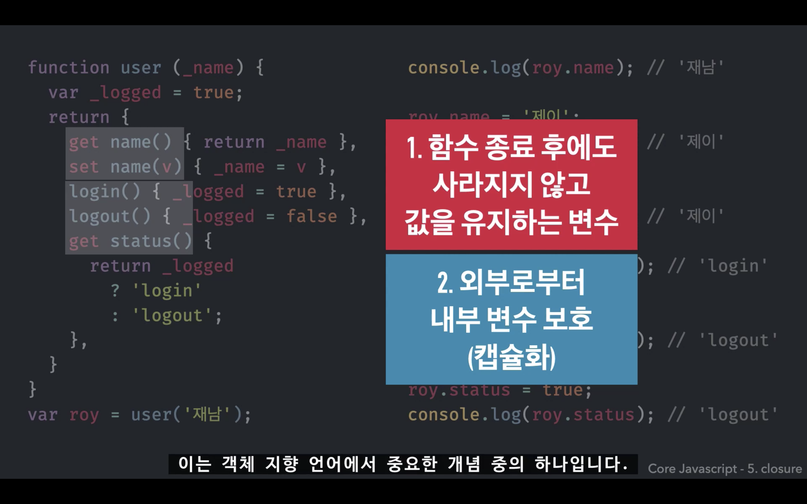

## 클로저 (Closure)

### closure
에워싸여져 함께 묶여진 함수  
둘러쌓인 LexicalEnvironment의 참조  

=> <strong>내부함수와 LexicalEnvironment의 조합</strong>

클로저는 함수가 생성될 때 매번 같이 발생

 

### 예제

 

### 정리

지역변수가 함수 종료 후에도 사라지지 않게 할 수 있다.  
(사용자가 선택적으로 어떤 것은 사라지게, 어떤 것은 사라지지 않게 할 수 있다.)

=> <strong>⭐️함수 종료 후에도 사라지지 않는 지역변수를 만들 수 있다.</strong>  
클로저의 가장 큰 이점

 

