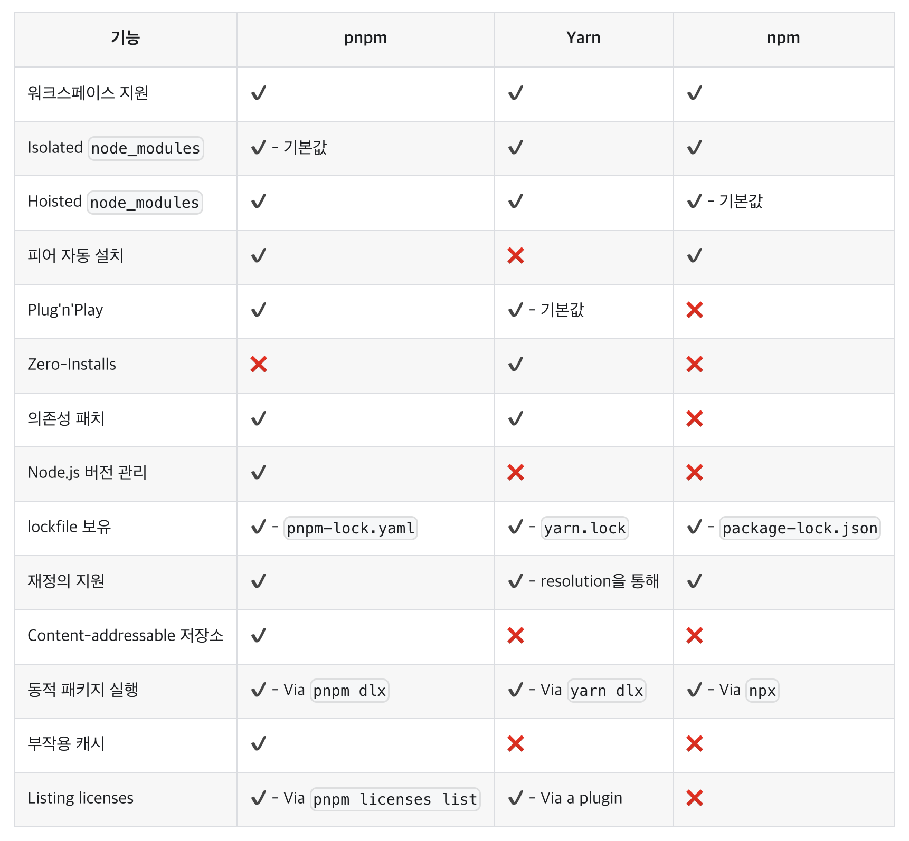

# JavaScript

## 패키지 매니저(package manager)

개발에 필요한 라이브러리나 애플리케이션을 쉽게 설치하고 관리할 수 있도록 돕는 도구들의 모임  
-> 패키지의 효율적인 관리

<br>

### 주요 기능

* 패키지 설치 및 제거 : 라이브러리나 애플리케이션 설치, 삭제
* 업데이트 : 설치된 패키지나 종속성을 최신 버전으로 업데이트
* 의존성 관리 : 각 패키지가 어떤 다른 패키지에 의존하고 있는지 관리, 필요한 의존성 라이브러리들을 자동으로 설치
* 버전 관리 : 특정 버전의 패키지를 고정해서 프로젝트에 사용하거나, 모든 패키지를 최신 버전으로 업데이트
* 레지스트리, 레포지토리 접근 : 중앙 저장소에 있는 수많은 패키지 목록에 접근해 쉽게 찾고 사용할 수 있음

<br>

### 자바스크립트 패키지 매니저 종류

1. **npm** : Node.js의 기본 패키지 매니저 
2. **pnpm** : 성능과 디스크 사용을 최적화하기 위해 하드 링크와 심볼릭 링크를 활용 
3. **Yarn** : 페이스북에 의해 개발되어 속도와 안정성을 높이고자 설계된 npm의 대안

<br><br>

## npm

> 🔗 https://www.npmjs.com/

Node Package Manager, Node.js의 패키지 관리 도구  
마이크로소프트가 깃허브, npm을 인수 

Node.js의 기본 패키지 매니저로, 전 세계적으로 가장 널리 사용됨  
Node.js가 설치될 때 기본적으로 설치됨  
`package.json` 파일을 통해 프로젝트의 종속성 관리  

<br>

### `package-lock.json`

npm에서 `package.json`과 함께 생성되는 파일   
Node.js 프로젝트에서 패키지의 의존성 및 버전 정보를 고정하는 데 사용  
프로젝트의 종속성을 안정적으로 관리하고, 일관된 패키지 버전이 설치되도록 보장하는 역할

<br>

### CLI 명령어

> https://docs.npmjs.com/cli/v10/commands

```bash
# npx
npm 패키지를 다운로드하지 않고 실행

# npm ci (clean install)
package-lock.json 파일에 명시된 버전으로 패키지를 빠르게 설치
CI/CD 파이프라인에서 널리 사용됨

# npm audit
설치된 패키지의 종속성을 검사해 보안 취약점을 보여줌
보안 취약점을 파악하고 프로젝트의 종속성을 최신 상태로 유지할 수 있음

# npm init
package.json 파일 생성

# npm install
패키지 설치

# npm uninstall
패키지 삭제
```

<br>

### npm 구성 요소

* 웹 사이트
  * 패키지 검색, 프로필 설정 등
  * 공개/비공개 패키지에 대한 액세스를 관리하도록 조직 설정 가능
* 커맨드라인 인터페이스(CLI)
  * 터미널에서 실행되며 개발자와 npm이 상호 작용하는 방식
* 레지스트리 
  * JavaScript 소프트웨어와 메타정보의 대규모 공개 데이터베이스
  * npm 레지스트리에는 수백만 개의 패키지가 등록되어 있음

<br>

### 기능 

* npx를 사용하여 다운로드하지 않고 패키지를 실행
* 패키지 유지 관리, 코딩 및 개발자를 조정하는 조직 생성 
* 여러 버전의 코드 및 코드 종속성을 관리
* 기본 코드가 업데이트되면 애플리케이션을 쉽게 업데이트할 수 있음 

<br><br>

## pnpm

> 🔗 https://pnpm.io/

**performant** npm, '효율적인, 성능이 좋은' npm   
성능과 디스크 공간 효율을 높이기 위해 하드 링크와 심볼릭 링크를 사용  
npm 보다 2배 빠른 패키지 설치 속도  
`package.json` 파일을 통해 프로젝트의 종속성 관리

<br>

### CLI 명령어

| 비교 | npm           | pnpm           |
|----|---------------|----------------|
| 설치 | npm install   | pnpm install   |
| 설치 | npm i <pkg>   | pnpm add <pkg> |
| 실행 | npm run <cmd> | pnpm <cmd>     |

<br>

### 기능

* 전체 프로젝트의 모듈을 공유해 디스크 사용 최소화 
* `pnpm-lock.yaml`을 통해 재현 가능한 빌드 보장
* 모노레포를 지원 - 여러 패키지를 단일 프로젝트로 관리 가능

<br>

### npm vs pnpm

#### 1. 효율적인 디스크 사용

패키지의 전역 저장소를 사용  
npm을 사용할 때 종속성을 사용하는 프로젝트가 100개라면 디스크에 해당 종속성의 복사본 100개가 저장됨  
pnpm을 사용하면 종속성이 **콘텐츠 주소 지정 가능 저장소에 저장**됨  

* 서로 다른 버전의 종속성을 사용하는 경우, 서로 다른 파일만 저장소에 추가
  * 새 버전에서 해당 파일 중 하나만 변경된 경우, 단일 변경에 대해서만 저장소에 새 파일 1개만 추가 (pnpm update) 
  * 전체 종속성을 복제 X
* 모든 파일은 디스크의 **한 위치**에 저장 
  * 패키지가 설치되면 해당 파일이 단일 위치에서 하드 링크되므로 추가 디스크 공간을 소비하지 않음 

=> 💡 프로젝트 간 동일한 버전의 종속성을 공유해, 디스크 공간이 절약되고 설치 속도가 상승

#### 2. 빠른 설치

설치 3단계

1. 종속성 해결 - 필요한 모든 종속성이 식별되어 저장소로 가져옴 
2. 디렉토리 구조 계산 - `node_modules` 디렉터리 구조는 종속성을 기반으로 계산됨
3. 종속성 연결 - 나머지 모든 종속성은 저장소에서 `node_modules`로 가져와 하드 링크됨 

공유 저장소를 통해 이미 다운로드된 패키지를 링크만으로 참조 가능  
-> 새 프로젝트에서 필요한 패키지를 빠르게 설치   
-> 캐시된 패키지를 활용하여 설치 시간과 네트워크 대역폭을 절약

#### 3. 논플랫 node_modules 디렉토리 생성

`package.json`에 정의되지 않은 패키지는 참조할 수 없기 때문에, 의존성 오류를 줄일 수 있음  
pnpm은 심볼릭 링크를 사용해 프로젝트의 **직접적인 종속성**만 모듈 디렉터리의 루트에 추가

npm/Yarn Classic을 사용하여 종속성을 설치할 때 모든 패키지는 모듈 디렉터리의 루트에 끌어 올려짐  
-> 종속성으로 추가되지 않은 패키지에 액세스할 수 있음

#### 4. 빠른 모노레포 지원

여러 패키지를 단일 프로젝트로 관리하는 모노레포를 효과적으로 지원  
다중 패키지에서 동시에 설치할 수 있는 `pnpm -r` 기능이 있어 모노레포 관리가 간단해짐

<br><br>

## yarn

> 🔗 https://yarnpkg.com/

페이스북이 개발한 npm의 대안으로, 속도와 효율성을 높이고자 설계됨  
속도, 정확성, 보안, 개발자 경험에 초점  
작업 공간, 오프라인 캐싱, 병렬 설치, 강화 모드, 대화형 명령 등의 기능을 활용

<br>

### `yarn.lock`

Yarn 패키지 매니저가 생성하는 잠금 파일로, 프로젝트의 패키지 의존성을 일관되게 관리  
패키지의 버전과 해당 종속성의 버전 정보 기록    
의존성 관리, 프로젝트의 안정성과 예측 가능성을 유지  

<br>

### CLI 명령어

> https://yarnpkg.com/cli

```bash
# yarn(yarn install)
Yarn을 실행하는 것만으로 설치를 시작

# yarn add
단일 패키지에 의존성을 추가하거나 업데이트

# yarn up
프로젝트 전체에서 의존성을 업그레이드

# yarn npm 
레지스트리 관련 대부분의 명령은 yarn npm 뒤에 위치 (예: yarn npm audit)

# yarn build
스크립트는 별칭으로 처리 -> yarn build = yarn run build

# yarn remove
패키지 삭제
```

<br>

### 기능

* 병렬 설치를 통해 빠른 패키지 설치
* 의존성 버전을 고정하는 `yarn.lock` 파일
* 오프라인 캐싱을 통해 이미 설치된 패키지의 재사용 가능
* 커맨드 실행 시 터미널 출력이 더 깔끔하게 관리됨
* Yarn 2 버전부터 플러그인 시스템 도입

<br><br>

## yarn berry

Yarn berry = Yarn v2 이상

<br>

### Yarn vs Yarn Berry

1. 플러그인 아키텍처
   * 새로운 플러그인 시스템을 도입해 다양한 기능을 쉽게 추가하고 확장
   * 필요에 따라 플러그인을 생성하거나 기존 플러그인을 사용하여 Yarn의 기능을 커스텀 가능 

2. Zero-Install
   * 기존의 설치는 명시적으로 명령을 내릴 때마다 수행 
   * `.yarn/cache` 폴더에 패키지를 캐시하고, 캐시된 파일을 버전 관리 시스템에 포함시켜 다른 사용자/환경에서 추가적인 설치 과정 없이 바로 사용

3. 향상성
   * 더 빠르고, 효율적인 종속성 해결 및 패키지 페칭 방식으로 성능 개선

4. 모듈 레이아웃
   * 기존에는 `node_modules` 폴더에 모든 패키지를 저장 
   * **Plug'n'Play (PnP)** 기술로 `node_modules` 폴더 없이 종속성 관리
   * -> 디스크 공간 절약, 프로젝트 설정을 간단하게 함

5. 호환성 
   * Yarn은 기존 npm 생태계와의 호환성을 중시 
   * Yarn Berry는 호환성은 여전히 유지하면서도, Yarn만의 새로운 기능과 최적화를 추구

<br><br>

## 패키지 매니저 비교



<br><br>

## 참고 사이트 

> https://pnpm.io/ko/motivation  
> https://pnpm.io/ko/pnpm-vs-npm
