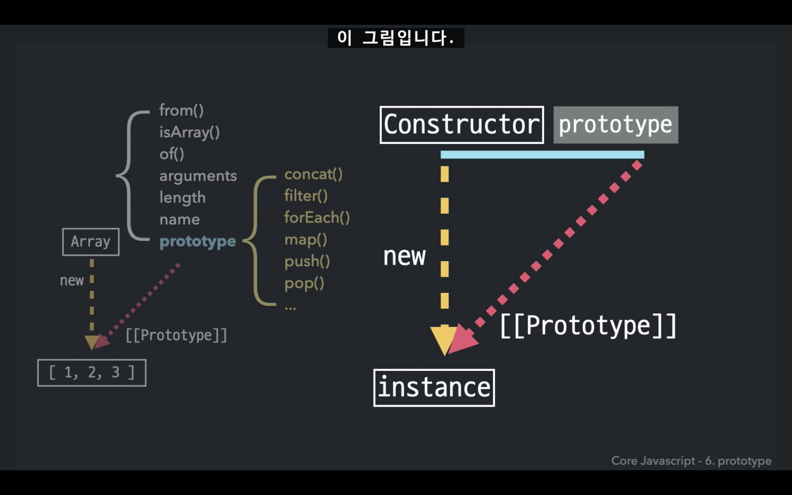
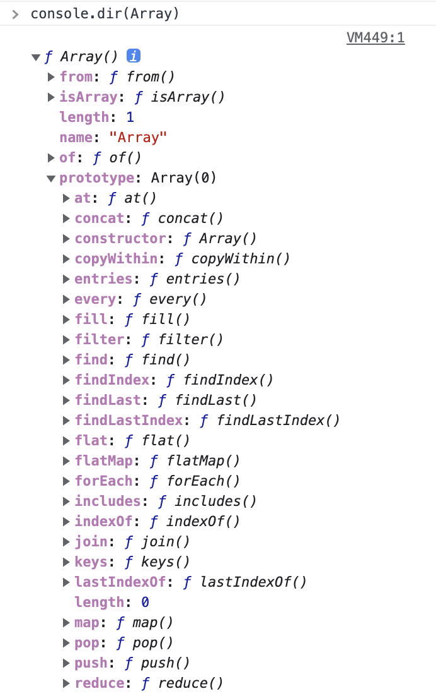
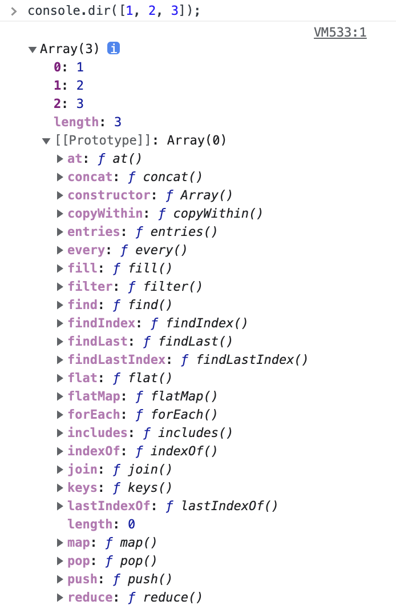
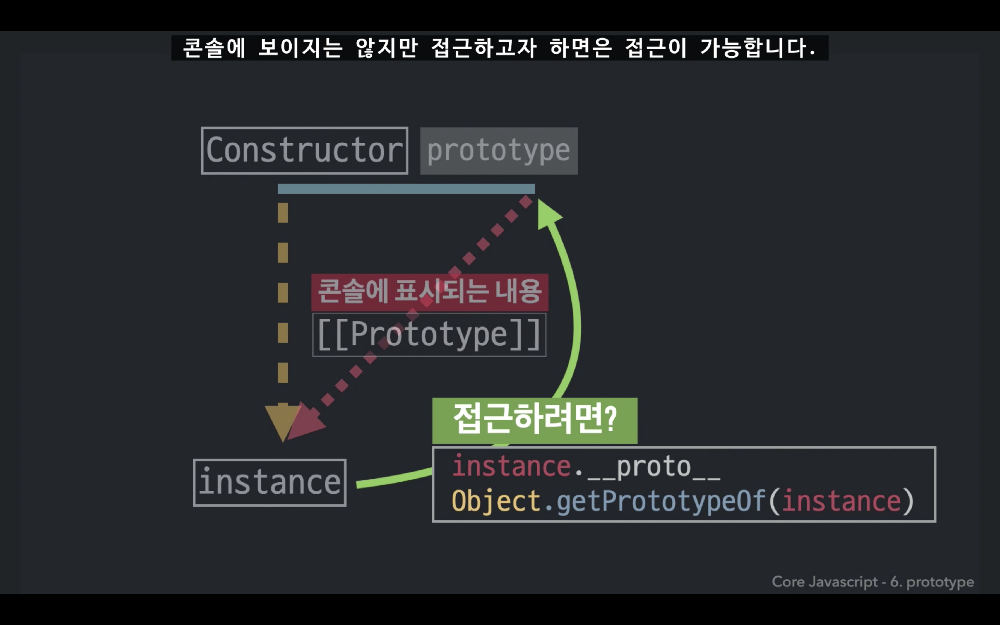
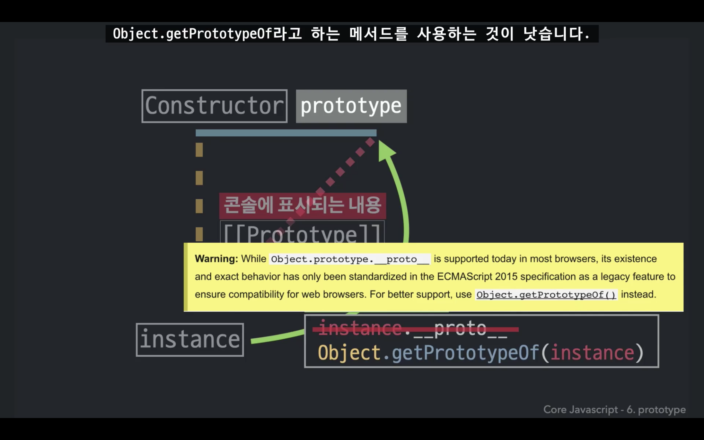
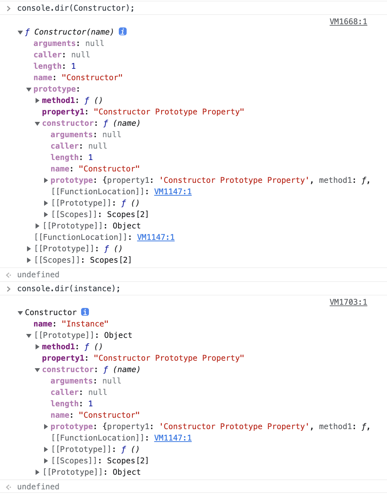
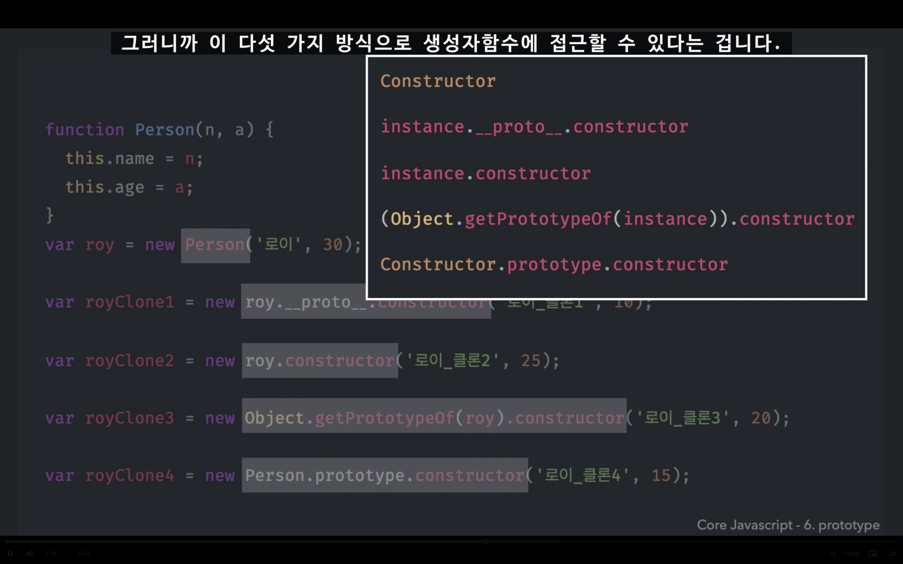
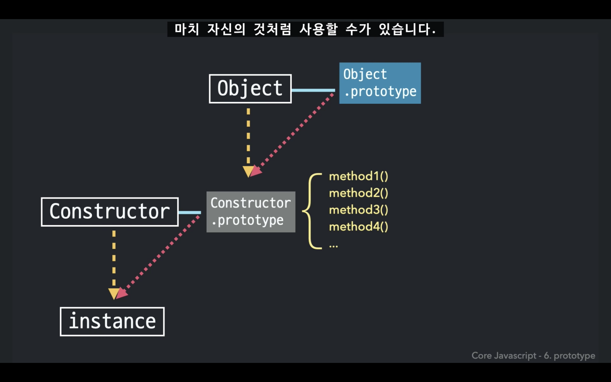
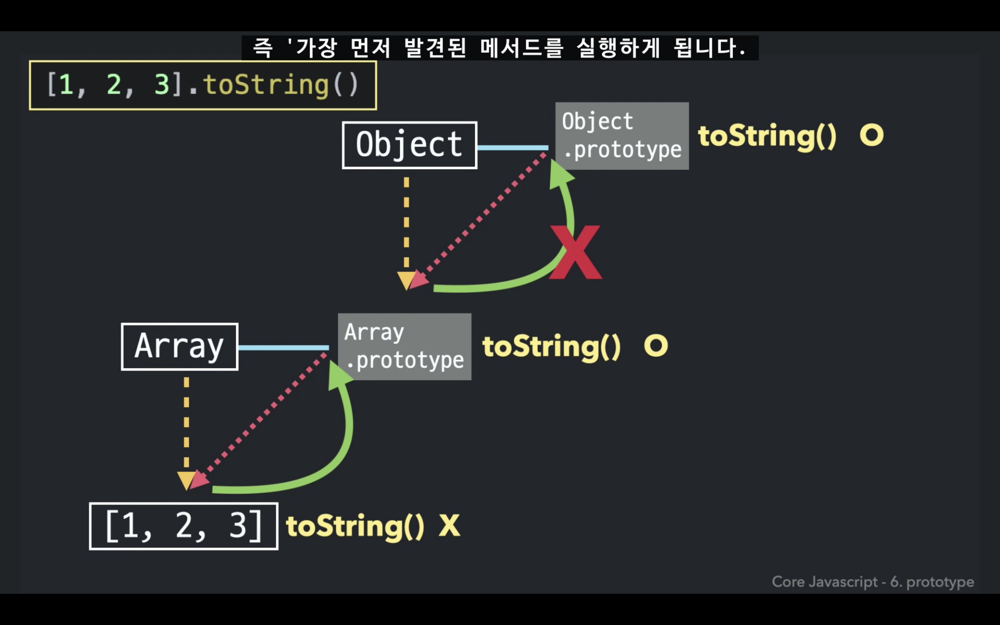

# 코어 자바스크립트

## 프로토타입 (prototype)

### 목차

1. prototype 
2. [[Prototype]] = 프로토 
3. constructor 

### 프로토타입

자바스크립트는 프로토타입 기반 언어  
어떤 객체를 **원형(prototype)** 으로 삼고, 이를 **복제(참조)** 함으로써 클래스 기반 언어의 상속과 비슷한 효과를 얻음

<br><br>

## 도식화



생성자 함수 - 프로토타입  
⬇️    ↙️  
인스턴스 

> 둘은 같은 객체  
> constructor.prototype = instance[[prototype]]

생성자 함수 **Array**의 프로퍼티 중 **prototype**가 배열 리터럴의 `[[prototype]]`로 연결이 되어 있음    

prototype 프로퍼티는 객체이고, 내부에는 다음과 같은 내용이 담겨있음 (= 배열 메소드)

* concat
* map
* filter
* push
* pop

<br>

### Array 생성자 함수 출력 시



<br>

### 배열 인스턴스 출력 시 Array.prototype과 동일




<br>

### 기본형 데이터

> **기본형 데이터가 메소드를 호출하는 방식**  
> 메소드를 호출하는 순간에 임시로 인스턴스를 만들어서 메소드를 실행하고, 결과를 얻음과 동시에 인스턴스를 폐기   

숫자/문자 리터럴의 경우, 이 자체는 객체가 아니므로 `[[Prototype]]` 프로퍼티가 없음  
그런데도 리터럴을 인스턴스인 것처럼 사용할 경우 (= **메소드를 사용할 경우**) `Ex. 10.toFixed(2);`  
자바스크립트가 임시로 숫자/문자 리터럴에 해당하는 Number/String **생성자 함수의 인스턴스를 만들어서** `Ex. Number.prototype`    
그 프로토타입에 있는 메소드를 적용해 원하는 결과를 얻게 한 다음 `Ex. Number.prototype가 담고있는 toFixed() 메소드 이용`  
**인스턴스를 제거**하는 식으로 동작  

<br>

### 참조형 데이터

> 📐 메소드에 접근할 때는 전부 삼각형 구조  
> 숫자, 문자, 배열, 함수 모든 형태에서 삼각형 구조  

처음부터 인스턴스이기 때문에 임시로 인스턴스를 생성했다가 폐기하는 과정을 거치지 않음    
**null, undefined**를 제외한 모든 데이터 타입에서 생성자 함수가 존재 

**생성자 함수의 프로토타입에는 각 데이터 타입에만 해당하는 전용 메소드가 정의되어 있음**   

<br><br>

## [[Prototype]]

`[[Prototype]], 프로토` 프로퍼티는 **콘솔에 표시**가 되는 내용일 뿐, 실제로 이 프로퍼티를 이용해서 prototype에 직접 **접근할 수는 없음**  
new 연산자로 생성자 함수를 호출하면 인스턴스가 생성되고, `__proto__` 프로퍼티가 자동으로 생성됨     
`__proto__`는 생략 가능한 프로퍼티

<br>

### 실제로 인스턴스에서 프로토타입에 직접 접근하는 방법

1. `instance.__proto__`  
    콘솔에 보이지는 않지만, 접근하려고 하면 접근은 가능  
    ES2015에서 기존 브라우저가 마음대로 제공하고 있는 기능을 호환성 차원에서 문서화 해준 것이기 때문에, 
    가급적 공식적인 2번 방법을 사용하는 것이 좋음   

3. `Object.getPrototypeOf(instance)`





#### 생성자 함수의 prototype 프로퍼티에 접근하는 방법  

* instance.`__proto__`
* instance
* Object.getPrototypeOf(instance)
* Constructor.prototype

<br>

### constructor

constructor는 클래스의 인스턴스 객체를 생성하고 초기화하는 특별한 메소드  

원래의 생성자 함수(자기 자신)을 참조 

* 생성자 함수의 prototype 프로퍼티 객체 내부
* 인스턴스의 `__proto__` 객체 내부

인스턴스에서 그 원형이 무엇인지 알 수 있는 수단 



* constructor는 값을 바꿀 수 있음 
  * 읽기 전용 속성인 기본형 리터럴 변수(number, string, boolean) 제외
* constructor가 변경되어도 참조하는 대상이 변경될 뿐
  * 이미 만들어진 인스턴스의 원형이 바뀌거나 데이터 타입이 변하지는 않음 
  * 인스턴스의 생성자 정보를 알기 위해 constructor 프로퍼티에 의존하는 것이 항상 안전하지는 않은 이유
  * 클래스 상속을 흉내내는 등이 가능해짐
  
<br>

### 생성자 함수 접근 방법 



모두 Person이라는 생성자 함수를 가리킴

* Constructor 
* instance.`__proto__`.constructor
* instance.constructor
* Object.getPrototypeOf(instance).constructor
* Constructor.prototype.constructor

<br><br>

## 프로토타입 체이닝 (prototype chaining)

[[Prototype]]로 이어진 각 프로토타입에 모두 접근할 수 있는 것   
인스턴스에는 메소드가 없지만 [[Prototype]] 매개체 덕분에 생성자 함수의 prototype에 있는 메소드를 사용할 수 있음

### 메소드 상속 및 동작 원리

> **DRY 원칙**
>
> DIY 하지 말고 DRY 할 것  
> Do not Repeat Yourself  
> 매번 직접 반복하지 말고, 복붙하지 말고, 최대한 반복을 줄이자

메소드 생성 시, 동일한 메소드를 매번 만들지 말고 **프로토타입으로 메소드를 이동**시킴

인스턴스를 여러 개 찍어내도 **메소드는 한 번 만들어 놓은 코드**를 여러 곳에서 참조  
인스턴스는 자신만의 **고유한 정보**만 가지고 있으면 됨  
인스턴스가 모두 **동일하게 가지는 정보**는 prototype으로 보내기

#### 장점

* 메모리 사용 효율 극대화
* 어떤 객체가 속한 집단의 특징을 알 수 있음 (특정 집단의 공통된 속성 파악 가능)
    * 사람은 모두 나이를 먹음
    * 사람들의 나이를 알 수 있음

<br>

### 프로토타입과 프로토타입 체이닝

> 프로토타입은 모두 **객체**이므로, 모든 데이터 타입은 이와 동일한 구조를 따름  
> 숫자/문자/배열/함수 모두 **Object.prototype**과 **프로토타입 체인**으로 연결됨

프로토타입 역시 Object 생성자 함수의 new 연산으로 생성된 인스턴스 -> Object의 prototype과 연결됨  
=> 인스턴스는 Object.prototype에 있는 메소드도 사용 가능

모든 데이터 타입에 대해 [[Prototype]]으로 연결된 `Object.prototype`에는 **자바스크립트 전체를 통괄하는 공통된, 범용적인 메소드**가 정의되어 있음  

* hasOwnProperty
* toString
* valueOf
* isPrototypeOf

모든 데이터 타입이 프로토타입 체이닝을 통해 이 메소드에 접근 가능 



대각선의 빨간선을 따라 연결되어 있는 프로토타입들이 **프로토타입 체인**

<br>

### 객체 전용 메소드

객체의 프로토타입에는 `객체 전용 메소드`를 정의해둘 수 없음   
객체의 프로토타입에 있는 메소드는 모든 데이터 타입에 적용되기 때문

```
{ a: 1, b: 2 } 의 경우 { a: 1 }.values() = [1];
(10).values() ?
(false).values() ?
```

객체 외의 데이터도 프로토타입 체인을 타고 values 메소드를 실행할 수 있게 되버림 -> 객체 전용 메소드가 아니게 됨 

> 💡 객체 생성자 함수에 직접 메소드를 정의  
> 객체 전용 메소드를 Object.prototype이 아닌 **Object**에 직접 부여

객체 관련 명령어가 객체로부터 직접 메소드를 호출하는 대신, `Object.명령어`를 호출하면서 그 매개변수로 객체 자신을 넘겨주는 방식을 취하는 이유  
=> 프로토타입 체인 때문(Object.prototype이 프로토타입 체이닝을 타고 도달할 수 있는 최상위 존재이기 때문)

```
// 객체로부터 직접 메소드를 호출
❌ obj.keys();

// `Object.명령어`를 호출하면서 그 매개변수로 객체 자신을 넘기기
✅ Object.keys(obj);
```

#### Object.create

예외적으로 Object.create를 이용하면 Object.prototype의 메소드에 접근할 수 없는 경우가 발생 

```
// __proto__가 없는 객체를 생성
Object.create(null);
```

이 방식으로 만든 객체는 일반적인 데이터에서 반드시 존재하는 **내장 메소드 및 프로퍼티가 제거됨**  
기본 기능에 제약이 생긴 대신, 객체 자체의 무게가 가벼워지는 성능상의 이점을 가짐  

<br>

### 스코프 체인과 같은 개념



가장 가까운 자기 자신부터 찾고, 없을 경우 상위의 프로토타입에서 찾음  
가장 먼저 찾아진 메소드만 실행하고, 그보다 더 멀리 있는 체인까지는 찾아가지 않음  
스코프 체인에서 LE의 outerEnvironmentReference를 타고 상위 스코프로 식별자를 찾아 나가는 것과 동일한 흐름

<br><br>

## 참고 사이트 

> https://developer.mozilla.org/ko/docs/Learn/JavaScript/Objects/Object_prototypes#%ED%94%84%EB%A1%9C%ED%86%A0%ED%83%80%EC%9E%85_%EA%B8%B0%EB%B0%98_%EC%96%B8%EC%96%B4  
> https://ko.javascript.info/prototype-inheritance     
> https://developer.mozilla.org/ko/docs/Web/JavaScript/Reference/Classes/constructor
