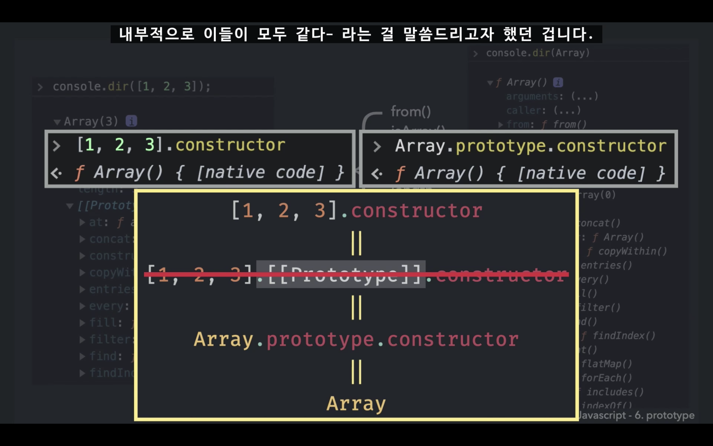

# 코어 자바스크립트

## 프로토타입 (prototype)

### 목차

1. prototype 
2. [[Prototype]] = 프로토 
3. constructor 

  

## 도식화

생성자 함수 - 프로토타입  
⬇️    ↙️  
인스턴스 

> 둘은 같은 객체  
> constructor.prototype = instance[[prototype]]

생성자 함수 **Array**의 프로퍼티 중 **prototype**가 배열 리터럴의 `[[prototype]]`로 연결이 되어 있음    

prototype 프로퍼티는 객체이고, 내부에는 다음과 같은 내용이 담겨있음 (= 배열 메소드)

* concat
* map
* filter
* push
* pop

### Array 생성자 함수 출력 시

### 배열 인스턴스 출력 시 Array.prototype과 동일

### 기본형 데이터

> **기본형 데이터가 메소드를 호출하는 방식**  
> 메소드를 호출하는 순간에 임시로 인스턴스를 만들어서 메소드를 실행하고, 결과를 얻음과 동시에 인스턴스를 폐기   

숫자/문자 리터럴의 경우, 이 자체는 객체가 아니므로 `[[Prototype]]` 프로퍼티가 없음  
그런데도 리터럴을 인스턴스인 것처럼 사용할 경우 (= **메소드를 사용할 경우**) `Ex. 10.toFixed(2);`  
자바스크립트가 임시로 숫자/문자 리터럴에 해당하는 Number/String **생성자 함수의 인스턴스를 만들어서** `Ex. Number.prototype`    
그 프로토타입에 있는 메소드를 적용해 원하는 결과를 얻게 한 다음 `Ex. Number.prototype가 담고있는 toFixed() 메소드 이용`  
**인스턴스를 제거**하는 식으로 동작  

### 참조형 데이터

> 📐 메소드에 접근할 때는 전부 삼각형 구조  
> 숫자, 문자, 배열, 함수 모든 형태에서 삼각형 구조  

처음부터 인스턴스이기 때문에 임시로 인스턴스를 생성했다가 폐기하는 과정을 거치지 않음    
**null, undefined**를 제외한 모든 데이터 타입에서 생성자 함수가 존재 

**생성자 함수의 프로토타입에는 각 데이터 타입에만 해당하는 전용 메소드가 정의되어 있음**   

  

### [[Prototype]]

프로토라고 하는 프로퍼티는 콘솔에 표시가 되는 내용일 뿐, 
실제로 이 프로퍼티를 이용해서 prototype에 직접 접근할 수는 없다.

 

<strong>실제로 인스턴스로부터 접근하는 방법 2가지</strong>

 

<strong>예제</strong>

 

### 메소드 상속 및 동작 원리
* 메모리 사용 효율을 상당히 끌어올릴 수 있다. 
* 어떤 객체가 속한 집단의 특징을 알 수 있다. (특정 집단의 공통된 속성 파악)

 

### 프로토타입 체이닝 (prototype chaining)
프로토타입은 모두 객체이므로, 모든 데이터타입은 이와 동일한 구조를 따른다.  

 

<strong>프로토타입과 프로토타입 체이닝 정리</strong>

대각선의 빨간선을 따라 연결되어 있는 프로토타입들을 '프로토타입 체인'이라 부른다.

 

<strong>스코프체인과 같은 개념</strong>

가장 가까운 자기 자신부터 찾고, 가장 먼저 찾아진 메소드만 실행하고, 
그보다 더 멀리 있는 체인까지는 찾아가지 않는다.

