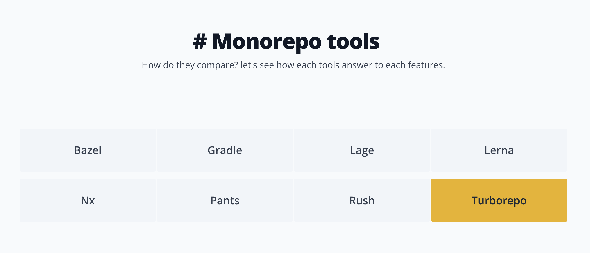

# Monorepo

## 모노레포 도구 

모노레포 툴은 설정, 구성, 성능 등을 최적화 시켜주는 도구  
로컬에서 빌드 캐시, 라이브러리 버전 업데이트 자동화 등을 도움 

* yarn berry의 워크스페이스를 한 겹 싸고있음 
* 자바스크립트 진영에서는 러나(Lerna), 터보레포, Nx를 주로 사용 

### Yarn Berry vs 터보레포 

* yarn berry, pnpm : 모노레포를 구성하기 위한 기능을 제공하는 것
  * 패키지 매니저에서 워크스페이스라는 기능을 제공

* 터보레포, Nx : 모노레포 도구

  

## 터보레포 

[Creating a new monorepo](https://turbo.build/repo/docs/getting-started/create-new)

Vercerl 소유  
웹팩 개발자가 Vercerl에 들어가서 Turbopack을 Rust로 만듦  

  

## 참고 사이트

> https://monorepo.tools/  
> https://turbo.build/  
> https://lerna.js.org/  
> https://nx.dev/

