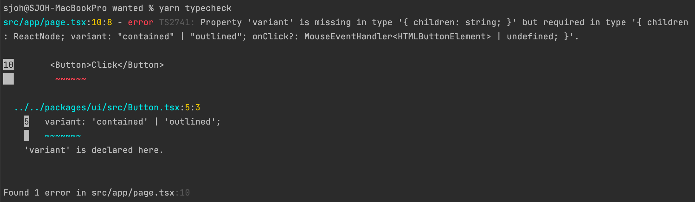
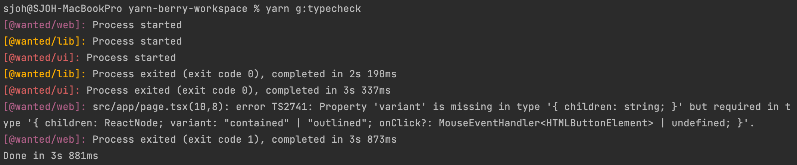
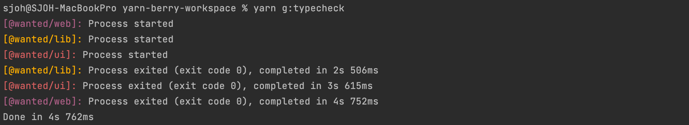

# type check

## 타입 체크 실행하기 

모노레포에서 타입 체크하는 방법

* 각 프로젝트로 이동해서 `yarn typecheck` 등의 명령어를 수행 => 매우 비효율적
* root 폴더에서 명령어를 통해 한 번에 타입 체크하기 ✅

### 프로젝트에 typecheck script 추가

아래 폴더에 `typecheck script` 추가

- `apps/wanted/package.json`
- `packages/lib/package.json`
- `packages/ui/package.json`

```bash
"scripts": {
  "typecheck": "tsc --project ./tsconfig.json --noEmit"
},
```

* "scripts"가 없다면 만들어주고, 있으면 내용만 추가하면 됨  

<br>

### Button 컴포넌트에 브레이킹 체인지 발생시키기

typecheck를 확인하기 위해 Button에 추가적인 props `variant` 를 작성

```tsx
import { ButtonHTMLAttributes, MouseEventHandler, ReactNode } from 'react';

export type ButtonProps = ButtonHTMLAttributes<HTMLButtonElement> & {
  children: ReactNode,
  variant: 'contained' | 'outlined', // 👈 이 부분 추가
  onClick?: MouseEventHandler<HTMLButtonElement>,
};

const Button = (props: ButtonProps) => {
  const { children, onClick, ...other } = props;

  return (
    <button type="button" onClick={onClick} {...other}>
      {children}
    </button>
  );
};

export default Button;
```

<br>

### 타입 오류 확인하기  

커맨드를 입력해 오류 메시지 확인하기 

```bash
yarn workspace @wanted/web typecheck
```



<br>

### 모든 프로젝트를 typecheck하는 scripts 만들기

[yarn workspace를 관리하기 위한 기본 제공 plugin](https://yarnpkg.com/api/modules/plugin_workspace_tools.html)

#### `workspace-tools` plugin 설치하기

```bash
yarn plugin import workspace-tools
```

#### `root package.json`에 scripts 추가하기

```bash
"scripts": {
  "g:typecheck": "yarn workspaces foreach -pv run typecheck"
},
```

[workspace 관련 명령어 - foreach](https://yarnpkg.com/cli/workspaces/foreach)

* g:* : global 하게 모든 프로젝트를 실행
* p : 병렬 실행
* v : workspace name 출력

```bash
# 실행하기 
yarn g:typecheck
```



* 병렬적인 실행

<br>

### `apps/wanted/pages/index.tsx` 에서 버튼 컴포넌트에 **`variant`** prop 추가

```tsx
export default function Home() {
  return (
    <main className={styles.main}>
      <div>{sayHello()}</div>
      <Button variant="outlined">Click</Button>
```



#### 최종적으로 정상 작동하는 것을 확인

```bash
yarn workspace @wanted/web dev
```
