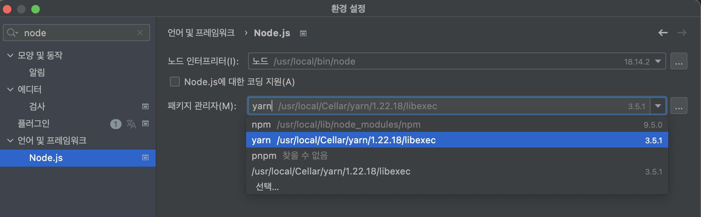

# 공통 라이브러리 패키지 만들기

## 1. TypeScript 적용하기

### TypeScript 패키지 설치

```bash
yarn add -D typescript
```

<br>

### Webstorm 패키지 매니저 설정

웹스톰을 사용하는 경우, yarn berry를 이용해야하기 때문에 별도의 설정이 필요

`settings` → `Nodejs` 검색 → 패키지 매니저에서 `Yarn berry`로 지정  
⚠️ 버전을 확인할 것 



<br>

### vscode extension 설치

vscode를 사용하는 경우, `arcanis.vscode-zipfs` extends를 설치  
`.vscode/extensions.json`에 내용 추가  

[ZipFS - a zip file system](https://marketplace.visualstudio.com/items?itemName=arcanis.vscode-zipfs)

```
// .vscode/extensions.json

{
  "recommendations": ["arcanis.vscode-zipfs"]
}
```

* 다른 사용자가 프로젝트 이용 시 extensions 설치를 추천하도록 설정 가능

<br><br>

## 2. 공통 라이브러리 패키지 생성

공통 패키지를 만들어서 다른 프로젝트, 패키지에 활용할 수 있음 

### packages/lib 공통 패키지 만들기

`package/lib` 폴더를 생성하고, 아래 스크립트를 실행

```bash
cd packages/lib

yarn init
yarn add typescript
```

<br>

### `packages/lib/package.json` 파일 수정

```
{
  "name": "@wanted/lib",     // 👈 추가
  "version": "1.0.0",
  "private": true,
  "main": "./src/index.ts",  // 👈 추가
  "depdndencies": {
    "typescript": "^5.0.4"
  }
}
```

<br>

### `packages/lib/tsconfig.json` 파일 생성하기 

```json
{
  "$schema": "https://json.schemastore.org/tsconfig",
  "compilerOptions": {
    "strict": true,
    "useUnknownInCatchVariables": true,
    "allowJs": true,
    "skipLibCheck": true,
    "forceConsistentCasingInFileNames": true,
    "isolatedModules": true,
    "newLine": "lf",
    "module": "ESNext",
    "moduleResolution": "node",
    "target": "ESNext",
    "lib": ["ESNext", "dom"],
    "esModuleInterop": true,
    "allowSyntheticDefaultImports": true,
    "baseUrl": "./src",
    "noEmit": false,
    "incremental": true,
    "resolveJsonModule": true,
    "paths": {}
  },
  "exclude": ["**/node_modules", "**/.*/", "./dist", "./coverage"],
  "include": ["**/*.ts", "**/*.js", "**/.cjs", "**/*.mjs", "**/*.json"]
}
```

<br>

### package/lib/src/index.ts 파일 생성하기 

```tsx
export const sayHello = () => {
   return "Hello from lib";
};
```

<br><br>

## 3. 프로젝트에 packages/lib 사용하기 

apps/wanted 프로젝트에 의존성을 주입

### 설치

```bash
# root로 이동
cd ../../

# pwd 실행시 root 폴더에 위치해야 함 
yarn workspace @wanted/web add @wanted/lib
```

* pwd : print working directory, 현재 작업 중인 디렉토리의 이름을 출력 

#### `apps/wanted/package.json` 에 의존성 추가된 것 확인 

```
"@wanted/lib": "workspace:^"
```

<br>

### @wanted/lib 사용하기

`apps/wanted/src/pages.tsx`에서 sayHello 함수를 호출
```tsx
import { sayHello } from '@wanted/lib';

export default function Home() {
    return (
        <>
            <div>{sayHello()}</div>
            {/*...*/}
        </>
    )
}
```

<br>

### 프로젝트 재실행

```
yarn workspace @wanted/web dev
```


