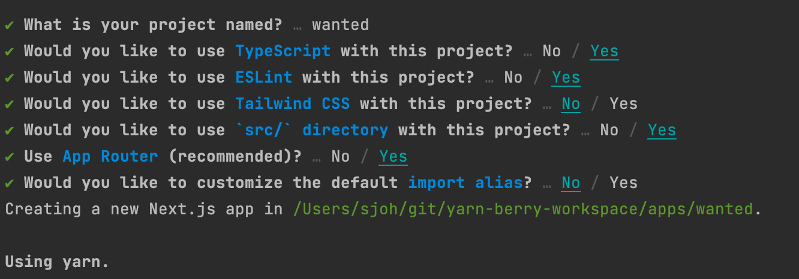

# yarn worksapce 패키지 만들기

## 1. 프로젝트 폴더 생성

```bash
$ 폴더 생성

mkdir yarn-berry-workspace
cd yarn-berry-workspace
```

```bash
$ Yarn berry 설정

yarn set version berry
```

<br><br>

## 2. workspace 패키지 생성

### workspace

[workspace](https://yarnpkg.com/features/workspaces/#gatsby-focus-wrapper)

workspace란, 모노레포 내부의 각각의 프로젝트를 의미  
커다란 공유 오피스 안에 A 회사 사무실, B 회사 사무실 등이 있는 것과 같음

Yarn workspace는 모노레포 작업을 쉽게 만듦  
여러 프로젝트가 동일한 저장소에 함께 있고 서로 참조 가능  
하나의 소스 코드에 대한 수정 사항이 다른 프로젝트에 즉시 적용됨

<br>

### yarn berry cli 명령어

[ttps://yarnpkg.com/cli/init](https://yarnpkg.com/cli/init)

```bash
yarn init -w
```

* init은 초기화 명령어
* -w : 워크스페이스를 만드는것

<br><br>

## 3. root package.json 파일 수정

```
// package.json

{
  "name": "yarn-berry-workspace",
  "packageManager": "yarn@3.5.0",
  "private": true,
  "workspaces": [
    "apps/*",       // 👈 추가
    "packages/*"    // 👈 추가
  ]
}
```

<br><br>

## 4. apps 폴더에 next.js 프로젝트 추가

```bash
cd apps
yarn create next-app
```



<br><br>

## 5. workspace 적용

(예시)`wanted`를 프로젝트 이름으로 설정할 경우,  
이 프로젝트에 다른 패키지들을 추가하는 형식으로 진행됨 

### `package.json` 변경 

wanted 프로젝트의 `package.json`에서 `“name”: “@wanted/web”`으로 변경

### 상태 갱신

변경 후 root로 이동해서 상태를 갱신

```bash
cd ..
yarn
```

### 작동 확인 

@wanted/web 프로젝트가 정상적으로 실행되는지 확인

```bash
yarn workspace @wanted/web run dev
```
