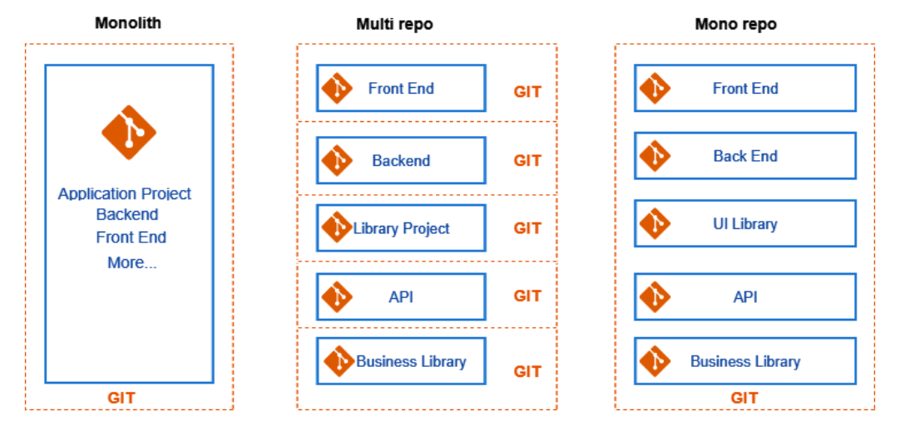

# Monorepo

## 변천사

1. 모놀리식(monolithic) 애플리케이션
2. 폴리레포 (=멀티레포)
3. 모노레포

  

## 모놀리식 애플리케이션

모듈화 없이 설계된 애플리케이션 방식 

### 장점

* 빠른 아키텍처 구축 가능
* 의존성 라이브러리 버전 통일
* 관리 비용 절감
* 공통 코드를 자유롭게 방영

### 단점

* 하나의 변경이 다른 서비스에 영향을 줌
* 관심사 분리가 어려움
* 서비스별 배포 불가

  

## 폴리레포, 멀티레포

관심사를 모듈화해서 여러 저장소로 구축하는 방식  
**마이크로 서비스** 개념 등장(멀티레포 ≠ 마이크로 서비스)

### 장점

* 서비스별 독립된 환경
* 하나의 변경이 다른 서비스에 영향 주지 않음
* 서비스별 배포 가능

### 단점

* 매번 새로 개발 환경 구축이 필요
* 일관되지 않은 코드 컨벤션
* 중복코드 발생
* 라이브러리 버전 변경에 따른 의존성 관리

  

## 모노레포

여러 프로젝트의 코드가 하나의 저장소에 저장되는 방식 

* 모놀리식의 장점 + 폴리레포의 장점
  * 단일 레포에서 함께 관리
  * 관심사 분리와 모듈화

  

## 참고 사이트 

> https://ko.wikipedia.org/wiki/%EB%A7%88%EC%9D%B4%ED%81%AC%EB%A1%9C%EC%84%9C%EB%B9%84%EC%8A%A4
