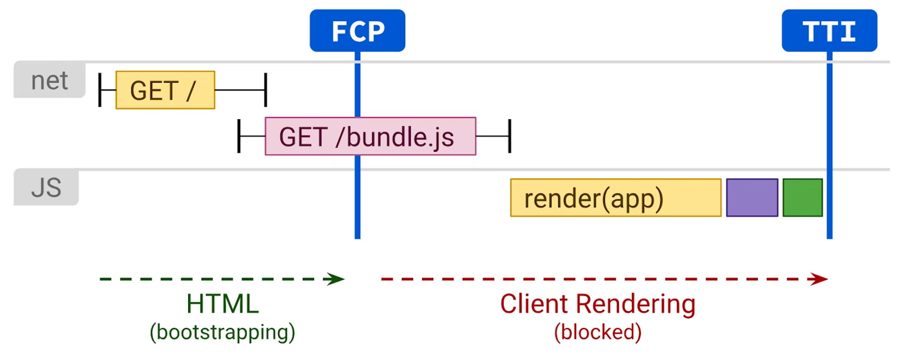
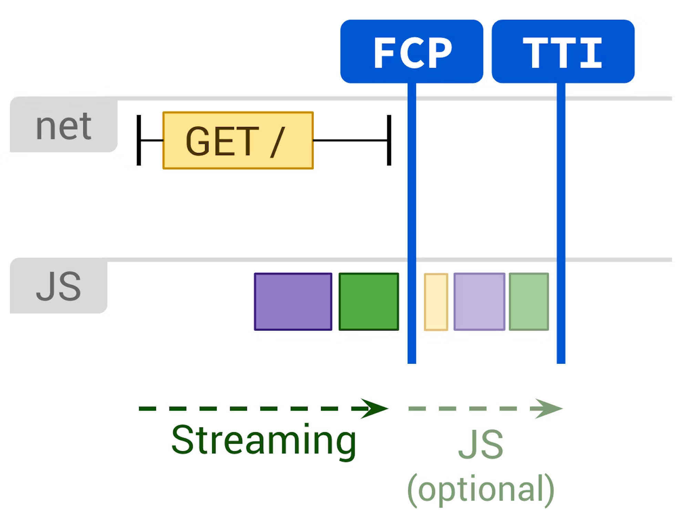
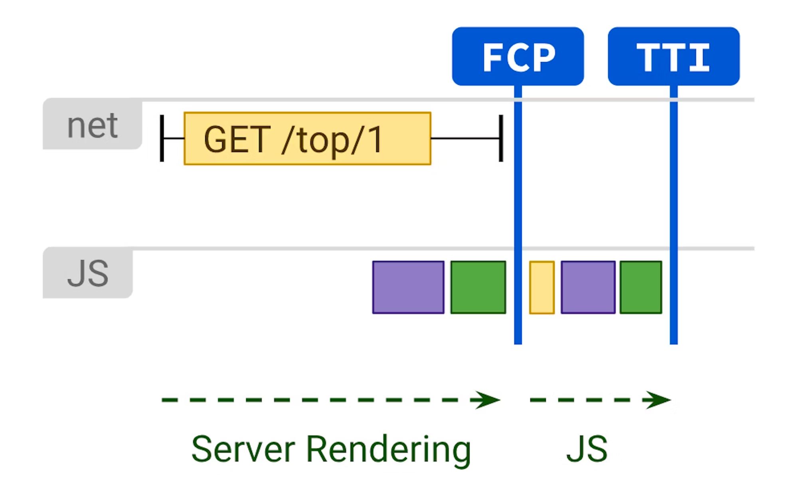

# CSR, SSR

## React SSR 구현하기

> 🍲 낙곱새(낙지, 곱창, 새우)

* 비조리 포장 배달 : **CSR**
  * 낙곱새 재료들을 불만 올리면 먹을 수 있는 형태로 포장
  * 배달을 통신으로, 음식 재료를 페이지를 그리는데 필요한 asset들로, 음식을 조리하는 것은 브라우저 렌더링
* 조리 포장 배달 : **SSR**
  * 식당에서 조리
  * `식당(서버)`에서 `음식을 조리(렌더링)`가 완료된 다음 `손님(브라우저)`에게 `배달(응답)`

 

### CSR

페이지에 들어갔을 때 처음은 빈 html  
JS, CSS 등 asset 다운받고 실행한 뒤 렌더링 완료 

- 서버에 최초 GET 요청
- 빈 HTML
- JS, CSS 등 asset 다운로드
- JS 파일 실행
- React 실행 후 React에 의한 렌더링
- 화면에 출력

 

### SSG

SSG는 개발자가 개발을 완료하고 빌드하는 순간에 렌더링이 일어남  
-> SSG는 SSR보다 정보의 변화가 적은 사이트에 대해 적합

정적 생성(Static Site Generation)된 React 앱이 실행되는 과정

- 서버에 최초 GET 요청
- CDN
- 미리 완성된 HTML 응답
- 화면에 출력

 

### SSR

> **🔎 CSR에 비해 SEO(Search Engine Optimization)에 유리**  
> 렌더링(조리)이 되지 않은, 정보값이 없는 페이지에서는 인덱싱(검색 엔진 사전에 등록)해둘 수가 없음  
> SSR, SSG가 SEO에 유리  
> 크롤러가 실시간으로 방문하는 것이 아니라, DB에 저장되는 것   

> **🏋️ SSR은 CSR에 비해 서버 부하가 큼**  
> SSR은 서버 측에서 처리해야 하는 렌더링 로직 때문에 반드시 **응답을 처리해줄 서버**가 필요  
> CSR only 서비스 보다 서버가 할 일이 많고 바쁨  
> 트래픽이 많이 몰릴 경우 응답이 느려지거나, 메모리가 한도를 초과하여 서버가 동작을 멈추기도 함
> 
> CSR only 서비스의 경우 미리 빌드해둔 HTML, JS, CSS 파일을 S3 등의 저장소에 올려두고, 
> Cloudfront 등의 CDN을 붙여 별도의 컴퓨팅 자원 없이 정적으로 제공할 수 있음   
> 서버에서 렌더링하는 로직이 없고, 동일한 응답을 돌려주어 캐싱이 용이한 특징 덕분에 
> SSR보다 많은 트래픽을 효과적으로 받아낼 수 있음  

중간에 서버 로직이 들어가는 것 외에는 동일 

서버에서 html 파일을 만들어서 보내줌 

> JSON -> props로 받아서 JSX -> html

- 서버에 최초 GET 요청
- 서버 측에서 요청 경로를 보고 알맞게 React 앱 렌더링
- 생성된 HTML 응답
- 화면에 출력

 

### 렌더링 성능 비교

|       비교       |              CSR              |                       SSR                        |
|:--------------:|:-----------------------------:|:------------------------------------------------:|
| TTFB fast, TTI | **빈 화면(TTFB fast, TTI slow)** |          **느린 응답(TTFB slow, TTI fast)**          |
|       -        |       번들 크기가 커질 수록 두드러짐       | 싱글 스레드 renderToString 메서드의 특징 상 최초 응답이 늦어질 수 있음  |
|       -        |  코드 스플리팅, 번들 압축, 트리 쉐이킹의 중요성  | 번들 크기가 커질 경우 TTI까지 속도가 느려저 CSR과 마찬가지 단점을 가질 수 있음 |

**TTFB(Time to First Byte)**

- 어떤 리소스를 요청하고 난 뒤, 해당 요청에 대한 첫 번째 바이트가 도착하기 까지 걸리는 시간

**FCP(First Contentful Paint)**

- 텍스트, 이미지 등 페이지가 로드되기 시작한 시점으로부터, 콘텐츠 일부가 화면에 렌더링 되기 시작한 시점의 시간을 측정
- FCP가 빠르면 사용자가 ‘콘텐츠가 로드되었음’을 인지하고 서비스를 더 빠르게 이용할 수 있음
- 1.8초 이하면 좋은 점수

**TTI(Time to Interactive)**

- 앱이 사용자와 상호작용할 준비가 된 시점
- 화면이 그려지는 것과는 거의 무관
- 자바스크립트 이벤트가 걸린 버튼을 눌렀을 때 해당 버튼이 제대로 이벤트 리스너에 연결된 함수를 호출하는 최초의 시점

 

### cdn

[CDN(Content Delivery Network)](https://ko.wikipedia.org/wiki/%EC%BD%98%ED%85%90%EC%B8%A0_%EC%A0%84%EC%86%A1_%EB%84%A4%ED%8A%B8%EC%9B%8C%ED%81%AC)

지리적으로 분산된 서버들을 연결한 네트워크  
웹 컨텐츠의 복사본을 사용자에 가까운 곳에 두거나, 동적 컨텐츠(예: 라이브 비디오 피드)의 전달을 활성화하여 웹 성능 및 속도를 향상시킴

미리 가져다둔것(🎁밀키트, 풀필먼트)

ttfb
csr이 빠름. 약속 잇는데 친구가 늦엇다고 빤스만 입고나옴
어쨋든 빠름

### 

하이드레이션은 ssr에서만

hydrateRoot
온거를 갖다씀
근데 안쓰고 응 안써 내가 직접 만들래 할수도 잇음

  

## Next.js가 프레임워크인 이유

### 라이브러리와 프레임워크 

* `라이브러리`는 개발자가 라이브러리 코드를 갖고와서 사용 (✏️연필, 볼펜)  
* `프레임워크`는 개발자의 코드를 프레임워크가 갖고가서 사용 (🖨프린터)
  * 편리하지만 자유가 없음

 

### CLS(Cumulative Layout Shift)

[누적 레이아웃 이동](https://web.dev/cls/)

사용자가 예상치 못한 레이아웃 이동을 경험하는 빈도를 수량화 => 시각적 안정성을 측정할 때 중요한 사용자 중심 메트릭   
CLS가 낮으면 우수한 사용자 경험을 보장하는 데 도움이 됨  

**Next.js image는 CLS를 방지**  
클릭하려고 햇는데 광고떠서 잘못누르는 등의 일 예방 

-> width, height 강제 등, **이미지 크기를 넣으라고 하는 이유**  
Image 컴포넌트는 src 속성으로 받은 이미지 주소를 조작하여 Next.js 내부 서버 API 쪽으로 경로를 돌려놓음

내부 서버 = Next.js로 만든 웹 애플리케이션 내부의 프론트엔드 서버  
클라이언트앱이 돌아가는 시스템환경의 성능이 안 좋으면 리사이징 속도도 느려짐

-> [샤프](https://nextjs.org/docs/messages/install-sharp)  
-> [Next.js 이미지 로딩이 느릴 경우 조치 방법](https://november11techblog.gatsbyjs.io/next-js-%EC%9D%B4%EB%AF%B8%EC%A7%80-%EB%A1%9C%EB%94%A9%EC%9D%B4-%EB%8A%90%EB%A6%B4-%EA%B2%BD%EC%9A%B0-%EC%A1%B0%EC%B9%98-%EB%B0%A9%EB%B2%95)

  

## SSR, SSG 인프라 구성

> 컴퓨팅 자원이 필요한가? → SSR (O) / SSG (X)

### SSR 

컴퓨팅 자원을 제공해주는 AWS EC2, GCP ComputeEngine, Azure VitualCompute 등의 인스턴스를 제품 사용  
AWS Lambda와 같은 서버리스 서비스 사용

 

### SSG

서버가 있어도, 없어도 됨

* 서버가 있을 경우 : 서버를 통해 들어온 요청을 인스턴스 내에 담긴, 혹은 별도의 저장소에 담긴 HTML 파일을 불러와 응답
* 서버가 없을 경우 : S3와 같은 저장소에서 요청에 대한 응답을 가져가도록 구성
  * 일반적으로 **CDN** 역할을 하는 `AWS CloudFront`와 저장소 역할을 하는 `S3 bucket`을 많이 조합해 사용

  

## lambda

즉시실행함수 기호

> 람다 (들 입 入)     
> 대문자 Λ, 소문자 λ

[AWS Lambda](https://aws.amazon.com/ko/lambda/features/)  

서버리스 + CDN = 람다 리스?

 

### Server 

Next.js로 만든 앱을 서빙하기 위해서는 빌드(Build) 과정이 필요  

SSR 혹은 API Route가 이에 해당    
람다 기호(λ)가 그려져 있는 만큼, 
클라이언트 측에서 요청이 들어오면 그 때마다 서버 로직이 개별 함수처럼 즉시 실행(Lambda) 되고 각 경로에 맞는 응답을 내려줌   
`getServerSideProps`를 사용하면 SSR 페이지를 만들 수 있음

  

## 참고 사이트

> 원티드 프리온보딩 7월 챌린지 강의 자료   
> https://web.dev/rendering-on-the-web/  
> https://patterns-dev-kr.github.io/  
> [React 공식문서 비공식 한글화 사이트](https://react-ko.dev/)  
> https://nextjs.org/blog/next-13  
> https://next-site-4vixvljn1.vercel.sh/
